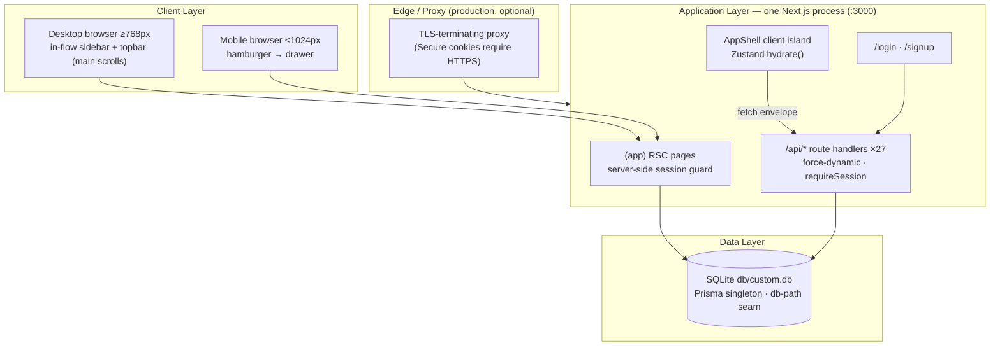
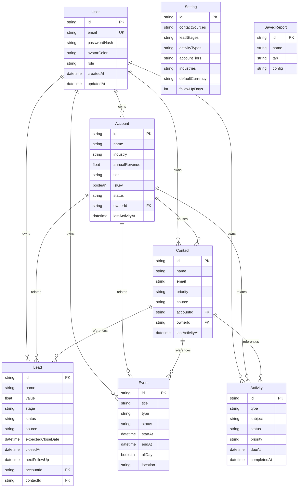

# NEO CRM — Master Project Architecture Document (PAD) v1.0

**Classification:** Internal Engineering Reference
**Status:** DEFINITIVE, PRODUCTION-LOCKED BLUEPRINT
**Companion Document:** `README.md` (onboarding), `AGENTS.md` (agent contract), `CLAUDE.md` (workflow reference)
**Last Updated:** 2026-09-29
**Audience:** Senior Engineers, Tech Leads, DevOps, and Onboarding Engineers
**Rule:** Every architectural decision in this document traces to a specific rationale.
Nothing is here "because it's popular."

---

## Table of Contents

1. [System Overview & Decisions](#1-system-overview--decisions)
2. [High-Level System Topology](#2-high-level-system-topology)
3. [Application Architecture](#3-application-architecture)
4. [Data Architecture](#4-data-architecture)
5. [Design System Reference](#5-design-system-reference)
6. [Security Architecture](#6-security-architecture)
7. [Testing Strategy](#7-testing-strategy)
8. [Build & Deployment](#8-build--deployment)
9. [Developer Handbook](#9-developer-handbook)
10. [Known Issues & Outstanding Tasks](#10-known-issues--outstanding-tasks)
11. [Key Files Reference](#11-key-files-reference)
12. [Glossary](#12-glossary)

---

## 1. System Overview & Decisions

### 1.1 Document Metadata & Purpose

NEO CRM is a faithful, self-hosted clone of the reference CRM workspace at
`https://neo-crm-8ab2c17c.base44.app/` (recon artifacts in `docs/`), rebuilt
on an open, single-process stack. Use this PAD to understand how the system is
wired, why each choice was made, and where the sharp edges are. A new engineer
should read sections 1–3 then skim 9; anyone debugging auth, the SQLite path
resolution, or the mobile navigation should read sections 3.3 and 6 in full.

The clone deliberately diverges from the reference in exactly one behavioral
area: **mobile navigation**. The reference app hides its sidebar below `md`
(768px — session-7 live verification at 900/700px) and ships no replacement
— phone users cannot reach any page. NEO CRM implements a focus-trapped
slide-out drawer (covering `< md` only) and pins it with a dedicated E2E
regression suite.

### 1.2 Technology Stack Summary

| Layer | Technology | Version | Key Rationale |
| ----- | ---------- | ------- | ------------- |
| Web framework | Next.js (App Router) | 16.3.6 | Single-process RSC + API routes; async `cookies()`/`params`; standalone output for self-contained deploys |
| UI runtime | React | 19.3 | Async params, `inert` as a boolean prop, no `forwardRef`; lint-enforced hook discipline |
| Language | TypeScript | 5.9 | Strict mode (except `noImplicitAny: false`, sandbox default); explicit `typecheck` gate compensates for `ignoreBuildErrors` |
| Styling | Tailwind CSS | 4.3.3 | CSS-first `@theme` tokens; zero JS config; validated against `docs/Tailwind-V4-Validation-Report.md` |
| Animation | tw-animate-css (vendored) | 1.4.0 | npm package exposes only the `style` export condition — unsupported by Turbopack, so the dist CSS is vendored |
| UI primitives | Radix UI | per-package | Dialog, Popover, Select, Label, Slot already in scaffold; hand-rolled tabs/tables/checkboxes with native ARIA |
| Charts | recharts | 2.15.4 | Matches reference chart anatomy (SvgRoot layout); React-19 compatible |
| Icons | lucide-react | 0.525 | Sole icon set; two-class stroke system (nav 1.8 / content 2.0) |
| ORM | Prisma | 6.19.3 | Schema-first single-file model; `db push` keeps zero-migration dev loop |
| Database | SQLite | (libsqlite) | Zero-config local story; path resolution normalized in `src/lib/db-path.ts` |
| State | Zustand | 5.0.15 | One client store for all server state — no React Query/SWR layer to keep in sync |
| Unit tests | Vitest | 5.0 | Fast node-environment seam tests; `@` alias resolution |
| E2E tests | Playwright | 1.63 | Real Chromium against the standalone production build on :3100 |

### 1.3 Architecture Decision Records (ADRs)

**ADR-001: Next.js 16 App Router single app (no monorepo)**

- **Context:** The reference is a single-page platform app; the operator
  wants a self-contained clone that runs with one command and pushes to one
  repo. The sibling scandihaven project demonstrates a pnpm/Turborepo
  monorepo, but its multi-package overhead buys nothing at this scope.
- **Decision:** One Next.js application; `src/app` route groups partition
  public (`/login`, `/signup`) from authenticated (`(app)`) surfaces; API
  handlers live under `src/app/api`.
- **Rationale:** Single deploy artifact, one lockfile, one test runner;
  the `(app)` layout guard replaces a middleware/proxy entirely.
- **Consequences:** + Simple mental model, trivial local setup. − No
  independent scaling of API vs UI (acceptable: SQLite is single-node anyway).
- **Alternatives Rejected:** Turborepo monorepo (scandihaven pattern) —
  premature at this scale; separate Express API — loses RSC and doubles
  surface area.

**ADR-002: Prisma + SQLite with normalized relative-path resolution**

- **Context:** The Prisma CLI resolves relative `file:` URLs against
  `prisma/schema.prisma`, but the runtime resolves them against the process
  CWD — and the standalone server chdirs into `.next/standalone`. Without
  normalization, dev, CLI and production land on three different database
  files (this failure was observed live during E2E bring-up). A second
  hazard surfaced in the session-2 audit: **bun loads `.env` for every
  `bun run`/`bun x` process and rewrites a relative `file:` DATABASE_URL
  into an absolute path resolved against the `.env` file's own directory** —
  with the root contract `file:../db/custom.db` that is one directory
  OUTSIDE the repo, and absolute URLs pass through the resolver untouched
  (observed live: the dev server opened `<parent-of-repo>/db/custom.db`).
- **Decision:** `src/lib/db-path.ts` re-implements the CLI rule at runtime
  (anchor order: standalone-CWD detector → module repo-root validator →
  plain CWD with an existence guard). Validated anchors `mkdir -p` the
  `db/` folder (first boot). `runtimeDatabaseUrl()` additionally parses the
  `.env` at the process CWD and, when the env var is exactly bun's
  absolutization of the `.env` value, re-derives the URL from the RAW value
  via the schema rule; any other env value (e2e override, postgres, an
  intentional absolute path) wins untouched. `src/lib/db.ts`,
  `prisma/seed.ts` and the `scripts/prisma-env.ts` wrapper (`db:push`) all
  derive their URL through this seam, so every consumer lands on
  `<repo>/db/<name>`.
- **Rationale:** Keeps `DATABASE_URL=file:../db/custom.db` working
  identically across `next dev`, `next build`, `next start`, Prisma CLI and
  the Playwright webServer — pinned by `tests/db-path.test.ts` (16 checks:
  urlForRoot first-boot mkdir, parseEnvFile, effectiveDatabaseUrl
  re-anchoring, runtimeDatabaseUrl discovery, plus the original passthrough
  and anchoring contract).
- **Consequences:** + Zero-config dev, no migration ceremony. − SQLite is
  single-writer; swapping to PostgreSQL later means changing the datasource
  block and re-verifying the path seam.
- **Alternatives Rejected:** Drizzle + Postgres 17 (scandihaven stack) —
  requires a running database service; absolute production paths in `.env` —
  cwd-fragile in containers; `prisma/.env` split — bun keeps loading the
  root `.env` first, so the split does not remove the hazard (verified
  empirically); `bun --env-file` in scripts — the flag does not chain into
  `bun x prisma` invocations.

**ADR-003: Hand-rolled scrypt + HMAC cookie sessions (no auth library)**

- **Context:** Two authenticated surfaces exist (login page + 27 route
  handler files). NextAuth/Better-Auth pull provider abstractions, adapters
  and their own DB schema for what is, here, a single email/password flow.
  The scaffold family already standardizes a minimal hand-rolled pattern.
- **Decision:** `src/lib/auth.ts`: scrypt password hashes
  (`scrypt:salt:hash`), HMAC-SHA256-signed stateless cookie `neo_session`
  (7-day TTL), `verifySessionToken` with `timingSafeEqual`, `requireSession()`
  guard used by every handler, login/signup rate-limited 10/IP/15min.
- **Rationale:** ~129 auditable lines, zero extra dependencies, no external
  identity provider needed for a self-hosted clone; the reference's Google
  button is rendered for parity but degrades to an explanatory toast (no
  OAuth credentials exist in a self-hosted clone — documented deviation, not
  a silent failure).
- **Consequences:** + No library churn, full control of cookie flags.
  − Rotating `AUTH_SECRET` invalidates all sessions (acceptable, documented);
  no SSO until deliberately added.
- **Alternatives Rejected:** NextAuth v4 (in scaffold's allowed stack) —
  adapter + provider ceremony outweighs a two-field login; Better-Auth —
  same, plus its own migration story.

**ADR-004: One Zustand store for all server state + `{ok,data}` envelope**

- **Context:** Nine entity pages all need the same slices (accounts,
  contacts, leads, activities, events, settings, dashboard, users), plus
  cross-cutting concerns (global search, quick-create from anywhere).
  Introducing React Query would add cache keys, retries and hydration rules
  for a dataset that fits in memory and is only mutated by one user at a
  time.
- **Decision:** `src/stores/crm-store.ts` — a single store with a `call()`
  fetch client that understands the envelope, `hydrate()` bootstrapping every
  slice after `/api/auth/me`, and per-entity CRUD actions that refresh the
  affected slices. All 39 API handlers respond with `ok()`/`fail()` from
  `src/lib/api.ts` (session-68 F-68b1: the stale "22" carrier refreshed —
  27 route files / 39 verb handlers, the count the audit censuses carry).
- **Rationale:** One place to reason about client cache; mutations always
  leave the store internally consistent (action → API → refetch slice);
  envelope gives uniform error UX via toasts.
- **Consequences:** + No query-key sprawl; trivially greppable data flow.
  − Refetch granularity is per-slice, not per-item (fine at demo scale).
- **Alternatives Rejected:** TanStack Query — cache complexity without a
  multi-user freshness requirement; React Context — re-render storms.

**ADR-005: Tailwind v4 CSS-first with literal-hex tokens and vendored animation CSS**

- **Context:** Tailwind v4 removes the JS config; its documented pitfalls
  (`@theme` `var()` chains silently dropped; `hidden` attribute overriding
  display utilities; plugin/PostCSS misconfiguration producing "flat look")
  were validated in `docs/Tailwind-V4-Validation-Report.md`. The scaffold
  shipped **without `postcss.config.mjs`**, which silently disabled the
  entire pipeline (observed: fully unstyled pages with parse warnings at the
  `@theme` directive). The `tw-animate-css` npm package additionally exposes
  only the `style` export condition, which Turbopack's CSS resolver rejects.
- **Decision:** All design tokens are literal hex in one `@theme` block
  (`src/app/globals.css`); custom utilities via `@utility`; the PostCSS
  config pins `@tailwindcss/postcss`; `tw-animate-css` is vendored at
  `src/app/vendor/tw-animate.css` and imported relatively.
- **Rationale:** Each rule prevents an observed failure: missing PostCSS
  config → unstyled app; package import → `Module not found: Can't resolve
  'tw-animate-css'`; `var()` chains → silently dropped tokens.
- **Consequences:** + Reproducible styling pipeline. − Animation library
  updates require re-vendoring (tracked in Known Issues).
- **Alternatives Rejected:** `@config` bridge to a JS config — legacy path,
  loses v4 features; `tailwindcss-animate` JS plugin — not loadable
  CSS-first.

**ADR-006: Mobile navigation drawer (deliberate fix over the reference)**

- **Context:** Verified on the live reference at 390×844: below `md` the
  sidebar vanishes and the only interactive chrome is the avatar dropdown
  (Profile/Logout). No hamburger, no drawer — the app is unusable on phones.
- **Decision:** `src/components/layout/mobile-nav.tsx` — always-mounted
  drawer (`inert` + `visibility:hidden` when closed so it is removed from
  tab order and from Playwright/AT visibility), CSS-transform slide
  animation, focus trap with Tab cycling, Escape close with focus restore,
  dual scroll-lock with original-value cleanup (`document.body` AND the
  `main` scroller — since session 6 `main` is the app's scroll container),
  close-on-route-change via
  adjust-during-render (React 19 lint-safe), and auto-close when the viewport
  grows past `md` (session-7: the drawer and trigger are `md:hidden`,
  matching the reference sidebar's `hidden md:flex`). Pinned by
  `tests/e2e/mobile-navigation.spec.ts` (7 checks, 390/700px viewports).
- **Rationale:** Restores the primary navigation affordance the reference
  lost; every behavior maps to a documented Tailwind-v4/React-19 failure
  class in the skills research (overlay clipping, z-index wars, scroll-lock
  leaks, setState-in-effect).
- **Consequences:** + Phone users get full navigation; regression suite
  prevents silent reintroduction. − One more layout component to keep in
  sync with the sidebar (shared `SidebarNav` keeps them in lockstep).
- **Alternatives Rejected:** Bottom tab bar — diverges visually from the
  reference sidebar; no fix (reference behavior) — unacceptable.

**ADR-007: React-19-lint-clean dialog patterns (remount-via-key)**

- **Context:** The scaffold's ESLint enforces `react-hooks/set-state-in-effect`
  as an error. The classic "reset form state when the dialog opens" effect
  violates it; naive fixes (refs, flags) just move the smell.
- **Decision:** Every entity dialog (`src/components/shared/entity-dialogs.tsx`)
  is split into a shell + form: the shell mounts the form only while open,
  keyed by entity id; the form initializes **all** state via `useState`
  initializers at mount. No dialog component contains a single effect-based
  setState.
- **Rationale:** The pattern is the React-docs-sanctioned way to "reset state
  with a key"; it is also bug-free against double-open / switch-edit-target
  races, and keeps the store's settings snapshot as the single source for
  defaults.
- **Consequences:** + Zero lint suppressions; predictable form lifecycles.
  − Slightly more files/props than an effect-based reset.
- **Alternatives Rejected:** Guarded setState-in-render inside one component
  — legal but fragile under concurrent rendering; disabling the rule —
  erodes the repo-wide guarantee.

---

## 2. High-Level System Topology



Runtime characteristics: a single Node/Bun process serves RSC pages, route
handlers and static chunks. Scaling is vertical only (SQLite is
single-writer); horizontal scaling requires the PostgreSQL swap documented in
ADR-002 consequences. There are no background workers, queues or external
service dependencies — every external integration point (email, OAuth) is a
documented graceful degradation.

---

## 3. Application Architecture

### 3.1 The Layer Model

```
Layer 0: Browser — the only "use client" leaves (AppShell, pages, dialogs,
         charts, store). Rule: client code never imports Prisma or lib/db.
Layer 1: RSC pages + (app) layout — resolve the session server-side,
         redirect unauthenticated visits, render client islands with props.
         Rule: no data fetching happens here beyond the session; pages own
         their data through the store.
Layer 2: API route handlers — 27 files / 39 handlers (incl. `PATCH
         /api/users` for the profile Full-Name edit), all `force-dynamic`,
         all guarded by `requireSession()` (except auth/login, auth/signup,
         health, search's public shell). Rule: hand-rolled validation at the
         boundary; return the envelope, never throw across it.
Layer 3: Pure seams (src/lib) — auth, api envelope, db + db-path, format,
         csv, constants, rate-limit, download. Rule: unit-tested; handlers
         and pages import these instead of inlining logic.
Layer 4: Persistence — Prisma singleton over SQLite. Rule: import `db` from
         "@/lib/db" only; never construct PrismaClient directly.
```

**Golden Rule:** dependencies point strictly downward (Browser → RSC → API →
seams → Persistence). The store is the sole Browser-side data gateway; the
envelope is the sole wire format.

### 3.2 Annotated Directory Structure

```
neo-crm/
├── prisma/
│   ├── schema.prisma            # 9 models; SQLite datasource
│   └── seed.ts                  # idempotent demo workspace (in-place wipe + insert)
├── src/
│   ├── app/
│   │   ├── (app)/               # session-guarded route group
│   │   │   ├── layout.tsx       # getSessionUser → redirect("/login") → AppShell
│   │   │   ├── page.tsx         # Dashboard: KPIs, filters, charts, lists, recent deals
│   │   │   ├── accounts/        # tier checkboxes, owner/industry/revenue filters
│   │   │   ├── contacts/        # sortable table, scan-card + CSV import dialogs
│   │   │   ├── leads/           # 7-stage pipeline + 3 charts + funnel
│   │   │   ├── calendar/        # month grid, agenda, per-day events, type filters
│   │   │   ├── activities/      # quick-log buttons, priority tabs, timeline
│   │   │   ├── reports/         # 5 analytics tabs, period/owner/stage/status filters
│   │   │   ├── settings/        # picklist editors, defaults, data/danger zone
│   │   │   └── profile/         # account card + workspace footprint
│   │   ├── api/                 # auth(6: login signup logout me verify
│   │   │                       # resend) users accounts contacts leads
│   │   │                       # activities events opportunities dashboard
│   │   │                       # reports settings search export upload
│   │   │                       # uploads/[name] reset health — 27 route files
│   │   ├── login/ signup/       # public auth pages (redirect away when signed in)
│   │   ├── not-found.tsx        # server 404 wrapper (absolute title) — session-12
│   │   ├── not-found-body.tsx   # client 404 body (usePathname, quoted-path msg)
│   │   ├── layout.tsx           # root: metadata, Toaster (NO webfont — session-22)
│   │   ├── globals.css          # Tailwind v4 @theme tokens + @utility definitions
│   │   └── vendor/tw-animate.css# vendored animation utilities (ADR-005)
│   ├── components/
│   │   ├── layout/
│   │   │   ├── app-shell.tsx    # sidebar + topbar + drawer composition, hydrate()
│   │   │   ├── sidebar.tsx      # SidebarNav + BrandMark (shared desktop/mobile)
│   │   │   ├── topbar.tsx       # global search, notifications, user dropdown
│   │   │   ├── mobile-nav.tsx   # THE drawer fix (ADR-006)
│   │   │   ├── nav-config.ts    # nav items (single source for both chromes)
│   │   │   └── login-card.tsx   # signin/signup card + Google parity button + the in-place reset-password flow (session-11)
│   │   ├── ui/                  # button input card dialog select dropdown table
│   │   │                       # tabs badge label(+checkbox) avatar toast misc
│   │   ├── charts/charts.tsx    # recharts wrappers at the DOM-pinned per-surface heights (300/250/150) with stock defaults (tooltip + legend)
│   │   └── shared/
│   │       ├── page-parts.tsx   # PageHeader, KpiCard, BarStatCard, TrendStatCard, IconStatCard, CircleStatCard, Sparkline (bare-shadow stat family; recharts monotone sparks — session-12)
│   │       └── entity-dialogs.tsx # remount-via-key forms (ADR-007)
│   ├── lib/                     # the pure seams (Layer 3)
│   ├── stores/crm-store.ts      # single Zustand store + call() client
│   └── types/index.ts           # wire types shared by API and client
├── tests/
│   ├── *.test.ts                # 77 Vitest suites — 1257 checks
│   └── e2e/                     # global-setup, auth.setup, 3 spec files + setup project — 112 checks
├── docs/                        # validation report, SSH runbook, screenshots
├── next.config.ts               # standalone output + traced prisma root
└── postcss.config.mjs           # @tailwindcss/postcss — REQUIRED (ADR-005)
```

### 3.3 Critical Code Patterns

**Pattern 1 — The session guard (every handler, every page shell)**

```ts
// src/lib/api.ts — guard returns either the user or a ready-to-return 401.
export async function requireSession(): Promise<{ user: SessionUser } | { response: NextResponse }> {
  const user = await getSessionUser();
  if (!user) return { response: ERR.UNAUTHORIZED() };
  return { user };
}

// Typical handler usage — the isGuarded() narrowing keeps it two lines:
export async function GET() {
  const guard = await requireSession();
  if (isGuarded(guard)) return guard.response;
  const rows = await db.account.findMany({ /* … */ });
  return ok(rows);
}
```

*Why this pattern:* avoids the double-`await getSessionUser()` that a
`getSessionUser() ?? throw` API would force, keeps TypeScript narrowing
explicit, and makes the guard visible as the first statement of every
handler — greppable in security review.

**Pattern 2 — SQLite path normalization (the seam that keeps dev/prod/e2e identical)**

```ts
// src/lib/db-path.ts — mirror the Prisma CLI rule: relative file: URLs
// resolve against prisma/schema.prisma, not process.cwd().
const anchors: Array<() => string | null> = [
  repoRootFromStandaloneCwd, // cwd contains ".next" (standalone chdir) → repo is two levels up
  repoRootFromModule,        // this file's repo root, validated by schema.prisma on disk
  () => process.cwd(),       // last resort
];
for (const anchor of anchors) {
  const root = anchor();
  if (!root) continue;
  const candidate = join(root, "prisma", ref); // same shape the CLI computes
  if (existsSync(candidate) || existsSync(dirname(candidate))) return `file:${candidate}`;
}
```

*Why this pattern:* without it, `next dev`, `next build`, the standalone
server and the Playwright webServer each resolve `file:../db/custom.db`
against a different CWD and silently create/read different database files —
observed live as "login works but the dashboard redirects to /login"
(API chunk and page chunk held different stale handles).

**Pattern 3 — Remount-via-key dialogs (React-19-lint-clean forms)**

```tsx
// src/components/shared/entity-dialogs.tsx — shell mounts the form only
// while open, keyed by entity id; the form owns NO effects that setState.
export function AccountDialog({ open, onOpenChange, account }: Props) {
  return (
    <Dialog open={open} onOpenChange={onOpenChange}>
      <DialogContent className="max-w-xl">
        <DialogHeader>…</DialogHeader>
        {open && (
          <AccountForm key={account?.id ?? "new"} account={account ?? null} … />
        )}
      </DialogContent>
    </Dialog>
  );
}

function AccountForm({ account }: { account: Account | null; … }) {
  const { settings, users } = useCrmStore();
  const [form, setForm] = React.useState(() => ({
    tier: account?.tier ?? settings?.defaultTier ?? "B", // settings snapshot at mount
    /* … */
  }));
  // …
}
```

*Why this pattern:* `react-hooks/set-state-in-effect` is an ERROR in this
repo. Keyed remount gives every open a pristine form initialized from
props/store — no reset effects, no stale-field bugs when switching the edit
target, and the store's settings snapshot is read exactly once.

**Pattern 4 — Mobile drawer lifecycle (the reference-app fix)**

```tsx
// src/components/layout/mobile-nav.tsx — close on route change WITHOUT
// setState-in-useEffect: adjust state during render (React 19 sanctioned).
const [prevPathname, setPrevPathname] = React.useState(pathname);
if (prevPathname !== pathname) {
  setPrevPathname(pathname);
  if (open) onOpenChange(false);
}
// …
// Closed state must be a real "hidden": inert removes it from the a11y tree
// and tab order; visibility:hidden (transitioned) keeps the slide-out
// animation while making `toBeHidden()` semantics honest for AT + tests.
<div
  className={cn("fixed inset-0 z-50 transition-[visibility] duration-300 lg:hidden",
    open ? "visible" : "invisible pointer-events-none")}
  role="dialog" aria-modal="true" inert={!open}
>
```

*Why this pattern:* every line answers a documented failure class —
Tailwind v4's `hidden`-attribute trap, scroll-lock leaks without cleanup,
focus left behind in a removed subtree, and drawers that stop closing when
JS state desyncs from the URL.

---

## 4. Data Architecture

### 4.1 Database Schema



Field notes: picklists (sources, stages, industries…) are stored as JSON
strings on the `Setting` singleton — settings round-trip as arrays through
`/api/settings`, parsed defensively with fallbacks. `Lead.status` is derived
from `stage` (`won`→`closed_won`, `lost`→`closed_lost`, else `open`) and
written transactionally by the API on every stage change. All relation
deletes are `SetNull` except `Activity→Account` and `Event→Account`
(`Cascade`) — deleting an account keeps its people but removes its logged
activities/events.

### 4.2 Data Models

Wire types live in `src/types/index.ts` (User, Account, Contact, Lead,
CrmEvent, Activity, Settings, SavedReport, plus the computed aggregates
`DashboardData` and `ReportsData` with their KPI shapes). Dates serialize as
ISO strings; `null` is used (never `undefined`) on the wire for optional
fields so JSON round-trips are lossless.

### 4.3 Persistence Strategy

- **Client instantiation:** one `PrismaClient` per process via
  `globalThis.__neoCrmPrisma` (`src/lib/db.ts`) — hot reload safe.
- **Schema evolution:** `bun run db:push` (no migrations directory). The seed
  (`prisma/seed.ts`) is idempotent: it wipes domain tables and reinserts —
  **in place**, never by deleting the file (a live server keeps reading the
  deleted inode; this exact failure was diagnosed and fixed during E2E
  bring-up).
- **Indexes:** every foreign key and every filtered column (`stage`,
  `status`, `dueAt`, `startAt`, `name`, `email`) is indexed.
- **Derived aggregates:** dashboard/report computations run server-side in
  their route handlers (single pass over leads/activities/users) — no
  SQL aggregates to port if the datasource changes.

---

## 5. Design System Reference

### 5.1 Typographic System

| Role | Face | Notes |
| ---- | ---- | ----- |
| Everything | **The system stack** (session-22: `ui-sans-serif, system-ui, sans-serif, "Apple Color Emoji", "Segoe UI Emoji", "Segoe UI Symbol", "Noto Color Emoji"` — pinned in `@theme --font-sans`) | The reference ships ZERO webfonts (no `@font-face`, `document.fonts` empty); the scaffold's Inter webfont was retired after measuring ~6-14% narrower text than the reference on the same string. No `antialiased`, no `text-rendering` override, no `::selection` tint (all browser defaults, like the reference) |
| KPI values | System 600, 28px, tight tracking | `text-[28px] font-semibold tracking-tight` |
| Card titles | System 600, 16px | `CardTitle` (the s13 re-pin — the base is 16px) |
| Table headers | System 500, 12px, uppercase, wide tracking | muted color |
| Body/base | System 400, 16px | set on `body` in `globals.css` (the s13 pin) |

### 5.2 Color Tokens

Defined as **literal hex** in the single `@theme` block
(`src/app/globals.css`) — `var()` chains inside `@theme` are silently
dropped by the v4 build (validated in
`docs/Tailwind-V4-Validation-Report.md`).

| Token | Hex | Usage |
| ----- | --- | ----- |
| `--color-sidebar` | `#2563eb` | Sidebar/drawer background (measured from reference) |
| `--color-primary` | `#3b82f6` | Primary buttons, active states, focus rings |
| `--color-background` | `#f9fafb` | App canvas |
| `--color-surface` | `#ffffff` | Cards, topbar, dialogs |
| `--color-foreground` | `#111827` | Primary text |
| `--color-muted` | `#6b7280` | Secondary text |
| `--color-subtle` | `#9ca3af` | Placeholders, tertiary text |
| `--color-line` | `#e5e7eb` | Borders, dividers |
| `--color-line-soft` | `#f3f4f6` | Hover fills, input fills |
| `--color-success` | `#10b981` | Won stage, positive deltas |
| `--color-warning` | `#f59e0b` | Proposal stage, key-account badges |
| `--color-danger` | `#ef4444` | Destructive actions, lost stage, overdue |
| Chart palette (stage/type hex) | `#3b82f6 #06b6d4 #eab308 #f97316 #9ca3af …` | Meta colors in `constants.ts` (session-4 DOM-pinned: Proposal yellow-500, Won grey-400) |
| Stat-bar palette (-400 family) | `#60a5fa #4ade80 #22d3ee #c084fc #f87171 #fbbf24` | Stat-card mini bars (accounts/activities/dashboard KPI strips), pinned by `tests/constants.test.ts` |
| Dialog/filter vocabularies (session-5) | Status: New/Contacted/Qualified/Unqualified · Sources: Call/Email/Website/Partner + 5 emoji contact sources · Event types: Meeting/Call/Demo/Task/Reminder/Appointment | DOM-extracted from the live dialogs, pinned by `tests/constants.test.ts` |

Contrast: all text pairs (`#111827`, `#6b7280` on `#ffffff`/`#f9fafb`)
exceed WCAG AA; the sidebar's `#ffffff`-on-`#2563eb` exceeds AA at nav sizes.

### 5.3 Component Primitives

Radix primitives (dialog, popover-based dropdown, select, label, slot) under
`src/components/ui/` with NEO CRM styling; tabs, tables, checkboxes, avatars
and toasts are hand-rolled with native ARIA (`role="tablist/tab/tabpanel"`,
`role="status"` toasts, native checkbox inputs). z-index scale: topbar `z-40`,
drawer/dialogs `z-50`, dropdown portals `z-[60]`, toasts `z-[100]`.

### 5.4 Motion / Animation

Dialog/dropdown enter-exit from the vendored `tw-animate-css`
(`data-[state=open]:animate-in`, `fade-in-0`, `zoom-in-95`); the mobile
drawer slides via a CSS `transition-transform` on a `translate-x` toggle with
a matched `transition-[visibility]` (so the closed state is truly hidden
after the animation completes). `prefers-reduced-motion: reduce` collapses
all animations to 0.01ms via a global media rule.

---

## 6. Security Architecture

### 6.1 Security Rules

| # | Rule | Enforcement |
| - | ---- | ----------- |
| 1 | Every API handler (except `auth/login`, `auth/signup`, `health`) requires a valid session | `requireSession()` first statement; grep-verified across all 27 files |
| 2 | Authenticated page group unreachable without a session | `(app)/layout.tsx` server redirect |
| 3 | Passwords stored as `scrypt:salt:hash` (64-byte derived key) | `hashPassword()` only; no plaintext paths exist |
| 4 | Session tokens HMAC-SHA256 signed, `timingSafeEqual` compared, 7-day TTL | `signSession` / `verifySessionToken` (unit-tested) |
| 5 | Cookies `HttpOnly`, `SameSite=Lax`, `Secure` in production, `Path=/` | `setSessionCookie` |
| 6 | Login + signup rate-limited 10 attempts / IP / 15 min | fixed-window limiter + `Retry-After` on 429 |
| 7 | All inputs trimmed, length-capped, enum-checked; IDs existence-checked | `asString/asNumber/asDate/asOneOf` + per-handler referential checks |
| 8 | Destructive reset requires typing `RESET` + explicit confirm | `/api/reset` + Settings danger zone |
| 9 | No secrets in git (`.env`, `*.key`, `db/*.db` ignored; `.env` untracked) | `.gitignore` + SSH wrapper runbook (keys never inside the repo) |
| 10 | No `console.log` of secrets / tokens in shipped code | review + envelope error messages are user-safe |

### 6.2 Security Utilities

`src/lib/auth.ts` (scrypt, HMAC, cookie lifecycle), `src/lib/rate-limit.ts`
(fixed-window limiter with sweeper), `src/lib/api.ts` (guard + validation
coercers). The Prisma client parameterizes all queries (no raw SQL except
the health probe's `SELECT 1`).

### 6.3 Authentication & Authorization

Stateless cookie sessions (ADR-003). Roles: `admin` (first user) vs `rep` —
currently informational (owners/filters), no route-level RBAC yet (tracked
in Known Issues). The signup endpoint assigns `admin` to the first user only
(bootstrap); subsequent users are `rep`.

### 6.4 Threat Model

| Vector | Mitigation |
| ------ | ---------- |
| Credential stuffing | rate limiter + constant-time token compare + generic error copy |
| Session forgery/tampering | HMAC + `timingSafeEqual`; 64-hex signatures |
| XSS | React auto-escaping; no `dangerouslySetInnerHTML` in app code; notes rendered as text |
| CSRF on mutations | `SameSite=Lax` cookies + JSON-only endpoints (cross-site form posts can't shape the body); no GET mutates anything except the explicit `?download=1` CSV export |
| SQLi | Prisma parameterization everywhere |
| Clickjacking | No embedded frames by design; standard `X-Frame-Options`/CSP left to the edge proxy (documented in Deployment) |
| Data loss | Danger-zone reset is double-gated (typed confirm + API confirm); backups are file-copies of `db/custom.db` (documented) |

---

## 7. Testing Strategy

### 7.1 Test Distribution

| Category | Files | Checks | Location | Framework |
| -------- | ----- | ------ | -------- | --------- |
| Unit — db-path | 1 | 16 | `tests/db-path.test.ts` | Vitest |
| Unit — auth | 1 | 9 | `tests/auth.test.ts` | Vitest |
| Unit — avatar | 1 | 5 | `tests/avatar.test.ts` | Vitest |
| Unit — format | 1 | 23 | `tests/format.test.ts` | Vitest |
| Unit — csv | 1 | 8 | `tests/csv.test.ts` | Vitest |
| Unit — rate-limit | 1 | 6 | `tests/rate-limit.test.ts` | Vitest |
| Unit — chart palette + vocabularies (DOM-pinned; + session-10 reports vocab) | 1 | 12 | `tests/constants.test.ts` | Vitest |
| Unit — leads-filters seam (session-8) | 1 | 12 | `tests/lead-filters.test.ts` | Vitest |
| Unit — layout + chrome + anatomy contracts (DOM-pinned, sessions 6–17) | 1 | 175 | `tests/page-layout.test.ts` | Vitest |
| Unit — design tokens (shadow/blur/border-split/foreground/base-font re-pins, ring, cursor rule, inks, th/td platform reset — sessions 9–16) | 1 | 15 | `tests/design-tokens.test.ts` | Vitest |
| Unit — reports-data seam (the 8-slug pipelineStageCounts SPLIT, the insertion-order "MMM yyyy" month keys, the actual/forecasted accuracy formula, the created-date aging, the last-activity at-risk join — session-31 rewrite) | 1 | 15 | `tests/reports-data.test.ts` | Vitest |
| Unit — login-reset seam (view swaps, submit gating — session-11) | 1 | 14 | `tests/login-reset.test.ts` | Vitest |
| Unit — page-titles (auth absolute titles — session-13) | 1 | 2 | `tests/page-titles.test.ts` | Vitest |
| Unit — charts-contracts (dashed grid + funnel type — session-13) | 1 | 4 | `tests/charts-contracts.test.ts` | Vitest |
| Unit — profile-route (the /Profile RENDER alias inside the (app) group + the retired s14 redirect — session-24 rewrite) | 1 | 5 | `tests/profile-route.test.ts` | Vitest |
| Unit — metadata (the siteUrl seam + SITE_DESCRIPTION + OG/Twitter/icon/sitemap/robots pins — session-18) | 1 | 14 | `tests/metadata.test.ts` | Vitest |
| Unit — pwa-metadata (the manifest route-handler bytes + theme-color/PWA_META + the apple-icon convention + the pageMetadata() per-route factory + the dialog micro-contracts — session-19) | 1 | 14 | `tests/pwa-metadata.test.ts` | Vitest |
| Unit — http-headers (the next.config.ts headers() security set + the static-file content-types — session-20) | 1 | 9 | `tests/http-headers.test.ts` | Vitest |
| Unit — login-views (the auth error strings + the Callout vocabulary + the signup/verify view machines/layouts + the verification ladder — session-21) | 1 | 31 | `tests/login-views.test.ts` | Vitest |
| Unit — typography (the Inter-webfont retirement + the exact reference `--font-sans` stack pin + the smoothing/::selection retirements — session-22) | 1 | 11 | `tests/typography.test.ts` | Vitest |
| Unit — tabs-aria (the useId trigger/panel id wiring + the TabsPanel shell contract + the ArrowLeft/Right/Home/End wrap keyboard pins + the per-page panel migration + the authed-login-redirect retirement — session-23) | 1 | 15 | `tests/tabs-aria.test.ts` | Vitest |
| Unit — route-case (the nine capital-route render aliases + the capital-case pageMetadata + the Dashboard root-head contract + the capitalized NAV_ITEMS hrefs + the case-insensitive isActive + the /Profile menu target + the dead More... + the no-capital-auth-alias pin + the zero-URL-state census — session-24) | 1 | 16 | `tests/route-case.test.ts` | Vitest |
| Unit — pdf-export (the html2canvas-pro + jsPDF seam — the A4 portrait pagination loop + the `crm_reports_` filename + the text-artifact `exportTablePdf` with the paren-truncating slug + the three-button wiring with NO window.print/toast — session-25) | 1 | 10 | `tests/pdf-export.test.ts` | Vitest |
| Unit — saved-reports (the `crm_saved_reports` localStorage seam + the SavedReport schema with the SHORT dateRange slugs + the encode/decode round-trip + the dialog structure pins + the live-count wiring — session-25) | 1 | 13 | `tests/saved-reports.test.ts` | Vitest |
| Unit — loading-layer (the skeleton retirement — zero Skeleton imports + zero animate-pulse + the loadingFlags/loading() removals + the misc.tsx export retirement — session-25; session-56: the whole app-authored misc.tsx MODULE retired, its s25-stranded EmptyState gone, the Skeleton pin re-anchored to the module's absence) | 1 | 8 | `tests/loading-layer.test.ts` | Vitest |
| Unit — csv-contract (the `prefix_YYYY-MM-DD.csv` filename + the leads 8-column set + the filter-aware type=report branch + downloadBlob() + the per-table client-side blobs with the SHORTER CSV prefixes — session-25) | 1 | 7 | `tests/csv-contract.test.ts` | Vitest |
| Unit — report-periods (the 6-entry period vocabulary today/week/month/quarter/ytd/all + the periodStart() mappings + the quarter default — session-25) | 1 | 3 | `tests/report-periods.test.ts` | Vitest |
| Unit — settings-data-tab (the three CardDescriptions + the per-index `ml-0 sm:ml-2` button margins + the trash2 icon — session-26) | 1 | 10 | `tests/settings-data-tab.test.ts` | Vitest |
| Unit — reset-flow (the native confirm/alert contract — the 118-char confirm message, the defensive/success/failure alerts, NO toast on the reset path, the store's refetch half — session-26) | 1 | 6 | `tests/reset-flow.test.ts` | Vitest |
| Unit — csv-templates (the three byte-exact static templates + the `_template.csv` convention + the seam wiring with zero /api/export — session-26) | 1 | 5 | `tests/csv-templates.test.ts` | Vitest |
| Unit — entity-export (the raw-dump seam — first-row-keys header, quoted values, empty-at-zero, singular prefixes + the quoted page-level exports incl. Health + the dead branches retired — session-26) | 1 | 16 | `tests/entity-export.test.ts` | Vitest |
| Unit — account-health (the stored health field — the schema default, the seeded three-state vocabulary, the export column — session-26) | 1 | 4 | `tests/account-health.test.ts` | Vitest |
| Unit — import-dialog (the reference's Import Contacts dialog — the copy, the dropzone family, the chosen-file box, the Required/Optional columns, the footer gating, no template link — session-26) | 1 | 9 | `tests/import-dialog.test.ts` | Vitest |
| Unit — charts-internals (the chart-family rewrite — the stock-axis correction, SingleBarChart/GroupedBarsChart/TrendLineChart/LabelPieChart/HorizontalBarChart, the retired scaffold components, the per-surface wirings — session-27) | 1 | 25 | `tests/charts-internals.test.ts` | Vitest |
| Unit — account-health-tab (the computed health seam — the days>60\|\|lost / days>30 rules, the 999 sentinel, "Nd ago"/"Never", the API's computed distribution + sorted top-10 + the slice-20 at-risk list, the tab-5 rendering pins — session-27) | 1 | 15 | `tests/account-health-tab.test.ts` | Vitest |
| Unit — dashboard-contracts (the O-map legend chips with the Won fallback, the KPI static deltas + spark arrays, the checkbox-row Lead Sources + Upcoming Activities — session-27) | 1 | 15 | `tests/dashboard-contracts.test.ts` | Vitest |
| Unit — leads-charts (the 5-status pipeline vocabulary with value sums, the grouped wonlost bars, the LEADS_FUNNEL labels/colors — session-27) | 1 | 8 | `tests/leads-charts.test.ts` | Vitest |
| Unit — calendar-cells (the EVENT_TYPE_CHIP tint map, the plain-text day numbers, the clickable chips, the "+N more" lines, the tall-bar upcoming rows, the 40×40 agenda squares + the filtered slice 10 + the EllipsisVertical dropdown — session-27) | 1 | 17 | `tests/calendar-cells.test.ts` | Vitest |
| Unit — contact-model (the Key/Standard/At Risk vocabulary, the role/engagement/company-size fields, the raw source values, the ce formatter, the health/tier badge maps — session-28) | 1 | 12 | `tests/contact-model.test.ts` | Vitest |
| Unit — entity-edit-dialog (the W7/wce/Mke edit-dialog family — the shared max-w-2xl component + the three configs' field sets — session-28) | 1 | 12 | `tests/entity-edit-dialog.test.ts` | Vitest |
| Unit — contact-surfaces (the contacts row contract, the Pke slide-over, the kke filter panel, the stats fix — session-28) | 1 | 20 | `tests/contact-surfaces.test.ts` | Vitest |
| Unit — account-surfaces (the accounts row, the Ece insights dialog, the Oce rail alignment — session-28) | 1 | 19 | `tests/account-surfaces.test.ts` | Vitest |
| Unit — leads-inline (the leads INTERACTIVE row — the orange Target name box, the inline Value/Status/Date inputs, the five raw status options, the source badge, the overdue border + CircleAlert, the dead Convert item, the sticky thead, the optimistic store apply, the Gke popover pins, the raw source migration — session-29) | 1 | 25 | `tests/leads-inline.test.ts` | Vitest |
| Unit — upload-api (the self-hosted UploadFile mirror — POST /api/upload with the image check + the 5MB ceiling, GET /api/uploads/[name] with the pinned name charset, uploads/ gitignored — session-30) | 1 | 11 | `tests/upload-api.test.ts` | Vitest |
| Unit — contact-photo (the AAe photo section — the img/initials/User render, the remove X, the camera + the MIME trio, the alert strings, the Uploading hint, the John Doe Name field, the W7 photo-less negative, the slide-over initial-only negative, the dialog scroll-cap layer — session-30) | 1 | 26 | `tests/contact-photo.test.ts` | Vitest |
| Unit — profile-photo (the aCe flow — the image/* input with no type alert, the toast vocabulary, the schema + API photoUrl carriage, the 500ms-reload save, the topbar img branch — session-30) | 1 | 11 | `tests/profile-photo.test.ts` | Vitest |
| Unit — opportunity-model (the Opportunity entity — the six-stage vocabulary + the P/O badge maps, the PIPELINE_STAGES opp redefinition, the schema/seed/API/store/reset pins, the dashboard KPI derivations incl. the hardcoded-0 sales target + the FIXED Nov..May labels, the reports derivations incl. the 8-slug funnel split + the opp-based KPI row — session-31) | 1 | 21 | `tests/opportunity-model.test.ts` | Vitest |
| Unit — currency scale + period wire ids (the fixed `scale: "k"/"M"` variants — the dashboard's literal /1e3 formulas incl. the "$0k" target quirk + the accounts' /1e6 family; the REPORT_PERIODS wire-id correction to thisWeek/thisMonth + the normalizeSavedPeriod legacy migration + the KPI call-site pins — session-32) | 4 | 14 | `tests/format.test.ts` `tests/dashboard-contracts.test.ts` `tests/account-surfaces.test.ts` `tests/report-periods.test.ts` | Vitest |
| Unit — the dead-control decode closure (the FILTER_BAR.searchPlaceholder pin — the reference's DEAD "Stage: Source" input — + the extended DASHBOARD_HEADER trio contract [Add + outline Export + blue Export] with the render pins [the contract-consumed placeholder/labels, the functional search wiring, the no-op Filter/More pair] — session-33) | 2 | 6 | `tests/page-layout.test.ts` `tests/dashboard-contracts.test.ts` | Vitest |
| Unit — the standalone-launch database-path recovery (the RED re-anchor pin [bun absolutized against the LAUNCH dir while server.js chdirs into .next/standalone → re-anchored on the validated repo root through urlForRoot] + the e2e-style override guard + the launch-from-standalone guard — session-34) | 1 | 3 | `tests/db-path.test.ts` | Vitest |
| Unit — the uploads-GET-route recovery + the API robustness layer (the ANCHORED `/uploads/` gitignore pin with its negative guard [the unanchored form silently ignored `src/app/api/uploads/` — the GET route was never committed] + the FK-guard/envelope/store source contracts across the four PUT `[id]` routes + the activities/events POSTs + the store's resetData-fetchOpportunities + logout-clears-settings — session-35) + the db-path absolute-launch-.env passthrough guard | 2 | 15 | `tests/api-robustness.test.ts` `tests/db-path.test.ts` `tests/upload-api.test.ts` | Vitest |
| Unit — the envelope-completion + input-hardening layer (the events PUT end≥start invariant against the MERGED record + the per-handler `handlerBlock()` try/catch slices across the five DELETEs / three POST creates / users PATCH / settings PUT / activities `[id]` update / the atomic `$transaction` reset + the photoUrl prefix guards + the health 503 pin — session-36) + the upload Content-Length pre-gate ordering pins | 2 | 21 | `tests/api-robustness.test.ts` `tests/upload-api.test.ts` | Vitest |
| Unit — the containment-proof + FK-type-hardening layer (the auth-family envelope completion [signup/verify/resend] + the activities `[id]` fetch-inside + the settings GET wrap + the `asFKId`/`isBadFK` non-string-FK 400s at all 16 parse sites across 9 route files + the `trySpans`/`allInsideTry` CONTAINMENT pins [every db call inside a try→catch span — the span end anchored on the `} catch` clause so promise `.catch` chains don't truncate] + the photoUrl cap-parity pin — session-37) | 1 | 35 | `tests/api-robustness.test.ts` | Vitest |
| Unit — the silent-bug + parser + proof-coverage layer (the signup name-parse `optional: true` revival [the `nameFromEmail` fallback was dead for 16 sessions — `""` is not nullish] + the `isBadFK(body.photoUrl)` guards on all three writers + the users trim harmonization + the parseCsv/importContacts import wiring with the single-refetch shape pin + the upload write envelope containment + the four-route sweepRateLimits pins + the reset/settings-GET/auth-reads/`$queryRaw` proof-coverage completion — session-38) + the gate umbrella script pins | 2 | 23 | `tests/api-robustness.test.ts` `tests/gate-script.test.ts` | Vitest |
| Unit — the error-semantics + gate-integrity layer (the gate's `CI=1` fresh-boot pins [the stale-server-reuse claim was false — `reuseExistingServer: !process.env.CI` reuses a leftover :3100 listener regardless of build timing] + the lint `--max-warnings 0` enforcement pin + the `importContacts` `{ created, attempted }` return-shape pin + the runImport three-way branch pin [all-POSTs-failed → the reference's "Failed to import contacts" vocabulary] + the signup `isBadFK(body.name)` guard + the derived-name 80-cap pin + the auth-reads presence pairing [the `allInsideTry` vacuity closer] + the before-the-denied-return sweep placement pins on all four auth routes + the profile save try/catch/finally envelope pin — session-39) | 3 | 13 | `tests/api-robustness.test.ts` `tests/gate-script.test.ts` `tests/profile-photo.test.ts` | Vitest |
| Unit — the non-FK coercion-guard layer (the `isBadString`/`isBadDate`/`isBadNumber` behavior tests on the REAL edge matrix [garbage date strings, `Number()`'s `true`→1 / `[5]`→5 / `" "`→0 truthy edges, the explicit-clear `""` conventions] + the 30-row PUT-side sweep pins across the five `[id]` routes + the contacts `status` CONTACT_STATUSES membership pin + the settings quartet `optional: true` revival pin + the five settings guard pins + the 7-row POST-side inventing-twin pins + the login envelope pin with its auth-reads it.each row — session-40) | 2 | 58 | `tests/coercion-guards.test.ts` `tests/api-robustness.test.ts` | Vitest |
| Unit — the POST-side lenient-create + export-integrity layer (the 31-row POST guard-sweep pins across the five create routes [the 19 string-null silent drops + the 12 enum type-gap silent defaults — the PUT twins' predicates + messages] + the session-read envelope pins [requireSession's try/catch → ERR.INTERNAL + auth/me's wrap] + the RFC-4180 qq() quote-doubling pins [the three builders + the export→import round-trip + the byte-exactness contract] + the case-insensitive relatedType join rows + isBadNumber's NaN/Infinity edge rows — session-41) | 4 | 42 | `tests/api-robustness.test.ts` `tests/entity-export.test.ts` `tests/reports-data.test.ts` `tests/coercion-guards.test.ts` | Vitest |
| Unit — the GET-list envelope + silent-clear completion layer (the 11-row GET containment it.each [presence pairing + allInsideTry + ERR.INTERNAL — the five entity lists, opportunities, users, dashboard, reports, search, export] + the isBadBool behavior edge matrix + the 4 strict-bool guard rows [accounts isKey POST/PUT, events allDay POST/PUT] + the activities/[id] FK-branch pins + its FK_SITES census row + the contacts status non-optional parse pin + the bare-request period-default pins [reports + export] — session-42) | 2 | 24 | `tests/api-robustness.test.ts` `tests/coercion-guards.test.ts` | Vitest |
| Unit — the Lead.contactId + defaults-quartet + dead-?? completion layer (the leads POST create-data + PUT existence FK pins + the two FK_SITES census rows [contactId added] + the 9-row dead-`??` it.each [leads stage, activities priority/type/status, events type/status, accounts status/tier, contacts priority] + the settings quartet pins [defaultLeadStage vs LEAD_STAGES, defaultTier vs ACCOUNT_TIERS, calendarView vs month/week/agenda, the firstDayOfWeek isBadString guard] + the events GET from/to isBadDate guard pin + the topbar search try/catch-wrap pins — session-43) | 2 | 20 | `tests/api-robustness.test.ts` `tests/topbar-search.test.ts` | Vitest |
| Unit — the health/status + clear-parity layer (the accounts health POST+PUT membership pins [the ACCOUNT_HEALTH_STATUSES vocabulary + the create-default `?? "Healthy"` + the PUT `!health \|\|` narrow] + the contacts POST status create-default pin + the **21-row dialog clear-parity it.each** [every dual-verb payload mapping asserts the POSITIVE null/"" shape — account industry/email/phone/website/revenue/employees/ownerId, contact accountId, lead email/phone/company/source/expectedCloseDate/nextFollowUp, event description/location/relatedType-"none"/endAt, activity notes/relatedType/relatedName] + the class-census pin [no \|\| undefined, no `: undefined` Number/Date ternary] + the reports saveReport try/catch + toast vocabulary pins + the topbar envelope-reset pin + the reports dead-account-include removal pin [owner stays, account gone] — session-44) | 3 | 30 | `tests/api-robustness.test.ts` `tests/constants.test.ts` `tests/dialog-clear-parity.test.ts` `tests/report-save-guard.test.ts` `tests/topbar-search.test.ts` | Vitest |
| Unit — the unwrapped-surface + stale-response layer (the reports PDF `.catch` + toast vocabulary pins [+ the happy-path regression guard: the `exportReportsPdf()` call stays] + the localStorage read-guard pins [the listSavedReports try/catch → `[]`, the leads mount-timer wrap, the zero-unguarded-reads census] + the topbar AbortController pins [the per-run `new AbortController()`, the `signal` on the fetch, the cleanup `controller.abort()` + the aborted early-return] + the store last-call-wins token pins [the `++eventsFetchToken` increment + the `token === eventsFetchToken` set guard] + the format-hygiene pins [3 negative source pins on the dead exports + the behavioral `formatMonthYear("not-a-date")` → `"—"`] — session-45) | 5 | 15 | `tests/report-pdf-guard.test.ts` `tests/storage-read-guards.test.ts` `tests/topbar-search.test.ts` `tests/store-fetch-guards.test.ts` `tests/format-hygiene.test.ts` | Vitest |
| Unit — the mutation-feedback + settings-write + dialog-repair layer (the ten-site toast-convention pins [3 edit-dialog submits + 5 deletes + 2 inline mutations + the four-page import census] + the DefaultsEditor debounce pins [the 500 ms trailing schedule, the unmount flush, the serialized flush chain, the happy-path persist] + the picklist-rollback pins [the guarded revert + the full-serialization remount keys] + the topbar abort-aware envelope-reset pin [the s44-P5 pin evolved with it] + the hygiene pair pins [the dead `leads` destructure + the dead `?? a.createdAt` tail] + the edit-dialog remount-key pins ×3 + the dropdown-containment pin — session-46) | 6 | 24 | `tests/mutation-feedback.test.ts` `tests/settings-debounce.test.ts` `tests/settings-rollback.test.ts` `tests/topbar-search.test.ts` `tests/dead-code-hygiene.test.ts` `tests/edit-dialog-remount.test.ts` `tests/dropdown-containment.test.ts` | Vitest |
| Unit — the export-rewire + vocabulary + feedback layer (the dashboard-export pins [zero `/api/export` + zero `downloadFile`, the four menu-item builder wirings, the one-click primary, the four page-convention builders verbatim — unquotedHeaderCsv 8-col leads / toQuotedCsv 7-col contacts / toQuotedCsv 10-col accounts / entityDumpCsv activity] + the insights-vocabulary pins [the lowercase comparisons + the Capitalized absence, the tint-class + icon-mapping regression guard] + the leads-inline-feedback pins [the three `.then(onLeadEditResult)` chains with the call shapes verbatim, the 500 ms debounced toast helper, the unmount cleanup] + the topbar-import-hygiene pin [the dead Dropdown block gone, Menu* intact] — session-47) | 4 | 12 | `tests/dashboard-export.test.ts` `tests/insights-vocabulary.test.ts` `tests/leads-inline-feedback.test.ts` `tests/topbar-import-hygiene.test.ts` | Vitest |
| Unit — the security-remainder + decision layer (the csv-formula-guard pins [the `=`/`+`/`@`/tab/CR guard inside the quoting on toCsv + toQuotedCsv + unquotedHeaderCsv + entityDumpCsv, the `-` exclusion, the no-op contract, the round-trip `'`, the templates-outside-guard, the both-seams source pin] + the source-vocabulary pins [the src-dead CONTACT_SOURCES absent, the contradictory s5 comment gone, the routes' free-form no-membership shape, the settings defaults verbatim] + the insights-badge-case pins [the ACTIVITY_TYPE_META label + raw fallback, the raw-slug badge absent] + the reports-export-feedback pins [zero downloadFile, the fetch→blob + toast shape, downloadFile retired from download.ts] — session-48) | 4 | 19 | `tests/csv-formula-guard.test.ts` `tests/source-vocabulary.test.ts` `tests/insights-badge-case.test.ts` `tests/reports-export-feedback.test.ts` | Vitest |
| Unit — the filter-membership + AND-semantics + feedback layer (the reports-filter-validation pins [both routes' stage-vs-OPPORTUNITY_STAGES + status-vs-REPORT_STATUSES membership with the envelope 400s, the owner/source-open guard with the raw notAll spreads preserved + no owner/source 400s, the in-file reconciliation records, the normalizeSavedStage/Status functional matrix incl. the lead-stage cross-vocabulary guards, the reports-page Load normalizer wiring, the AND-wrapped status conjunct in both routes' oppWhere with the bare overwrite form absent] + the leads-inline-feedback ordering pin [the clearTimeout precedes the ok early-return — a later success cancels the pending stale toast] + the constants re-anchor [LEAD_SOURCES absent, the living LEAD_SOURCE_OPTIONS values] — session-49) | 3 | 11 | `tests/reports-filter-validation.test.ts` `tests/leads-inline-feedback.test.ts` `tests/constants.test.ts` | Vitest |
| Unit — the create-dialog single-mode + docs-accuracy layer (the create-dialog-single-mode pins [the three Dialog wrappers carry NO entity prop, the three Forms carry NO createMode machinery, zero updateContact/updateAccount/updateLead references in the file, the three pages declare NO dead editing state] + the create-mode regression guards [the three titles + toasts + the reference's create vocabularies survive] + the EventDialog/ActivityDialog dual-mode boundary guard + the leads-inline create-default re-anchor [the raw "email" on the create-only initializer] — session-50) | 2 | 7 | `tests/create-dialog-single-mode.test.ts` `tests/leads-inline.test.ts` | Vitest |
| Unit — the calendar window + KPI-baseline layer (the calendar-fetch-bounds pins [the trailing next-month coverage: Nov 2026's `to` = the untrimmed grid's Dec 12 cell ≥ the trimmed render's Dec 5; the zero-trailing month Oct 2026; the prev-month `from` over-coverage preserved] + the page-wiring source pins [the effect derives its window from `calendarFetchBounds` with the month-end form absent; the three KPI trend baselines read `visible`, no raw `events.filter` in the KPI region] + the neighbor guard [calendarGrid's 42-cell + monday-default contracts, the page's sunday call + whole-week trim, the Total Events pseudo-delta + trend() helper verbatim, the fetchEvents(from, to) call shape] — session-51) | 1 | 5 | `tests/calendar-fetch-bounds.test.ts` | Vitest |
| Unit — the saveView updater-purity layer (the storage-read-guards purity pin [the leads-page saveView's `const next = [...savedViews, { name, filters }]` form + the guarded localStorage write in the handler body + NO storage access after the `setSavedViews(` call — updaters stay pure, the S44-P4 saveReport convention] — session-52) | 1 | 4 | `tests/storage-read-guards.test.ts` | Vitest |
| Unit — the census-seam + hygiene layer (the db-census pins [scripts/census.ts exists + counts through the app's db singleton with NO raw PrismaClient, prints the resolved runtimeDatabaseUrl, carries the seed-contract EXPECTED table with the process.exit(1) drift guard, the db:census package script wired] + the dead-code-hygiene session-53 pins [the seven calendar-page orphans absent with EVENT_TYPE_CHIP surviving, the leads-page CHART_COLORS import gone, the src-dead EVENT_STATUS_META retired, the never-caching wonVsLost useMemo replaced by the module-scope buildWonVsLost plain call] — session-53) | 2 | 8 | `tests/db-census.test.ts` `tests/dead-code-hygiene.test.ts` | Vitest |
| Unit — the dead-vocabulary retirement + calendar-memo layer (the N-54b pins [the seven FULLY-DEAD vocabulary exports absent — OPEN_STAGES/isClosedOppStage/CONTACT_SOURCE_LABEL/LEAD_EDIT_STATUSES/LEAD_EDIT_SOURCES/TIER_META/PRIORITY_META; the TEST-ONLY family absent — DROPPED_STAGES/isDroppedStage/REPORTS_PIPELINE_SLUGS/FUNNEL_STAGES/ACCOUNT_EDIT_STATUSES] + the N-54a calendar pins [the visible/eventsOn never-caching wrappers retired for the module-scope buildVisibleEvents plain call] + the re-anchors [the Dropped-equals-lost-STRICTLY live filter, the ACCOUNT_STATUSES select wiring — contact-model] + the ghost-action annotation markers + the census-banner derivation pin [no hardcoded count literal — db-census, with pin 2 strengthened to the `database: ${url}` print form] — session-54) | 4 | 8 | `tests/dead-code-hygiene.test.ts` `tests/db-census.test.ts` `tests/constants.test.ts` `tests/contact-model.test.ts` | Vitest |
| Unit — the orphaned-import + test-only-seam retirement layer (the N-55a pins [reports-page carries none of the four orphaned imports — KpiCard/RevenueLineChart/ConversionFunnel/CHART_COLORS — while the live siblings stay] + the N-55b pins [format.ts avgDaysBetween/percentDelta absent, the living formatters stay] + the N-55c pins [lead-filters.ts encodeLeadFilters/decodeLeadFilters absent] + the guards [the living saved-views seam survives; the leads-page stale palette-ownership claim corrected] — with the four encode/decode behavioral its RE-ANCHORED to the saved-views pair in tests/lead-filters.test.ts + the format analytics its retired [−3] — session-55) | 3 | 5 | `tests/dead-code-hygiene.test.ts` `tests/format.test.ts` `tests/lead-filters.test.ts` | Vitest |
| Unit — the orphaned-import sweep + dead-module retirement layer (the N-56a pins [contacts-page carries none of its six orphans — Pencil/Avatar/DropdownSeparator/FILTER_RAIL/ENGAGEMENT_LEVELS/timeAgo; accounts + activities carry none of their three; the dashboard + the reports route + charts.tsx carry none of their three — with the live siblings pinned staying] + the N-56b pins [page-parts CardCaption absent, the seven living exports stay] + the N-56c pins [the misc.tsx module GONE, zero ui/misc references] + the N-56f pins [format addMonths absent, the date-arithmetic siblings stay] + the guards [the living underlying surfaces stay exported; the vendored ui stock-surface mirror stays whole — the N-56e operator KEEP: CardDescription/CardFooter/DialogClose/DialogTrigger/DropdownLabel/SelectGroup/SelectLabel/SelectSeparator] — with the loading-layer Skeleton pin re-anchored to the module's absence + the addMonths it retired [−1] — session-56) | 3 | 8 | `tests/dead-code-hygiene.test.ts` `tests/loading-layer.test.ts` `tests/format.test.ts` | Vitest |
| E2E — auth (logged out + the reset-password flow + session-21's in-place signup/verify funnel) | 1 | 9 | `tests/e2e/auth.spec.ts` | Playwright |
| E2E — setup (login) | 1 | 1 | `tests/e2e/auth.setup.ts` | Playwright |
| E2E — golden path (+ titles, reports tabs, chart geometry, custom 404, account menu, funnel, by-type, settings Defaults/Data + /Profile alias, entity-dialog geometry, the session-16 responsive layer, the session-17 stock button/checkbox layer, the session-18 document-metadata layer, the session-19 PWA + per-route metadata layer, the session-20 HTTP response-header layer, the session-22 typography layer, the session-23 tabs ARIA + keyboard layer, the session-24 route-case layer — capital routes render in place, the capitalized sidebar hrefs, the case-insensitive active state, capital auth 404s, the dead More... — and the session-25 loading + export-contract layer — zero skeleton pass, the real client-side PDF/CSV artifacts, the Save Custom Report View round-trip, the 6-option period vocabulary — and the session-26 Settings import/export layer — the three Data-tab descriptions, the static template artifacts, the raw-dump singular-prefix exports, the quoted page-level CSVs incl. Health, the Import Contacts round-trip with its result box + auto-close, the reset flow's decline-holds/accept-wipes native-dialog round-trip — sessions 10–26, and the session-27 chart-internals + Account Health / calendar layer — the computed health PIE + horizontal Top-10 + red at-risk rows + the dashboard Follow-up rows + the static KPI sparks + the calendar chip Edit dialog + the single-blue by-type bars, and the session-28 entity layer — the contacts slide-over + the W7/wce/Mke edit dialogs + the inline role select + the Account Insights dialog + the kke filter panel, and the session-29 leads interactive layer — the inline Value/Status/Date editing round-trip + the overdue border + CircleAlert + the orange Target box + the sticky thead + the dead Convert item + the "(Active)" suffix + the prompt-based Save View + the loadable Saved Views select, and the session-30 photo-upload layer — the New Contact photo round-trip rendering + persisting with the remove X verified + the profile photo round-trip with the toast + both avatar renders + the topbar pickup after the 500ms reload, and the session-39 import error-semantics layer — the route.abort-driven all-POSTs-failed banner + the header-only no-rows banner + the delete-all-matches cleanup, and the session-47 dashboard-export layer — the outline Export menu's Leads item + the primary Export both downloading the client-side `leads_ISO.csv` with the URL staying `/` [was the raw 400 JSON navigation] — and the session-48 reports-export layer — the header Export CSV downloading the route's BOM'd 7-column artifact via the fetch→blob flow with the URL staying `/reports` [was the raw JSON navigation on any non-200] — and the session-49 filter-semantics + deterministic-wait layer — the stage+status AND intersection e2e [stage=Prospecting + status=Won → the API's wonDeals 0 + the rendered "Won Deals 0 $" KPI, failing on the pre-fix overwrite code], the 12 sleeps retired to 2 annotated no-op-contract keeps [5 redundant deletes before auto-retrying assertions, 4 response-waits with the post-wipe proofs asserted on the RESPONSE BODIES, 1 race-free reorder], and the N-48e toHaveURL tightening — and the session-54 month-flip trailing-cell layer [a next-month event created on a trailing cell through the dialog PERSISTS the month flip — the s51 N-51a fetch-window proof end-to-end — then deleted via the Demos-filtered agenda with zero residue]) | 1 | 95 | `tests/e2e/crm.spec.ts` | Playwright |
| E2E — mobile nav regression (+ focus entry — session 12) | 1 | 7 | `tests/e2e/mobile-navigation.spec.ts` | Playwright |
| Unit — the dead-surface narrowing + comment-accuracy layer (the N-57c pins [profile-page carries no usersTotal token — neither passed nor typed, no users.length feed] + the N-57b pins [uploads.ts no longer EXPORTS UPLOADS_DIR_NAME] + the guards [the constant stays defined internally for the repo-root resolution; the profile form keeps its live wiring — onSaved={fetchUsers} + the keyed remount] — session-57; the N-57a/nav-config + Avatar-attribution + seven→ten comment corrections ride GREEN in the touched sources) | 1 | 3 | `tests/dead-code-hygiene.test.ts` | Vitest |
| Unit — the dead-surface narrowing + type-contract boundary layer (the N-58a pins [crm-store carries no apiCall alias token] + the N-58b pins [types/index.ts carries no SearchResult token; constants.ts carries none of the three definition-only derived types — LeadStage/ActivityType/EventType] + the guard [the store's `async function call` engine + the three arrays stay; the N-58c module type-contract boundary holds — ApiError/ApiResult, DeltaText/DeltaBadgeText, RateLimitResult, CrmState stay exported] — session-58; the s58 line-citation self-shift refresh rides GREEN in the touched sources) | 1 | 4 | `tests/dead-code-hygiene.test.ts` | Vitest |
| Unit — the dead-surface narrowing, missed-sibling layer (the N-59a pins [types/index.ts carries no SavedReport token — the DB-wire-shape interface retired; the LIVE SavedReport is the localStorage shape in saved-reports.ts] + the N-59b pins [entity-edit-dialog carries no entityId token — the dead prop retired with its three call-site bindings] + the guard [the live saved-reports type stays exported with dateRange/wonDate; the dialog keeps initial/fields/onSubmit; the three pages keep their fields/initial bindings] — session-59) | 1 | 3 | `tests/dead-code-hygiene.test.ts` | Vitest |
| Unit — the dead-surface narrowing, palette-key + test-local layer (the N-60a pins [constants.ts carries none of the six never-read CHART_COLORS keys — blue/cyan/teal/amber/orange/green; zero key-reads + zero computed access repo-wide] + the N-60b pins [crm.spec.ts carries no formAvatar token — the dead test-local locator retired] + the guard [the ten live palette keys stay — red/gray/violet/emerald + the -400 family — with their live consumers: the dashboard sparklines, the accounts/activities stat-card mini bars] — session-60; the session_111.md line-count bracket correction + the SKILL §15.4/§19 carriers ride GREEN in the touched sources) | 1 | 3 | `tests/dead-code-hygiene.test.ts` | Vitest |
| Unit — the dead-surface narrowing, manifest + public-asset layer (the N-61a pins [public/ carries no neo-crm-dashboard.png — the byte-identical duplicate of the referenced docs/ original retired; it shipped in every standalone build via the `cp -r public` step] + the N-61b/d pins [package.json carries none of the three never-referenced dependency tokens — @radix-ui/react-alert-dialog + @radix-ui/react-radio-group runtime (zero imports repo-wide AND in all git history), bun-types dev (zero references, never auto-included)] + the guard [the 7 live radix packages + their real import sites stay — dialog/dropdown-menu/label/popover/select/slot/toast; tw-animate-css (the ADR-005 vendoring source) + jspdf + html2canvas-pro (the s25 PDF seam) stay; the docs/neo-crm-dashboard.png original stays] — session-61; the SKILL deps-table + runtime-deps-paragraph + §19 chart-row carriers + the README/PAD tree-block numerics + the PAD §11 Lines-column re-census + the package-lock.json regeneration to s25-parity ride GREEN in the touched sources) | 1 | 3 | `tests/dead-code-hygiene.test.ts` | Vitest |
| Unit — the manifest-honesty + dead-arm + profile-save layer (the N-62a pins [package.json carries no @radix-ui/react-toast — the never-imported from-scratch mirror dep retired; @types/node devDep EXPLICIT (the npm-world closure); the install script at the 30-token set: 19 runtime + 11 dev] + the 62-a#4 honest census [EVERY surviving radix package pinned to its REAL import site — label joins] + the N-62c re-anchor [activities-page reads `new Date(a.createdAt)` directly at both count filters — the unreachable `?? a.dueAt` arms retired; the s46 two-arm pin re-anchored] — session-62) + the N-62b profile pin [`save()` mirrors the reference's unconditional PATCH — no dirty gate, both fields sent; tests/profile-photo.test.ts +1] | 2 | 4 | `tests/dead-code-hygiene.test.ts` `tests/profile-photo.test.ts` | Vitest |
| Unit — the server-seam honesty layer (the 63-b#1 pins [the repo root carries NEITHER foreign manual — scandihaven_SKILL.md + project-management_SKILL.md retired, the s54 DOC-FILE variant] + the N-63b split [dashboard route + the client page read `PIPELINE_LABELS[stage]` / `PIPELINE_LABELS[s]` DIRECT — the construction-dead `??` arms retired; settings reads the includes form with no `!view`; the defensive DB-read family ANNOTATED: the reports triple + `o.stage || "unknown"` + the statically-required `: 0` arm] + the N-63g pins [auth.ts carries the production warn-once branch] + the N-63i pins [login reads the email at `{ max: 160 }` — the family truncation parity] — session-63) + the N-63c sweep pin [`allLayoutClasses()` covers every exported class-string group — 71 groups; page-layout.test.ts +1] + the N-63a re-anchors [CALENDAR_CELL re-derived from the live cell: the flex column + the focusRing key + the de-duplicated transition-all] + the sweep-collision re-anchors [the three O-map its re-anchored to the `export const PIPELINE_LEGEND` definition form — the sweep list now carries the token too, the chronic self-shift class] — session-63; +6 its = 1216) | 4 | 6 new + 4 re-anchored | `tests/dead-code-hygiene.test.ts` `tests/page-layout.test.ts` `tests/dashboard-contracts.test.ts` `tests/charts-internals.test.ts` | Vitest |
| Unit — the logout-seam + test-suite honesty layer (the N-64j pins [crm-store carries the module-level `sessionWriteToken`; logout bumps BOTH tokens — `eventsFetchToken += 1` + `sessionWriteToken += 1` — before the clearing set; every hydrate-fired slice fetch captures the session token and guards its set; hydrate dies entirely on a mid-auth logout] + the guard [fetchEvents keeps its s45 last-call-wins body byte-identical — the session guard rides logout's bump of the events token, NOT a second condition] + the N-64g absence pin [no tests/*.test.ts carries the unreachable stripComments second replace — the braced-pattern pass after the plain-pattern sweep, retired from all 54 helper copies] — session-64) + the N-64b re-anchor [the leads funnel cumulative pin on the EXACT filter forms `n(["contacted", "qualified", "won"])` / `n(["qualified", "won"])` — the pre-s64 /cumulative\|LEADS_FUNNEL/ disjunct could never fail; tests/leads-charts.test.ts re-pinned, perturbation-proven] | 2 | 6 new + 1 re-anchored | `tests/store-fetch-guards.test.ts` `tests/dead-code-hygiene.test.ts` (+ tests/leads-charts.test.ts re-anchored; 54 helper files swept) | Vitest |
| Unit — the e2e-honesty + page-render dead-surface layer (the N-65d pins [accounts-page carries no `a.tier === "Key"` disjunct — tier is membership-validated to A/B/C at both write seams; a.isKey is the live arm] + the N-65e pins [reports-page's stage select reads `OPP_STAGE_META[s].label` — no `?.`/`?? s` dead arm over the six-key internal constant] + the N-65c pins [contacts-page's store destructure carries no leads/users/settings lines; settings-page's SettingsPage destructure carries no updateSettings — the editors destructure their own] + the N-65g pins [AGENTS + PAD document `src/app/(app)/Profile/page.jsx` — the s24 render alias — and NOT the retired top-level redirect path outside the group] — session-65) + the N-65b e2e re-anchor [the global-search test asserts the dropdown's OWN DOM — the SearchResultRow button + the section header as its preceding sibling; the pre-s65 getByText().first() assertions resolved to the sidebar link + the Recent Deals cell] + the N-65h assertion [the mobile-nav Escape test asserts the focus RESTORE]; +5 its = 1227) | 1 | 5 new (+ tests/e2e/crm.spec.ts + tests/e2e/mobile-navigation.spec.ts re-anchored/strengthened) | `tests/dead-code-hygiene.test.ts` | Vitest |
| Unit — the badge-primitive honesty + parity-gap wiring layer (the N-66i pins [the Badge primitive is the reference's STOCK badge mirror — a DIV with rounded-md px-2.5 py-0.5 text-xs font-semibold + the stock default/secondary/destructive/outline variant set; the scaffold-era rounded-full SPAN + invented variants retired; the computed-equal variant expressions where our tokens are deliberately inverted; the accounts N-Overdue rides destructive; the slide-over priority badge carries no row overrides] + the call-site wirings [the ROW badge keeps `border font-medium px-3 py-1` byte-identical] — session-66) + the N-66d pins [the Tabs count span renders the reference's literal `ml-2 px-2 py-0.5 text-xs bg-red-100 text-red-800 rounded-full`; the activities Overdue tab passes the guarded count; ONLY that tab carries one] + the F-66a1 pin [the calendar agenda row aligns items-START — the bundle contract] + the N-66b/c pins [tabs carries no GRID_COLS_LG; KpiCard carries no deltaSuffix/invertDelta; BarStatCard carries no barColorFor + the ternary arm gone; the Sparkline guards before Math.max] + the N-66e scan [the route-case URL-state census sees .jsx aliases too]; +18 its = 1245) | 5 | 18 new (+ the badge-contract suite) + the e2e re-anchors/strengthenings [the search Escape round-trip; the overdue-count badge; the mobile-nav inert + Tab-wrap test +8] | `tests/badge-contract.test.ts`, `tests/dead-code-hygiene.test.ts`, `tests/tabs-aria.test.ts`, `tests/calendar-cells.test.ts` | Vitest |
| Unit — the auth-seam honesty + small-hole closures layer (the S67-P1 pins [verify/route.ts increments ATOMICALLY — `verificationAttempts: { increment: 1 }`, the returned record feeds the lockout/remaining ladder; the read-modify-write form retired] + the S67-P2 pins [api.ts exports MAX_AUTH_BODY_BYTES = 16 * 1024 + isBodyTooLarge; all four public auth routes gate BEFORE `req.json()`] + the S67-P3 pins [the upload route rate-limits at 20/15min AFTER the session guard — the documented placement rationale] + the S67-P4 pins [/signup carries no getSessionUser/redirect — the s23-P2 pure-render shape] + the S67-P5 pins [ERR.RATE_LIMITED carries the optional retryAfterSec + Retry-After; all four routes pass limit.retryAfterSec + zero NextResponse.json hand-builds; clearSessionCookie mirrors the set-side httpOnly/sameSite/secure/path family; the resend in-flight guard (resending state + disabled link + the early return); the honest `body?.data?.message` read] + the keep-set records [the per-process limiter/clientKey shapes; the upload pre-gate ceiling]; +12 its = 1257 — session-67) | 1 | 12 new (+ the e2e wrong-code ladder test — rungs 2-5 + the lockout repeat + the post-lockout resend — the 114th check) | `tests/auth-contract.test.ts` | Vitest |
| Unit — the stat-value honesty + small-wiring layer (the N-68a pins [page-parts' BarStatCard value renders the bare `text-2xl sm:text-3xl font-bold`, IconStatCard the bare `text-3xl font-bold`, CircleStatCard the bare `text-2xl font-bold` — the s13 decoration trio (leading-none/tracking-tight/leading-tight/text-foreground) retired from the three families the s13 sweep missed; the bundle census x15/x4/x10 all bare] + the N-68b pins [the reports Won/Lost call-sites pass `scale: "k"` — the reference's literal /1e3 formula; the sub-1000 options window closed ($950 renders "$0.9K"/"$1K", pinned, not "$950.0K")] + the N-68d pins [entity-edit-dialog consumes DIALOG_CONTENT.wide + DIALOG_FOOTER_WIDE; save-report-dialog consumes DIALOG_CONTENT.wide; settings-page consumes SETTINGS_PICKLIST.industriesPlaceholder; contacts-page consumes CONTACTS_LAYOUT.mobileCards — the inline byte-copies gone, the source pins re-anchored to the constant-consumption form] + the F-68a2 pins [all 12 sessioned routes import isBodyTooLarge, gate BEFORE req.json() (ordering-pinned), and answer the auth family's exact 400 form] + the N-68i absence pin [CARD_TITLE_OVERRIDE carries no `filters` member] + the N-68e coverage [timeAgo upcoming/>=7d, timeUntil in-1m/in-Nd, the startOf* boundaries + addDays rollover] + the N-68h dedupe pin [format.ts declares the month array exactly once]; +18 its = 1275 — session-68) | 8 | 18 new + 5 re-anchored | `tests/stat-value-contract.test.ts`, `tests/body-pregate.test.ts`, `tests/format.test.ts`, `tests/dead-code-hygiene.test.ts`, `tests/page-layout.test.ts`, `tests/entity-edit-dialog.test.ts`, `tests/saved-reports.test.ts`, `tests/contact-photo.test.ts` | Vitest |
| Unit — the e2e-honesty + s68-straggler layer (the F-69a1 pin [the IconStatCard LEADS variant renders the bare `text-xl sm:text-2xl font-bold` — the surviving text-foreground + pre-normalization order retired, the absence pinned] + the F-69a3 pin [no sessioned route reads the DB between its handler start and the pre-gate — handler-scoped so root GET findMany stays green; leads/[id] hoisted above the try] + the F-69a5 pin [contact-detail-panel's mmmDyyyy rides the exported MONTHS_SHORT — the repo declares the array exactly once] + the N-69g pin [the 3100 e2e-port default lives exactly once, in tests/e2e/e2e-port.ts; config + 401 probe import it]; +4 its = 1279 — session-69) | 4 | 4 new | `tests/stat-value-contract.test.ts`, `tests/body-pregate.test.ts`, `tests/dead-code-hygiene.test.ts`, `tests/gate-script.test.ts` | Vitest |
| Unit — the chart-family honesty + store write-guard layer (the F-70a1 pin [STAT_CARD.value is the bare `text-2xl font-bold` — the 5th stat-card family's text-foreground retired, the page-layout pin re-anchored in lockstep, the consumer pinned at the constant-consumption form] + the N-70c4 pins [REPORTS_PIE_FILLS.four/.five carry the reference's literal palettes; the three reports pies consume the constants, no inline arrays] + the N-70c5/c6 pins [the by-type chart rides SingleBarChart grid={false} tickFontSize={10} height={150}, no name="Logged"; ZERO isAnimationActive in src/] + the N-70c2/c10 pins [updateSettings' post-await set carries the session-token guard; updateLead's fetchLeads unconditional + fetchDashboard gated on res.ok]; +8 its = 1287 — session-70) | 8 | 8 new/extended | `tests/stat-value-contract.test.ts`, `tests/constants.test.ts`, `tests/charts-internals.test.ts`, `tests/store-fetch-guards.test.ts`, `tests/page-layout.test.ts`, `tests/dead-code-hygiene.test.ts` | Vitest |
| E2E — the 69-c coverage closures (the sessioned pre-gate 400 probe [PUT /api/settings, 20KB → 400 "Request body too large", zero residue — the s68 fix surface, unit+LIVE-only until now] + the ten-route zero-390px-overflow sweep [both Dashboard casings — the LIVE-battery check, now pinned]; +2 checks = 116 — session-69) | 2 | 2 new | `tests/e2e/crm.spec.ts`, `tests/e2e/mobile-navigation.spec.ts` | Playwright |
| Unit — the permanently-mounted dialog-family layer (the S71-P1 pins [the open-epoch mount contract: useOpenEpoch adjust-during-render, all five Dialog wrappers + the EntityEditDialog shell mounting their forms UNCONDITIONALLY keyed by the epoch; ZERO render-time keys — Date.now() retired; the three pages carry NO outer key on EntityEditDialog; the EntityEditForm child + the useOpenEpoch helper pinned] + the S71-P2 pins [the three edit call sites feed isLoading={savingEdit} with the setSavingEdit(true/false) bracket] + the S71-P3 pin [the Event status SelectItems' plain literal labels, no capitalize] + the S71-P4 hygiene quartet pins [zero hideClose in src/, ContactForm's settings-free destructure, the charAt(0).toUpperCase() form, the DIALOG_FIELDS_WRAPPER exactly-one-consumer guard] + the re-anchored page-layout wrapper pin [only .lead survives] + the rewritten edit-dialog-remount 4 [the epoch-keyed child mechanism + the no-outer-key contract]; +13 its = 1300 — session-71) | 4 | 13 new/rewritten | `tests/dialog-mount-contract.test.ts` (NEW), `tests/edit-dialog-remount.test.ts` (rewritten), `tests/dead-code-hygiene.test.ts`, `tests/page-layout.test.ts` | Vitest |
| **Total** | **80** | **1300 unit + 119 e2e** | | |

> **Counting convention (session-54, N-54h)**: the per-session rows
> count the FILES TOUCHED by that session's pin additions and the checks
> those rows added or re-anchored — NOT the file's total checks, and NOT
> a summable column (shared files like `constants.test.ts` appear in
> several session rows). The **Total** row counts files and checks at
> HEAD: 80 Vitest suites with 1300 checks + 119 e2e checks in 4 spec
> files. Verify counts by run (`bun run test`, `bun run test:e2e`),
> never by summing the table.

### 7.2 Test Patterns

- **Pure-seam unit tests** exercise exported functions with known literals
  (no recomputation of expected values — tautology guard) and pin edge cases
  (expired tokens, end-of-month clamping, BOM stripping, stale-bucket sweep).
- **E2E storageState flow:** the setup project logs in once through the real
  UI and persists cookies to `tests/e2e/.auth/user.json` (also dodges the
  login rate limiter); `auth.spec.ts` opts out with an empty storageState.
- **Isolated E2E database:** `global-setup` pushes + seeds `db/e2e.db`
  **in place** (never deletes the file — see ADR/known-issue on stale
  inodes); the Playwright webServer boots the standalone build on :3100 with
  that database and its own `AUTH_SECRET`.
- **Browser-verified interactivity:** beyond the suites, the dev server was
  driven with agent-browser at 1440px and 390px (login → all 9 pages →
  drawer behaviors) with visual (VLM) checks against the reference
  screenshots.
- **Chart empty-state reversal (session-10):** charts render the REAL
  recharts output at all-zero data — NO placeholder boxes. Fixed lists
  render ticks at zero; row-derived series (via `monthsFromEvents`) render
  empty. The session-1 `ChartEmpty` design is retired; recharts defaults
  apply everywhere (tooltip, ticks 12px #666, dashed "3 3" #ccc grid with
  horizontal AND vertical lines).
- **Login reset flow (session-11):** the reference's "Forgot password?"
  swaps the login card in place (`signin → reset → sent`, no email is
  actually sent — the confirmation is pure client state). `auth.spec.ts`
  drives the full swap on the real build; the view/gating logic is the
  `src/lib/login-reset.ts` seam pinned by `tests/login-reset.test.ts`.
- **Mobile-nav focus race (session-12):** the drawer's initial focus
  RETRIES across frames — the rAF can fire in the same frame as the
  `transition-[visibility]` class flip, before the browser applies the
  visible state, and `focus()` on a still-hidden element silently
  no-ops (keyboard users Tabbed through the background behind the
  aria-modal dialog). The bounded retry verifies `activeElement` landed
  inside the panel; `mobile-navigation.spec.ts` pins it.
- **Border-color split (session-12):** the reference's platform default
  border is #e5e5e5 (neutral-200 — every bare-`border` surface: stock
  cards, table rows, tablists, outline buttons, selects, dialogs, bare
  inputs) with an EXPLICIT gray-200 family (#e5e7eb — reports KPI cards,
  the reports filter card, the contacts table card, the topbar search).
  `--color-line` carries the default, `--color-line-strong` the explicit
  family; login keeps its slate-200 tokens.
- **Custom 404 (session-12):** `src/app/not-found.tsx` (server,
  absolute title) + `not-found-body.tsx` (client, `usePathname`) render
  the reference's designed not-found page — `NOT_FOUND_LAYOUT` pins the
  slate-50 center, the divider bar, the space-y-3 text group with the
  emphasized pathname span, and the pt-6 Go Home group.
- **Tabs + sparkline rebuild (session-12):** the tab strips ship stock
  Radix classes (`TABS_PILL`/`TABS_SEGMENTED` — muted-ink tracks,
  data-state variants, bare-shadow active pills, no hover); the KPI
  sparklines are recharts monotone curves (`KPI_SPARK` — dashboard h-8,
  reports h-12 slot capped 176px, Lost Deals sparkless; solid color-50
  chips via `KPI_CHIP_BG`).
- **Tabs ARIA + keyboard contract (session-23):** `src/components/ui/tabs.tsx`
  wires the reference's full Radix tabs contract — `useId()`-generated
  trigger/panel id pairs (`id` + `aria-controls` on every trigger, `id` +
  `aria-labelledby` on every `TabsPanel` shell, all N shells mounted with
  the inactive ones `hidden` + empty), the tablist keyboard model
  (ArrowLeft/ArrowRight with wrap, Home/End, automatic activation — focus
  follows selection, `preventDefault` swallows the scroll), and the
  reference's wrapper anatomy (the component root div carries the page's
  Tabs-region classes — `space-y-6` on settings/reports, bare on
  activities; the shells append to the stock Radix `TabsContent`
  focus-ring family: `mt-4 space-y-2` / `mt-2 space-y-4` / `mt-2`). The
  activities priority card is ONE `p-4 border-b` region (title + tablist +
  panels — its border-b renders below the content at the card's bottom;
  the old CardContent split drew a separator line the reference does not
  ship and inset the rows at p-6 instead of p-4). The login page serves
  the card to authenticated visitors (no redirect — the reference's own
  behavior). Pinned by `tests/tabs-aria.test.ts` + the session-23 e2e
  checks.
- **Route-case contract (session-24):** every app route serves at BOTH
  casings — nine thin RENDER aliases inside the `(app)` group
  (`(app)/{Dashboard,Accounts,Contacts,Leads,Calendar,Activities,Reports,
  Settings,Profile}/page.jsx` — `.jsx` ON PURPOSE: TS1149 rejects a
  program with two files differing only in casing, and Next's generated
  validator imports both; the extension difference breaks the collision)
  each re-exporting the lowercase page
  component + `pageMetadata({ page, route: "/Capital" })`, so the
  capital URLs render in place with NO normalization and carry
  first-class heads (og:url + canonical mirror the requested case —
  live-curl-verified on the reference at /Reports vs /reports; the
  Dashboard alias exports NO metadata and inherits the root head exactly
  like the reference's /Dashboard). The lowercase routes stay canonical
  (all prior pins, the sitemap, the search-result rows). The nav hrefs
  are the reference's CAPITALIZED paths (`NAV_ITEMS` — Dashboard at
  `/Dashboard`, not `/`) with a CASE-INSENSITIVE `isActive` in
  `sidebar.tsx` (plus the Dashboard `/`-or-`/Dashboard` special case);
  the account menu pushes `/Profile`. Capital `/Login` + `/Signup`
  deliberately have NO aliases (the reference 404s them too — its router
  case-folds only the app routes). The dashboard's "More..." button is
  the reference's dead affordance (no onClick). URL-state parity is
  closed: zero writes anywhere, params ignored by both apps. Pinned by
  `tests/route-case.test.ts` + `tests/profile-route.test.ts` + the
  session-24 e2e checks.
- **Instant-render loading model (session-25):** the reference ships
  ZERO loading UI — with its entity fetch network-aborted it renders
  the full page immediately (KPI cards at 0, the empty table row, even
  "Hi, Guest" when the user fetch fails). Every skeleton family was an
  invention and is retired: the dashboard's `!k` branch renders the
  KPI cards through `k?.field ?? 0` null-safety; leads/accounts/
  contacts render their empty-state rows directly; the reports page
  dropped its `loading` state + the ReportSkeletons component; the
  store's `loadingFlags` + `loading()` helper and `misc.tsx`'s
  Skeleton export are gone. The empty state IS the loading state.
  Pinned by `tests/loading-layer.test.ts` + the session-25 e2e
  zero-skeleton-pass check.
- **Client-side export artifacts (session-25):** the Reports exports
  are REAL browser-generated files, not a print dialog — the header
  PDF captures the `<main>` content area (sidebar excluded) through
  `html2canvas-pro` (the PRO fork: the Tailwind v4 stylesheet's 242
  `color-mix()` calls break classic html2canvas) and paginates via
  jsPDF into A4 portrait (`crm_reports_YYYY-MM-DD.pdf`); the
  per-table Export PDFs are TEXT jsPDFs (title truncated at the
  parenthetical + `Generated: M/D/YYYY` + headers + rows) as
  `<slug>_YYYY-MM-DD.pdf`; the CSVs download as
  `prefix_YYYY-MM-DD.csv` — the leads 8-column set via
  `/api/export?type=leads`, the SINGULAR `crm_report_` 7-column deal
  CSV via the filter-aware `type=report` branch, and the per-table
  3-column client-side blobs with the reference's own inconsistency:
  SHORTER prefixes than the PDFs (`open_deals_` vs
  `open_deals_by_stage_`). The seam is `src/lib/pdf-export.ts` +
  `downloadBlob()` in `src/lib/download.ts`. Pinned by
  `tests/pdf-export.test.ts` + `tests/csv-contract.test.ts` + the
  session-25 e2e download checks.
- **Saved reports + period vocabulary (session-25):** the "Saved
  Reports (N)" button opens the Save Custom Report View dialog
  (Report Name input + the 6 column checkboxes Name/Account/Owner/
  Value/Stage/Won Date + the Current Filters summary + the loadable
  list) persisting to `localStorage.crm_saved_reports` under the
  reference's byte-exact schema; **Load** reapplies the saved filters.
  The filters carry the SHORT dateRange slugs, matching the
  `REPORT_PERIODS` 6-entry vocabulary (today/week/month/quarter/ytd/
  all — `this_year` retired for `ytd`, `today` added; the page default
  `quarter`). Pinned by `tests/saved-reports.test.ts` +
  `tests/report-periods.test.ts` + the session-25 e2e round-trip.
- **Auth absolute titles (session-13):** `/login` and `/signup` had
  RELATIVE titles that the root `"%s | NEO CRM"` template DOUBLED
  (`NEO CRM | NEO CRM` in raw SSR HTML); both ship
  `title: { absolute: … }` — pinned by `tests/page-titles.test.ts`.
- **Dashed grids, corrected (session-13):** the reference passes
  `strokeDasharray="3 3"` explicitly on `#ccc` grid lines on every
  gridded chart — recharts' default grid is SOLID (the session-10
  "dashed default" pin was a misread); `charts-contracts.test.ts` pins
  it on all four grid-bearing charts.
- **Reports funnel type (session-13):** the reports tab-1 "Conversion
  Funnel" is a horizontal `BarChart layout="vertical"`
  (`FunnelBarChart`) — dashed grid, numeric X, category Y with the eight
  raw stage slugs; NOT a recharts FunnelChart (the s10 inference,
  disproven by DOM). The leads-page funnel stays a FunnelChart.
- **Foreground + base font re-pins (session-13):**
  `--color-foreground: #0a0a0a` (was #111827) and the base font-size is
  16px (was 14px — a scaffold-era assumption); page h1s are explicit
  `text-gray-900`; the KPI value drops leading-none/tracking-tight
  (36px line-height, normal letter-spacing); the Label is stock shadcn
  (`text-sm font-medium leading-none`) and DialogTitle stock
  (`text-lg font-semibold leading-none tracking-tight`).
- **Button radius + CardTitle map (session-13):** every button surface is
  `rounded-md` (6px — Button base + lg; login submit keeps its rounded-xl
  family); `CARD.title` = the stock 16px string with per-page overrides
  (dashboard/leads `text-base sm:text-lg`, filter rails + by-type
  `text-base`, settings `text-lg`, reports/profile stock).
- **Account menu + profile + by-type + calendar (session-13):** the
  topbar account menu is a stock Radix DropdownMenu (`role=menu`,
  z-50/rounded-md/shadow-md, items rounded-sm focus:bg-accent); the
  profile page ships the reference's neutral family (bg-gray-50
  disabled inputs, capitalize role, stock Badge on bg-neutral-900,
  `w-full sm:w-auto` stock buttons); the activities by-type card is
  complete (FILTER_RAIL header, static "Last 2 days" subtitle, chips row
  with blue/violet/amber/emerald/teal swatches, border-t checkbox
  footer); calendar day cells keep their border in all three states
  (`bg-gray-50 text-gray-400 transition-all` out-of-month).
- **Build script note (session-13):** `bun run build` = `next build` +
  `cp -r .next/static .next/standalone/.next/` + `cp -r public
  .next/standalone/` — running `next build` bare leaves the standalone
  server without static chunks (all `/_next/static` requests 404 and
  pages never hydrate); always use the package script.
- **Settings Defaults tab (session-14):** the reference's "Default
  Values" card is a SINGLE-COLUMN `space-y-4` stack of six `space-y-2`
  groups with the STOCK CardTitle + the stock CardDescription subtitle
  (`text-sm text-muted-ink`, 14px/#737373) — ours had shipped a
  responsive 3-column grid. The s13 "settings (5) text-lg" CardTitle
  override covers ONLY the five CRM Configuration picklist cards; the
  Defaults (1) + Data (3) cards ride the stock default.
- **Settings Data tab + Danger Zone (session-14):** the template card is
  "Import Templates" (with the prefix); the list bodies are vertical
  `space-y-2` stacks of stock outline default-size buttons
  (`w-full sm:w-auto`, download icon `w-4 h-4`); the Danger Zone is the
  tinted `border-red-200 bg-red-50` surface with the circle-alert
  `w-5 h-5` title on `text-red-700`, a `max-w-xs` confirm input with the
  `mt-2` group-control fix, the destructive button BELOW it (fg
  #fafafa), and NO warning paragraph.
- **The v4 space-y inline-label no-op (session-14):** Tailwind v4's
  space-y flip (margin-BOTTOM on `:not(:last-child)`) lands on an INLINE
  `<label>` — vertical margins on inline elements do not apply, so the
  label→control gap collapsed to ~3px where the reference's v3 semantics
  compute 12px (margin-TOP on the block-level control). Fix: literal
  `space-y-2` group kept + explicit `mt-2` on every control
  (`SETTINGS_DEFAULTS.controlMt` / `SETTINGS_DANGER.controlMt`); the
  label-top-to-control-top distance is 28px on both apps.
- **/Profile casing alias (session-14, superseded at session-24):** the
  reference serves both casings (its account menu links to `/Profile`);
  ours ships a thin RENDER alias at `src/app/(app)/Profile/page.jsx`
  INSIDE the (app) group (a `.jsx` re-export + capital-case
  `pageMetadata` that renders in place — a next.config.ts redirect
  LOOPS: Next matches redirects case-insensitively; `caseSensitive` is
  not a valid per-redirect property in Next 16; and the alias is `.jsx`
  on purpose — TS1149 fires on two same-program files differing only in
  casing).
- **line-soft re-pin (session-14):** `--color-line-soft` #f3f4f6 →
  #f5f5f5 (the reference's muted/accent, computed live on the segmented
  tab tracks + a bg-accent probe) — the scaffold-era gray-100 was never
  live-pinned; 27 class usages ride the token.
- **Reference drift (session-14):** the reference REMOVED its signup
  flow (the login Sign-up button is dead and `/signup` renders the 404
  view, SSR title "Signup | NEO CRM") — our functional `/signup` stays
  the documented superset; its logout leaves it on `/` as "Hi, Guest"
  (ours redirects to /login — safer, documented).

- **Entity-dialog geometry layer (session-15):** all five reference
  create dialogs were fully mapped (outerHTML + computed probes at
  1512/390) and the chrome rebuilt to STOCK shadcn: `w-full max-w-lg
  sm:rounded-lg shadow-lg` + slide-in/out animations (0px radius and
  FULL-BLEED width below 640 — our rounded-2xl/shadow-xl/2rem-inset
  retired), the stock `bg-black/80` overlay (no blur), the
  `text-center sm:text-left` header (centered titles on phones), the
  opacity-70 close X, NO DialogDescription and NO placeholders (the
  reference ships neither). Two body families: the max-w-lg dialogs
  (Lead/Account/Contact) use `py-4` grid wrappers + `space-y-2` groups
  (the s14 controlMt fix — 12px/28px geometry both apps), Lead's
  Status+Source 2-col pair, Account's whole-body 2-col grid, Contact's
  gradient-avatar section (live initials + camera + Name inside); the
  max-w-2xl Event/Activity family (672px) uses `space-y-4` forms with
  BARE field divs (4px gaps) + grid-cols-2 pairs + the `pt-4` footer.
  The Event submit is the ONE-OFF blue — expressed through the
  `--primary`/`--primary-hover` TOKENS because v4's literal
  `bg-blue-600` class compiles to a DIFFERENT oklch blue
  (rgb(21,93,252) ≠ the reference's #2563eb) — a new v4 hazard class
  (literal-palette drift), pinned by the DIALOG_FAMILY contracts.

- **The responsive page-root layer (session-16):** the audit went after
  the responsive anatomy — the page-ROOT model, the table kit's stock
  strings, and the calendar card internals. The reference's pages OWN
  their padding (`p-4 sm:p-8 bg-gray-50 min-h-screen` on six pages, bare
  `p-4 sm:p-8` on Leads + Profile, the h-calc flex directly under `main`
  on Contacts) — our blanket AppShell wrapper double-padded the contacts
  full-height layout (358px box at 390 instead of 390, a 294px table
  card instead of 326px, 37px of main scroll instead of the 5px mirrored
  topbar quirk); `PAGE_ROOT` standard/bare + the contacts fullHeight root
  replaced it. The table kit moved to the STOCK strings (container
  `relative w-full overflow-auto`, the checkbox variant classes on
  TableHead/TableCell, `hover:bg-muted/50` → line-soft/50 + the selected
  state) and the platform's global `th, td { padding: 1px }` reset was
  mirrored in the base layer (43px header rows, `8px 1px` compact th).
  FOUR surfaces had a border LEAK — the Card primitive's `border
  border-line` passes through `cn()` untouched (tailwind-merge replaces
  same-property classes only), so the accounts/leads/activities table
  cards + the activities timeline computed a 1px border against the
  reference's plain borderless `bg-white rounded-lg shadow [p-6]` divs;
  TABLE_CARD surfaces never render via Card now (source-pinned). The
  settings picklist grid broke at lg where the reference breaks at md
  (ONE 580px column at 768-1023px vs two 282px cards — a mid-width-only
  divergence; always sweep a mid width). The calendar card was rebuilt
  flat (header row + DOW grid + month grid as three direct children of
  the padded card, `text-xl sm:text-2xl font-bold text-gray-900` title,
  `gap-1 sm:gap-2` responsive gaps, 24px/8px spacing). One documented
  anomaly: a single `/Reports` load served the full demo dataset (an
  instance with data exists behind the platform's load balancer), then
  6/6 loads returned the steady zero state — if a future session catches
  the data instance, the edit-dialog/picklist/upload layers become
  verifiable.

- **The stock button/checkbox layer + the icon-glyph census (session-17):**
  the first ICON-GLYPH census (icon name + SVG path data on every page,
  both apps) found 14 drifted surfaces — the sidebar ships `users` /
  `circle-user` / `calendar` (ours: three different glyphs), the
  Filter/Filters buttons ship the OLD lucide POLYGON funnel (lucide 0.525
  re-exports the redesigned curved Funnel as `Filter`; the polygon is
  exported by NO name → hand-rolled `FilterPolygon` in
  `src/components/ui/icons.tsx`), contacts ships `scan` + a DOWNLOAD
  glyph on Import, the leads/calendar KPI chips ship `circle-check-big` /
  `calendar` / `users`, and the quick-log ships `calendar` +
  `message-square`. LESSON: compare glyph PATH DATA, never names alone —
  renames can hide redesigns and aliases can hide renames. The topbar
  account trigger was rebuilt as the STOCK ghost Button (the hand-written
  trigger had NO focus-visible ring — a keyboard-focus gap) with the
  stock two-level Avatar. Every filter rail's checkbox was rebuilt as
  the stock Radix-style BUTTON (`role=checkbox` + `data-state` + a
  Check indicator mounting only when checked; the reference's checked
  fill computes #171717 — its platform primary is the DARK stock shadcn
  one, not the app blue — so the expression is neutral-900/neutral-50);
  our native inputs never rendered a check glyph at all. The default
  (blue) Button variant moved to the BARE shadow scale (the reference's
  blue primaries compute rgba(0,0,0,.1) 0 1px 3px 0; shadow-sm was one
  step light) and the ghost variant dropped its invented `text-muted`
  (the stock ghost carries no base text color).

- **Time-relative e2e assertions are forbidden (session-18)** — the
  reports suite once pinned the quarter-relative won total (`$542.0k`),
  which silently depended on the seeded close dates falling inside the
  then-current quarter; it detonated on 2026-10-01 when Q4 began and the
  server-side `periodStart()` window emptied. The deterministic pattern:
  drive the period selector to a fixed window (All Time) and pin the
  date-independent value (`7 $687.0K`), or assert structure only.
- **Byte-format metadata routes (session-18)** — `robots.txt` and
  `sitemap.xml` are explicit route handlers (not `app/robots.ts` /
  `app/sitemap.ts`) because Next's serializers drift from the reference's
  bytes: `User-Agent` (capital A) vs the reference's `User-agent`, and
  priority 1.0 serialized as `1`. Pinned by `tests/metadata.test.ts`.
- **The PWA/per-route metadata layer (session-19)** — the same
  byte-format rule extends to `/manifest.json` (`src/app/
  manifest.json/route.ts`, key order mirrored; `app/manifest.ts` would
  re-order) and to THREE new serializer hazards: `metadata.icons`
  REPLACES the file-convention `link[rel=icon]` (both icons ship as file
  conventions — `src/app/icon.png` + `src/app/apple-icon.png`);
  page-level `metadata.other` REPLACES the layout's map (the
  `pageMetadata()` factory re-declares PWA_META + twitter:url per page);
  and Next's URL resolution strips the root canonical's trailing slash
  (accepted as cosmetic serialization). Per-route OG/Twitter + canonical
  are built by the `pageMetadata({ page, route, title? })` factory in
  `src/lib/site.ts` — the reference prefixes every inner page's og
  description with `"<Page> on NEO CRM. "` (live-verified on all 10
  routes). Dialog micro-contracts: Contact Phone `type=tel` (Lead stays
  text — the reference's own split), zero datalists, avatar accept
  `image/jpeg,image/png,image/jpg`. Pinned by
  `tests/pwa-metadata.test.ts`.
- **The HTTP response-header layer (session-20)** — the reference's edge
  (Cloudflare/Caddy) injects `referrer-policy:
  strict-origin-when-cross-origin`, `x-content-type-options: nosniff`, and
  `strict-transport-security: max-age=31536000` (bare) on EVERY response
  (curl-verified on 10+ responses incl. its hashed CSS asset); the
  self-hosted expression is the `headers()` field in `next.config.ts`
  (one `/:path*` block), which applies to pages + /_next/static + route
  handlers with no content-type conflicts (verified live). HSTS is inert
  over plain-HTTP localhost (RFC 6797 §7.1) and correct behind HTTPS.
  The sitemap's content-type tightened to the reference's bare
  `application/xml` (no charset suffix — the s18
  cosmetic-serialization class; robots/manifest already matched).
  Census-method lessons: HEAD ≠ GET on the reference (its HEAD
  /manifest.json says 200 text/html but the GET chain is 302 →
  /api/apps/… → 200 application/json — always GET-verify), and
  `Element.checkVisibility()` without options does NOT test the
  `visibility` property (the fixed-position drawer panel is never
  display:none — read `getComputedStyle(el).visibility`). Pinned by
  `tests/http-headers.test.ts` + 4 e2e response-header checks.
- **The login-card funnel layer (session-21)** — the reference's login
  card swaps its column through FIVE in-place views at one URL: the s11
  reset flow plus the signup view (an onclick BUTTON — the s10 "dead
  login button" pin DISPROVEN live; a minimal Email/Password/Confirm
  form, no name field, no Google button, no divider) and the
  verify-email view (six 40×44 single-digit inputs, the 5-attempt
  ladder → lockout → resend). Every auth error renders the shadcn
  Callout banner (`bg-red-50/70 border-red-200` + the inner red-700
  text-sm div — the red variant of the s11 sent-callout; the resend
  confirmation rides the green variant and auto-dismisses ~3s); ZERO
  toasts fire on the auth flows. The exact strings are pinned
  ("Invalid email or password", "A user with this email already
  exists", "Passwords do not match", "Please enter all 6 digits",
  "Invalid verification code. N attempts remaining.", "Too many failed
  attempts. Please request a new verification code.", "New
  verification code sent to your email", "Please verify your email
  before logging in. Check your email for the verification code.").
  The machinery splits client/server: `src/lib/verification.ts` (pure
  constants + messages, client-safe) vs `src/lib/verification-server.ts`
  (node:crypto + the auth layer — NEVER imported from a client
  component) + `/api/auth/verify` + `/api/auth/resend` + three nullable
  User columns (NULL expiry = no verification pending — the seeded demo
  users pass straight through). The 6-digit code is logged to the
  SERVER console (self-hosted delivery). Census-method lessons:
  `visibility !== 'hidden'` does NOT detect display:none ancestors (the
  INVERSE of the s20 checkVisibility hazard — use
  `getClientRects().length > 0`); lab()/oklab() computed colors break
  rgb()-regex parsers; read the FULL computed box-shadow before claiming
  a missing ring; and a bare `bunx prisma db push` writes to
  `<parent-of-repo>/db/custom.db` under bun's .env absolutization —
  always `bun run db:push` (the `scripts/prisma-env.ts` wrapper). Pinned
  by `tests/login-views.test.ts` + 4 new e2e funnel checks.
- **The typography / base-cascade layer (session-22)** — the reference
  ships ZERO webfonts: no `@font-face` rule in its 79.5KB stylesheet,
  `document.fonts` empty, every surface (body, h1, buttons, the sidebar
  brand) computing the stock sans stack (byte-extracted from its
  preflight html rule). The scaffold's `next/font/google` Inter +
  v3-style `--font-sans` fallback list rendered every text surface in
  the wrong typeface (measured: same 62-char string at 16px —
  reference 466.8px/522.4px regular/bold vs ours 439px/451.3px). The
  remediation pins the reference's EXACT stack in `@theme --font-sans`
  (explicitly — Tailwind 4.3's own default is the v4.0
  `-apple-system, BlinkMacSystemFont, …` list, NOT byte-identical; the
  pin is version-proof), retires the Inter import + `--font-inter`
  variable, and also retires the double `antialiased` smoothing (the
  html CSS rule + the body class — the reference computes `auto` with
  no `text-rendering` override) and the invented `::selection` tint.
  Post-fix the controlled-span metrics MATCH the reference exactly
  (466.8/522.4) and the 390px overflow sweep stayed clean on all 11
  routes (the wider system font breaks nothing). Census-method
  lessons: `AGENT_BROWSER_SESSION` exports LEAK across bash
  invocations (a "reference" probe silently ran against the clone —
  the smoothing false-parity; prefix reference probes with
  `env -u AGENT_BROWSER_SESSION`); a programmatic `.focus()` followed
  by a separate CLI keypress can land on BODY (re-establish focus
  before declaring a trap broken); text-width comparisons need a
  controlled created-span with pinned size/weight (element widths mix
  in per-surface class differences). Pinned by
  `tests/typography.test.ts` + 3 e2e computed-style checks.

### 7.3 Coverage Thresholds

No percentage gate is configured. The working rule: every new pure helper in
`src/lib/` ships with unit tests in the same PR; every user-visible page
change extends the golden-path spec; any change touching the mobile drawer
must keep all 7 regression checks green unmodified.

### 7.4 Pre-PR / Pre-Deploy Checklist

- [ ] `bun run lint` — 0 errors, 0 warnings
- [ ] `bun run typecheck` — clean (the real type gate; build has `ignoreBuildErrors`)
- [ ] `bun run test` — 1191/1191
- [ ] `bun run build` — standalone build succeeds
- [ ] `bun run test:e2e` — 112/112
- [ ] Mobile drawer manually exercised at 390px (open → navigate → Escape)
- [ ] Zero webfonts: `document.fonts` empty on /, body computes the stock
      `ui-sans-serif, system-ui` stack, smoothing `auto` (session-22)
- [ ] No new `console.log`, no `window.location.href` outside `download.ts`
- [ ] `git status` clean of `.env`, keys, `db/*.db`

---

## 8. Build & Deployment

### 8.1 Production Build

```bash
bun run build   # next build → .next/standalone/{server.js, traced deps}
                # + copies .next/static and public/ into the standalone tree
bun run start   # NODE_ENV=production bun .next/standalone/server.js (:3000)
```

`next.config.ts` pins `output: "standalone"` and
`outputFileTracingRoot` to the repo root so the traced `prisma/schema.prisma`
copy lands where `src/lib/db-path.ts` expects it. TypeScript/ESLint build
blocking is intentionally off — the explicit `lint`/`typecheck` scripts are
the gate (there is no hosted CI; the local gate is the only gate).

### 8.2 Environment Variables

| Name | Required | Description | Default |
| ---- | -------- | ----------- | ------- |
| `DATABASE_URL` | Yes | SQLite URL; relative paths resolve against `prisma/schema.prisma` (dev-friendly). Use an **absolute** path in production. | `file:../db/custom.db` |
| `AUTH_SECRET` | Prod (≥16 chars) | HMAC secret for `neo_session` cookies. Changing it invalidates all sessions. | insecure dev-only constant |
| `NEXT_PUBLIC_SITE_URL` | No | Canonical origin — consumed via `src/lib/site.ts` for `metadataBase`, the OG/Twitter cards, `robots.txt` and `sitemap.xml` (NEXT_PUBLIC_* values are inlined at build time — set before `bun run build`) | `http://localhost:3000` |
| `E2E_PORT` | No (CI) | Playwright webServer port override | `3100` |

### 8.3 Docker Configuration

None shipped (deliberate — the reference clone targets zero-config hosts).
The standalone server is a single relocatable directory: containerize with
`FROM node:22-alpine`, `COPY .next/standalone`, set `DATABASE_URL` to a
volume-mounted absolute path, `AUTH_SECRET` from a secret, expose 3000.

### 8.4 CI/CD Pipeline

No hosted CI. The pre-push gate (§7.4) is run locally by agents/operators;
pushes go through `docs/ssh_git_wrapper_v3.py` (auth preflight → push →
remote-ref verification → tracking-ref sync → key shred), runbook in
`docs/how-to-git-push-using-ssh-wrapper_SKILL.md`.

---

## 9. Developer Handbook

### 9.1 Local Setup

```bash
bun install
cp .env.example .env
echo "AUTH_SECRET=\"$(openssl rand -hex 32)\"" >> .env
bun run db:push && bun run db:seed
bun run dev          # http://localhost:3000 — demo: sepnetflix2023@outlook.com / $Abcd1234
```

### 9.2 Common Commands

| Command | Location | Purpose |
| ------- | -------- | ------- |
| `bun run dev` | root | Dev server :3000, log tee'd to `dev.log` |
| `bun run lint` / `typecheck` | root | Quality gates (must be 0/0 / clean) |
| `bun run test` | root | 1191 unit checks |
| `bun run test:e2e` | root | 112 browser checks (build first) |
| `bun run db:census` | root | The sanctioned DB census — resolved path + counts + the seed-contract verdict (session-53; never a raw PrismaClient) |
| `bun run gate` | root | The full gate in one command (lint → typecheck → test → build → e2e) |
| `bunx vitest run tests/auth.test.ts` | root | One suite |
| `bunx playwright test --project=chromium -g "mobile"` | root | Focused E2E |
| `bunx prisma generate` | root | Regenerate client after schema edits |
| `bun run db:push` / `db:seed` | root | Recreate / reseed (in place) |
| `python3 docs/ssh_git_wrapper_v3.py --key-file <k> --remote git@github.com:nordeim/neo-crm.git` | root | Verified push (shim on PATH if no `ssh` binary) |

### 9.3 Code Style Rules

Enforced by `eslint.config.mjs` (flat, next/core-web-vitals + TypeScript).
Notable ERROR-level rules: `react-hooks/set-state-in-effect`,
`react-hooks/rules-of-hooks`, `react-hooks/refs`,
`react-hooks/static-components` — use the repo's established patterns
(remount-via-key, adjust-during-render, module-level components) instead of
suppressions. Formatting is hand-consistent (2-space, double quotes,
semicolons); there is no formatter config to fight.

### 9.4 Git Workflow

`main` only. Conventional Commits with emoji prefixes (`:tada: feat:`,
`:bug: fix:`, `:memo: docs:`). Atomic commits; never commit `.env`/keys/db
files. Push via the SSH wrapper (§8.4).

---

## 10. Known Issues & Outstanding Tasks

| Priority | Issue | Impact | Status |
| -------- | ----- | ------ | ------- |
| LOW | Vendored `tw-animate.css` will not track upstream releases | Manual re-vendor needed on upgrade | Accepted (ADR-005) |
| LOW | `role` field (`admin`/`rep`) is informational — no route-level RBAC | Multi-tenant teams would need authorization checks | Open (single-workspace clone by design) |
| LOW | Rate limiter is per-process (in-memory) | Resets on restart; not shared across instances | Accepted for single-node deploy |
| LOW | "Continue with Google" is visual parity only (toast degradation) | No OAuth credentials in a self-hosted clone | Documented deviation |
| LOW | Scan Card requires a device camera (desktop degrades gracefully) | Feature hint on non-camera hosts | Documented deviation |
| INFO | E2E golden path mutates `db/e2e.db` (created lead) | Isolated scratch DB; dev DB untouched | By design |
| INFO | `.env` was untracked from the scaffold's initial commit | Fresh clones must copy `.env.example` | Documented in README |

---

## 11. Key Files Reference

| File | Lines | Purpose |
| ---- | ----- | ------- |
| `src/stores/crm-store.ts` | 343 | Single Zustand store: hydrate, slices, CRUD actions, `call()` envelope client |
| `src/lib/auth.ts` | 133 | scrypt hashing, HMAC session tokens, cookie lifecycle, `getSessionUser` |
| `src/lib/api.ts` | 137 | `ok`/`fail`/`ERR` envelope, `requireSession` guard, validation coercers |
| `src/lib/db-path.ts` | 227 | SQLite URL normalization (CLI-rule mirroring, bun-absolutization re-anchoring, .env parsing, standalone-safe) |
| `src/lib/db.ts` | 22 | `globalThis` Prisma singleton (the only sanctioned constructor) |
| `src/lib/format.ts` | 257 | Currency/date/relative-time/calendar-grid pure helpers |
| `src/lib/constants.ts` | 498 | Status vocabularies + label/color metadata + chart palette |
| `src/lib/lead-filters.ts` | 174 | Leads Filters popover persist/restore seam — the saved-views list pair `encodeSavedLeadViews`/`decodeSavedLeadViews` (localStorage key `neo-crm.leads.views`), vocabulary-guarded decoding through the internal `asFilters` (legacy capitalized vocabularies decode to null), pinned by `tests/lead-filters.test.ts` (sessions 8/29/55) |
| `src/lib/login-reset.ts` | 245 | Session-11 login reset-password seam — `LOGIN_RESET_LAYOUT` (the two view contracts: classes for the reset/sent views, the lighter slate-400 placeholder, the `mb-4` v4-correct back-gap), `nextLoginView()` swap table, `canSubmitReset()` gating — pinned by `tests/login-reset.test.ts` |
| `src/lib/reports-data.ts` | ~210 | Session-31 reports derivations — `pipelineStageCounts` (the 8-slug leads+opps funnel SPLIT), `monthKey`/`countByMonth`/`revenueByMonth`/`wonLostByMonth` (the insertion-order "MMM yyyy" close-month series), `forecastAccuracySeries` (the actual/forecasted formula), `agingCounts` (created-date age), `dealsAtRiskRows` (the last-activity join) — pinned by `tests/reports-data.test.ts` |
| `src/lib/page-layout.ts` | 1258 | DOM-pinned layout + chrome contracts (KPI grids, page headers, rails, filter bars, shell/sidebar/topbar, login card, stat cards, view switchers, leads filters popover, mobile-nav breakpoint, stock-primitive pins, CHART_GEOMETRY / STAT_SHADOWS / TABLE_SHADOWS / CONTACTS_LAYOUT) consumed by every page — sessions 6–11 |
| `src/lib/csv.ts` | 104 | RFC-4180 serializer/parser (export + import) |
| `src/app/(app)/*/page.tsx` + `*-page.tsx` | — | Session-10 pattern: thin SERVER `page.tsx` wrappers (per-page metadata titles) rendering the renamed client parts — client pages cannot export metadata; per-route `layout.tsx` hit a Next 16 typed-routes bug |
| `src/lib/rate-limit.ts` | 47 | Fixed-window limiter with sweeper |
| `src/components/layout/mobile-nav.tsx` | 206 | THE mobile drawer fix (focus trap, dual scroll lock, inert) |
| `src/components/layout/app-shell.tsx` | 70 | Chrome composition + store bootstrap; session-7 reference model: in-flow `hidden md:flex` sidebar, `flex h-screen` root, `main` the only scroller |
| `src/components/shared/entity-dialogs.tsx` | ~1080 | Five entity forms, remount-via-key pattern |
| `src/app/globals.css` | 269 | Tailwind v4 `@theme` tokens + `@utility` definitions |
| `src/app/(app)/layout.tsx` | 11 | Session guard for every authenticated page |
| `prisma/schema.prisma` | 242 | 9 models, SQLite datasource, indexes, the session-21 verification columns |
| `prisma/seed.ts` | 468 | Idempotent in-place demo workspace |
| `tests/e2e/mobile-navigation.spec.ts` | ~150 | 7-check mobile drawer regression suite |
| `postcss.config.mjs` | 8 | `@tailwindcss/postcss` — required for any styling at all |
| `next.config.ts` | 47 | standalone output + tracing root |
| `docs/ssh_git_wrapper_v3.py` | 336 | Verified SSH push wrapper (key never in repo) |

---

## 12. Glossary

| Term | Meaning |
| ---- | ------- |
| Reference app | The base44-hosted CRM this project clones (`neo-crm-8ab2c17c.base44.app`) |
| Drawer | The mobile navigation overlay (`mobile-nav.tsx`) — the reference-app fix |
| Envelope | The `{ ok, data } \| { ok, error: { code, message } }` JSON shape every API returns |
| Seam | A pure, unit-tested module boundary in `src/lib/` |
| db-path seam | `src/lib/db-path.ts` — runtime mirror of Prisma's schema-relative `file:` URL rule |
| Stage | Lead pipeline step: `new → contacted → qualified → proposal → negotiation → won/lost` |
| Tier | Account classification `A/B/C` plus the `isKey` flag |
| Quick-log | The Activities page's type-preset Log Call/Email/Meeting/WhatsApp buttons |
| Standalone | Next.js self-contained build output (`.next/standalone/server.js`) used by `bun run start` and E2E |
| StorageState | Playwright's persisted cookie jar (`tests/e2e/.auth/user.json`) shared by the chromium project |
| Stale inode | The failure mode where a live SQLite handle keeps reading a deleted database file — why reseeding must be in-place |
| Vendored CSS | `src/app/vendor/tw-animate.css` — the in-repo copy of tw-animate-css (Turbopack cannot resolve its `style` export) |
