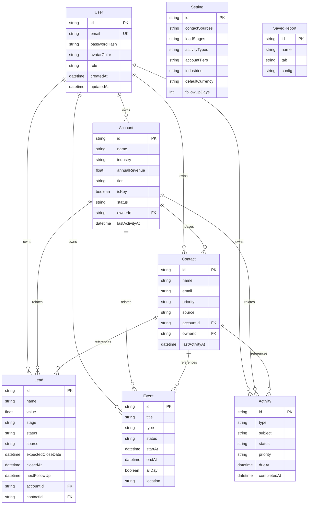

# NEO CRM — Master Project Architecture Document (PAD) v1.0

**Classification:** Internal Engineering Reference
**Status:** DEFINITIVE, PRODUCTION-LOCKED BLUEPRINT
**Companion Document:** `README.md` (onboarding), `AGENTS.md` (agent contract), `CLAUDE.md` (workflow reference)
**Last Updated:** 2026-09-29
**Audience:** Senior Engineers, Tech Leads, DevOps, and Onboarding Engineers
**Rule:** Every architectural decision in this document traces to a specific rationale.
Nothing is here "because it's popular."

---

## Table of Contents

1. [System Overview & Decisions](#1-system-overview--decisions)
2. [High-Level System Topology](#2-high-level-system-topology)
3. [Application Architecture](#3-application-architecture)
4. [Data Architecture](#4-data-architecture)
5. [Design System Reference](#5-design-system-reference)
6. [Security Architecture](#6-security-architecture)
7. [Testing Strategy](#7-testing-strategy)
8. [Build & Deployment](#8-build--deployment)
9. [Developer Handbook](#9-developer-handbook)
10. [Known Issues & Outstanding Tasks](#10-known-issues--outstanding-tasks)
11. [Key Files Reference](#11-key-files-reference)
12. [Glossary](#12-glossary)

---

## 1. System Overview & Decisions

### 1.1 Document Metadata & Purpose

NEO CRM is a faithful, self-hosted clone of the reference CRM workspace at
`https://neo-crm-8ab2c17c.base44.app/` (recon artifacts in `docs/`), rebuilt
on an open, single-process stack. Use this PAD to understand how the system is
wired, why each choice was made, and where the sharp edges are. A new engineer
should read sections 1–3 then skim 9; anyone debugging auth, the SQLite path
resolution, or the mobile navigation should read sections 3.3 and 6 in full.

The clone deliberately diverges from the reference in exactly one behavioral
area: **mobile navigation**. The reference app hides its sidebar below `md`
(768px — session-7 live verification at 900/700px) and ships no replacement
— phone users cannot reach any page. NEO CRM implements a focus-trapped
slide-out drawer (covering `< md` only) and pins it with a dedicated E2E
regression suite.

### 1.2 Technology Stack Summary

| Layer | Technology | Version | Key Rationale |
| ----- | ---------- | ------- | ------------- |
| Web framework | Next.js (App Router) | 16.3.6 | Single-process RSC + API routes; async `cookies()`/`params`; standalone output for self-contained deploys |
| UI runtime | React | 19.3 | Async params, `inert` as a boolean prop, no `forwardRef`; lint-enforced hook discipline |
| Language | TypeScript | 5.9 | Strict mode (except `noImplicitAny: false`, sandbox default); explicit `typecheck` gate compensates for `ignoreBuildErrors` |
| Styling | Tailwind CSS | 4.3.3 | CSS-first `@theme` tokens; zero JS config; validated against `docs/Tailwind-V4-Validation-Report.md` |
| Animation | tw-animate-css (vendored) | 1.4.0 | npm package exposes only the `style` export condition — unsupported by Turbopack, so the dist CSS is vendored |
| UI primitives | Radix UI | per-package | Dialog, Popover, Select, Label, Slot already in scaffold; hand-rolled tabs/tables/checkboxes with native ARIA |
| Charts | recharts | 2.15.4 | Matches reference chart anatomy (SvgRoot layout); React-19 compatible |
| Icons | lucide-react | 0.525 | Sole icon set; two-class stroke system (nav 1.8 / content 2.0) |
| ORM | Prisma | 6.19.3 | Schema-first single-file model; `db push` keeps zero-migration dev loop |
| Database | SQLite | (libsqlite) | Zero-config local story; path resolution normalized in `src/lib/db-path.ts` |
| State | Zustand | 5.0.15 | One client store for all server state — no React Query/SWR layer to keep in sync |
| Unit tests | Vitest | 5.0 | Fast node-environment seam tests; `@` alias resolution |
| E2E tests | Playwright | 1.63 | Real Chromium against the standalone production build on :3100 |

### 1.3 Architecture Decision Records (ADRs)

**ADR-001: Next.js 16 App Router single app (no monorepo)**

- **Context:** The reference is a single-page platform app; the operator
  wants a self-contained clone that runs with one command and pushes to one
  repo. The sibling scandihaven project demonstrates a pnpm/Turborepo
  monorepo, but its multi-package overhead buys nothing at this scope.
- **Decision:** One Next.js application; `src/app` route groups partition
  public (`/login`, `/signup`) from authenticated (`(app)`) surfaces; API
  handlers live under `src/app/api`.
- **Rationale:** Single deploy artifact, one lockfile, one test runner;
  the `(app)` layout guard replaces a middleware/proxy entirely.
- **Consequences:** + Simple mental model, trivial local setup. − No
  independent scaling of API vs UI (acceptable: SQLite is single-node anyway).
- **Alternatives Rejected:** Turborepo monorepo (scandihaven pattern) —
  premature at this scale; separate Express API — loses RSC and doubles
  surface area.

**ADR-002: Prisma + SQLite with normalized relative-path resolution**

- **Context:** The Prisma CLI resolves relative `file:` URLs against
  `prisma/schema.prisma`, but the runtime resolves them against the process
  CWD — and the standalone server chdirs into `.next/standalone`. Without
  normalization, dev, CLI and production land on three different database
  files (this failure was observed live during E2E bring-up). A second
  hazard surfaced in the session-2 audit: **bun loads `.env` for every
  `bun run`/`bun x` process and rewrites a relative `file:` DATABASE_URL
  into an absolute path resolved against the `.env` file's own directory** —
  with the root contract `file:../db/custom.db` that is one directory
  OUTSIDE the repo, and absolute URLs pass through the resolver untouched
  (observed live: the dev server opened `<parent-of-repo>/db/custom.db`).
- **Decision:** `src/lib/db-path.ts` re-implements the CLI rule at runtime
  (anchor order: standalone-CWD detector → module repo-root validator →
  plain CWD with an existence guard). Validated anchors `mkdir -p` the
  `db/` folder (first boot). `runtimeDatabaseUrl()` additionally parses the
  `.env` at the process CWD and, when the env var is exactly bun's
  absolutization of the `.env` value, re-derives the URL from the RAW value
  via the schema rule; any other env value (e2e override, postgres, an
  intentional absolute path) wins untouched. `src/lib/db.ts`,
  `prisma/seed.ts` and the `scripts/prisma-env.ts` wrapper (`db:push`) all
  derive their URL through this seam, so every consumer lands on
  `<repo>/db/<name>`.
- **Rationale:** Keeps `DATABASE_URL=file:../db/custom.db` working
  identically across `next dev`, `next build`, `next start`, Prisma CLI and
  the Playwright webServer — pinned by `tests/db-path.test.ts` (16 checks:
  urlForRoot first-boot mkdir, parseEnvFile, effectiveDatabaseUrl
  re-anchoring, runtimeDatabaseUrl discovery, plus the original passthrough
  and anchoring contract).
- **Consequences:** + Zero-config dev, no migration ceremony. − SQLite is
  single-writer; swapping to PostgreSQL later means changing the datasource
  block and re-verifying the path seam.
- **Alternatives Rejected:** Drizzle + Postgres 17 (scandihaven stack) —
  requires a running database service; absolute production paths in `.env` —
  cwd-fragile in containers; `prisma/.env` split — bun keeps loading the
  root `.env` first, so the split does not remove the hazard (verified
  empirically); `bun --env-file` in scripts — the flag does not chain into
  `bun x prisma` invocations.

**ADR-003: Hand-rolled scrypt + HMAC cookie sessions (no auth library)**

- **Context:** Two authenticated surfaces exist (login page + 22 route
  handler files). NextAuth/Better-Auth pull provider abstractions, adapters
  and their own DB schema for what is, here, a single email/password flow.
  The scaffold family already standardizes a minimal hand-rolled pattern.
- **Decision:** `src/lib/auth.ts`: scrypt password hashes
  (`scrypt:salt:hash`), HMAC-SHA256-signed stateless cookie `neo_session`
  (7-day TTL), `verifySessionToken` with `timingSafeEqual`, `requireSession()`
  guard used by every handler, login/signup rate-limited 10/IP/15min.
- **Rationale:** ~129 auditable lines, zero extra dependencies, no external
  identity provider needed for a self-hosted clone; the reference's Google
  button is rendered for parity but degrades to an explanatory toast (no
  OAuth credentials exist in a self-hosted clone — documented deviation, not
  a silent failure).
- **Consequences:** + No library churn, full control of cookie flags.
  − Rotating `AUTH_SECRET` invalidates all sessions (acceptable, documented);
  no SSO until deliberately added.
- **Alternatives Rejected:** NextAuth v4 (in scaffold's allowed stack) —
  adapter + provider ceremony outweighs a two-field login; Better-Auth —
  same, plus its own migration story.

**ADR-004: One Zustand store for all server state + `{ok,data}` envelope**

- **Context:** Nine entity pages all need the same slices (accounts,
  contacts, leads, activities, events, settings, dashboard, users), plus
  cross-cutting concerns (global search, quick-create from anywhere).
  Introducing React Query would add cache keys, retries and hydration rules
  for a dataset that fits in memory and is only mutated by one user at a
  time.
- **Decision:** `src/stores/crm-store.ts` — a single store with a `call()`
  fetch client that understands the envelope, `hydrate()` bootstrapping every
  slice after `/api/auth/me`, and per-entity CRUD actions that refresh the
  affected slices. All 22 API handlers respond with `ok()`/`fail()` from
  `src/lib/api.ts`.
- **Rationale:** One place to reason about client cache; mutations always
  leave the store internally consistent (action → API → refetch slice);
  envelope gives uniform error UX via toasts.
- **Consequences:** + No query-key sprawl; trivially greppable data flow.
  − Refetch granularity is per-slice, not per-item (fine at demo scale).
- **Alternatives Rejected:** TanStack Query — cache complexity without a
  multi-user freshness requirement; React Context — re-render storms.

**ADR-005: Tailwind v4 CSS-first with literal-hex tokens and vendored animation CSS**

- **Context:** Tailwind v4 removes the JS config; its documented pitfalls
  (`@theme` `var()` chains silently dropped; `hidden` attribute overriding
  display utilities; plugin/PostCSS misconfiguration producing "flat look")
  were validated in `docs/Tailwind-V4-Validation-Report.md`. The scaffold
  shipped **without `postcss.config.mjs`**, which silently disabled the
  entire pipeline (observed: fully unstyled pages with parse warnings at the
  `@theme` directive). The `tw-animate-css` npm package additionally exposes
  only the `style` export condition, which Turbopack's CSS resolver rejects.
- **Decision:** All design tokens are literal hex in one `@theme` block
  (`src/app/globals.css`); custom utilities via `@utility`; the PostCSS
  config pins `@tailwindcss/postcss`; `tw-animate-css` is vendored at
  `src/app/vendor/tw-animate.css` and imported relatively.
- **Rationale:** Each rule prevents an observed failure: missing PostCSS
  config → unstyled app; package import → `Module not found: Can't resolve
  'tw-animate-css'`; `var()` chains → silently dropped tokens.
- **Consequences:** + Reproducible styling pipeline. − Animation library
  updates require re-vendoring (tracked in Known Issues).
- **Alternatives Rejected:** `@config` bridge to a JS config — legacy path,
  loses v4 features; `tailwindcss-animate` JS plugin — not loadable
  CSS-first.

**ADR-006: Mobile navigation drawer (deliberate fix over the reference)**

- **Context:** Verified on the live reference at 390×844: below `md` the
  sidebar vanishes and the only interactive chrome is the avatar dropdown
  (Profile/Logout). No hamburger, no drawer — the app is unusable on phones.
- **Decision:** `src/components/layout/mobile-nav.tsx` — always-mounted
  drawer (`inert` + `visibility:hidden` when closed so it is removed from
  tab order and from Playwright/AT visibility), CSS-transform slide
  animation, focus trap with Tab cycling, Escape close with focus restore,
  dual scroll-lock with original-value cleanup (`document.body` AND the
  `main` scroller — since session 6 `main` is the app's scroll container),
  close-on-route-change via
  adjust-during-render (React 19 lint-safe), and auto-close when the viewport
  grows past `md` (session-7: the drawer and trigger are `md:hidden`,
  matching the reference sidebar's `hidden md:flex`). Pinned by
  `tests/e2e/mobile-navigation.spec.ts` (5 checks, 390px viewport).
- **Rationale:** Restores the primary navigation affordance the reference
  lost; every behavior maps to a documented Tailwind-v4/React-19 failure
  class in the skills research (overlay clipping, z-index wars, scroll-lock
  leaks, setState-in-effect).
- **Consequences:** + Phone users get full navigation; regression suite
  prevents silent reintroduction. − One more layout component to keep in
  sync with the sidebar (shared `SidebarNav` keeps them in lockstep).
- **Alternatives Rejected:** Bottom tab bar — diverges visually from the
  reference sidebar; no fix (reference behavior) — unacceptable.

**ADR-007: React-19-lint-clean dialog patterns (remount-via-key)**

- **Context:** The scaffold's ESLint enforces `react-hooks/set-state-in-effect`
  as an error. The classic "reset form state when the dialog opens" effect
  violates it; naive fixes (refs, flags) just move the smell.
- **Decision:** Every entity dialog (`src/components/shared/entity-dialogs.tsx`)
  is split into a shell + form: the shell mounts the form only while open,
  keyed by entity id; the form initializes **all** state via `useState`
  initializers at mount. No dialog component contains a single effect-based
  setState.
- **Rationale:** The pattern is the React-docs-sanctioned way to "reset state
  with a key"; it is also bug-free against double-open / switch-edit-target
  races, and keeps the store's settings snapshot as the single source for
  defaults.
- **Consequences:** + Zero lint suppressions; predictable form lifecycles.
  − Slightly more files/props than an effect-based reset.
- **Alternatives Rejected:** Guarded setState-in-render inside one component
  — legal but fragile under concurrent rendering; disabling the rule —
  erodes the repo-wide guarantee.

---

## 2. High-Level System Topology


Runtime characteristics: a single Node/Bun process serves RSC pages, route
handlers and static chunks. Scaling is vertical only (SQLite is
single-writer); horizontal scaling requires the PostgreSQL swap documented in
ADR-002 consequences. There are no background workers, queues or external
service dependencies — every external integration point (email, OAuth) is a
documented graceful degradation.

---

## 3. Application Architecture

### 3.1 The Layer Model

```
Layer 0: Browser — the only "use client" leaves (AppShell, pages, dialogs,
         charts, store). Rule: client code never imports Prisma or lib/db.
Layer 1: RSC pages + (app) layout — resolve the session server-side,
         redirect unauthenticated visits, render client islands with props.
         Rule: no data fetching happens here beyond the session; pages own
         their data through the store.
Layer 2: API route handlers — 22 files / 34 handlers (incl. `PATCH
         /api/users` for the profile Full-Name edit), all `force-dynamic`,
         all guarded by `requireSession()` (except auth/login, auth/signup,
         health, search's public shell). Rule: hand-rolled validation at the
         boundary; return the envelope, never throw across it.
Layer 3: Pure seams (src/lib) — auth, api envelope, db + db-path, format,
         csv, constants, rate-limit, download. Rule: unit-tested; handlers
         and pages import these instead of inlining logic.
Layer 4: Persistence — Prisma singleton over SQLite. Rule: import `db` from
         "@/lib/db" only; never construct PrismaClient directly.
```

**Golden Rule:** dependencies point strictly downward (Browser → RSC → API →
seams → Persistence). The store is the sole Browser-side data gateway; the
envelope is the sole wire format.

### 3.2 Annotated Directory Structure

```
neo-crm/
├── prisma/
│   ├── schema.prisma            # 8 models; SQLite datasource
│   └── seed.ts                  # idempotent demo workspace (in-place wipe + insert)
├── src/
│   ├── app/
│   │   ├── (app)/               # session-guarded route group
│   │   │   ├── layout.tsx       # getSessionUser → redirect("/login") → AppShell
│   │   │   ├── page.tsx         # Dashboard: KPIs, filters, charts, lists, recent deals
│   │   │   ├── accounts/        # tier checkboxes, owner/industry/revenue filters
│   │   │   ├── contacts/        # sortable table, scan-card + CSV import dialogs
│   │   │   ├── leads/           # 7-stage pipeline + 3 charts + funnel
│   │   │   ├── calendar/        # month grid, agenda, per-day events, type filters
│   │   │   ├── activities/      # quick-log buttons, priority tabs, timeline
│   │   │   ├── reports/         # 5 analytics tabs, period/owner/stage/status filters
│   │   │   ├── settings/        # picklist editors, defaults, data/danger zone
│   │   │   └── profile/         # account card + workspace footprint
│   │   ├── api/                 # auth(4) users accounts contacts leads
│   │   │                       # activities events dashboard reports settings
│   │   │                       # search export reset health — 22 route files
│   │   ├── login/ signup/       # public auth pages (redirect away when signed in)
│   │   ├── not-found.tsx        # server 404 wrapper (absolute title) — session-12
│   │   ├── not-found-body.tsx   # client 404 body (usePathname, quoted-path msg)
│   │   ├── layout.tsx           # root: Inter font, metadata, Toaster
│   │   ├── globals.css          # Tailwind v4 @theme tokens + @utility definitions
│   │   └── vendor/tw-animate.css# vendored animation utilities (ADR-005)
│   ├── components/
│   │   ├── layout/
│   │   │   ├── app-shell.tsx    # sidebar + topbar + drawer composition, hydrate()
│   │   │   ├── sidebar.tsx      # SidebarNav + BrandMark (shared desktop/mobile)
│   │   │   ├── topbar.tsx       # global search, notifications, user dropdown
│   │   │   ├── mobile-nav.tsx   # THE drawer fix (ADR-006)
│   │   │   ├── nav-config.ts    # nav items (single source for both chromes)
│   │   │   └── login-card.tsx   # signin/signup card + Google parity button + the in-place reset-password flow (session-11)
│   │   ├── ui/                  # button input card dialog select dropdown table
│   │   │                       # tabs badge label(+checkbox) avatar toast misc
│   │   ├── charts/charts.tsx    # recharts wrappers at the DOM-pinned per-surface heights (300/250/150) with stock defaults (tooltip + legend)
│   │   └── shared/
│   │       ├── page-parts.tsx   # PageHeader, KpiCard, BarStatCard, TrendStatCard, IconStatCard, CircleStatCard, Sparkline (bare-shadow stat family; recharts monotone sparks — session-12)
│   │       └── entity-dialogs.tsx # remount-via-key forms (ADR-007)
│   ├── lib/                     # the pure seams (Layer 3)
│   ├── stores/crm-store.ts      # single Zustand store + call() client
│   └── types/index.ts           # wire types shared by API and client
├── tests/
│   ├── *.test.ts                # 15 Vitest suites — 262 checks
│   └── e2e/                     # global-setup, auth.setup, 3 spec files — 31 checks
├── docs/                        # validation report, SSH runbook, screenshots
├── next.config.ts               # standalone output + traced prisma root
└── postcss.config.mjs           # @tailwindcss/postcss — REQUIRED (ADR-005)
```

### 3.3 Critical Code Patterns

**Pattern 1 — The session guard (every handler, every page shell)**

```ts
// src/lib/api.ts — guard returns either the user or a ready-to-return 401.
export async function requireSession(): Promise<{ user: SessionUser } | { response: NextResponse }> {
  const user = await getSessionUser();
  if (!user) return { response: ERR.UNAUTHORIZED() };
  return { user };
}

// Typical handler usage — the isGuarded() narrowing keeps it two lines:
export async function GET() {
  const guard = await requireSession();
  if (isGuarded(guard)) return guard.response;
  const rows = await db.account.findMany({ /* … */ });
  return ok(rows);
}
```

*Why this pattern:* avoids the double-`await getSessionUser()` that a
`getSessionUser() ?? throw` API would force, keeps TypeScript narrowing
explicit, and makes the guard visible as the first statement of every
handler — greppable in security review.

**Pattern 2 — SQLite path normalization (the seam that keeps dev/prod/e2e identical)**

```ts
// src/lib/db-path.ts — mirror the Prisma CLI rule: relative file: URLs
// resolve against prisma/schema.prisma, not process.cwd().
const anchors: Array<() => string | null> = [
  repoRootFromStandaloneCwd, // cwd contains ".next" (standalone chdir) → repo is two levels up
  repoRootFromModule,        // this file's repo root, validated by schema.prisma on disk
  () => process.cwd(),       // last resort
];
for (const anchor of anchors) {
  const root = anchor();
  if (!root) continue;
  const candidate = join(root, "prisma", ref); // same shape the CLI computes
  if (existsSync(candidate) || existsSync(dirname(candidate))) return `file:${candidate}`;
}
```

*Why this pattern:* without it, `next dev`, `next build`, the standalone
server and the Playwright webServer each resolve `file:../db/custom.db`
against a different CWD and silently create/read different database files —
observed live as "login works but the dashboard redirects to /login"
(API chunk and page chunk held different stale handles).

**Pattern 3 — Remount-via-key dialogs (React-19-lint-clean forms)**

```tsx
// src/components/shared/entity-dialogs.tsx — shell mounts the form only
// while open, keyed by entity id; the form owns NO effects that setState.
export function AccountDialog({ open, onOpenChange, account }: Props) {
  return (
    <Dialog open={open} onOpenChange={onOpenChange}>
      <DialogContent className="max-w-xl">
        <DialogHeader>…</DialogHeader>
        {open && (
          <AccountForm key={account?.id ?? "new"} account={account ?? null} … />
        )}
      </DialogContent>
    </Dialog>
  );
}

function AccountForm({ account }: { account: Account | null; … }) {
  const { settings, users } = useCrmStore();
  const [form, setForm] = React.useState(() => ({
    tier: account?.tier ?? settings?.defaultTier ?? "B", // settings snapshot at mount
    /* … */
  }));
  // …
}
```

*Why this pattern:* `react-hooks/set-state-in-effect` is an ERROR in this
repo. Keyed remount gives every open a pristine form initialized from
props/store — no reset effects, no stale-field bugs when switching the edit
target, and the store's settings snapshot is read exactly once.

**Pattern 4 — Mobile drawer lifecycle (the reference-app fix)**

```tsx
// src/components/layout/mobile-nav.tsx — close on route change WITHOUT
// setState-in-useEffect: adjust state during render (React 19 sanctioned).
const [prevPathname, setPrevPathname] = React.useState(pathname);
if (prevPathname !== pathname) {
  setPrevPathname(pathname);
  if (open) onOpenChange(false);
}
// …
// Closed state must be a real "hidden": inert removes it from the a11y tree
// and tab order; visibility:hidden (transitioned) keeps the slide-out
// animation while making `toBeHidden()` semantics honest for AT + tests.
<div
  className={cn("fixed inset-0 z-50 transition-[visibility] duration-300 lg:hidden",
    open ? "visible" : "invisible pointer-events-none")}
  role="dialog" aria-modal="true" inert={!open}
>
```

*Why this pattern:* every line answers a documented failure class —
Tailwind v4's `hidden`-attribute trap, scroll-lock leaks without cleanup,
focus left behind in a removed subtree, and drawers that stop closing when
JS state desyncs from the URL.

---

## 4. Data Architecture

### 4.1 Database Schema



Field notes: picklists (sources, stages, industries…) are stored as JSON
strings on the `Setting` singleton — settings round-trip as arrays through
`/api/settings`, parsed defensively with fallbacks. `Lead.status` is derived
from `stage` (`won`→`closed_won`, `lost`→`closed_lost`, else `open`) and
written transactionally by the API on every stage change. All relation
deletes are `SetNull` except `Activity→Account` and `Event→Account`
(`Cascade`) — deleting an account keeps its people but removes its logged
activities/events.

### 4.2 Data Models

Wire types live in `src/types/index.ts` (User, Account, Contact, Lead,
CrmEvent, Activity, Settings, SavedReport, plus the computed aggregates
`DashboardData` and `ReportsData` with their KPI shapes). Dates serialize as
ISO strings; `null` is used (never `undefined`) on the wire for optional
fields so JSON round-trips are lossless.

### 4.3 Persistence Strategy

- **Client instantiation:** one `PrismaClient` per process via
  `globalThis.__neoCrmPrisma` (`src/lib/db.ts`) — hot reload safe.
- **Schema evolution:** `bun run db:push` (no migrations directory). The seed
  (`prisma/seed.ts`) is idempotent: it wipes domain tables and reinserts —
  **in place**, never by deleting the file (a live server keeps reading the
  deleted inode; this exact failure was diagnosed and fixed during E2E
  bring-up).
- **Indexes:** every foreign key and every filtered column (`stage`,
  `status`, `dueAt`, `startAt`, `name`, `email`) is indexed.
- **Derived aggregates:** dashboard/report computations run server-side in
  their route handlers (single pass over leads/activities/users) — no
  SQL aggregates to port if the datasource changes.

---

## 5. Design System Reference

### 5.1 Typographic System

| Role | Face | Notes |
| ---- | ---- | ----- |
| Everything | **Inter** (`next/font/google`, `--font-inter`) | Single family; weight/size carry hierarchy |
| KPI values | Inter 600, 28px, tight tracking | `text-[28px] font-semibold tracking-tight` |
| Card titles | Inter 600, 14px | `CardTitle` |
| Table headers | Inter 500, 12px, uppercase, wide tracking | muted color |
| Body/base | Inter 400, 14px | set on `body` in `globals.css` |

### 5.2 Color Tokens

Defined as **literal hex** in the single `@theme` block
(`src/app/globals.css`) — `var()` chains inside `@theme` are silently
dropped by the v4 build (validated in
`docs/Tailwind-V4-Validation-Report.md`).

| Token | Hex | Usage |
| ----- | --- | ----- |
| `--color-sidebar` | `#2563eb` | Sidebar/drawer background (measured from reference) |
| `--color-primary` | `#3b82f6` | Primary buttons, active states, focus rings |
| `--color-background` | `#f9fafb` | App canvas |
| `--color-surface` | `#ffffff` | Cards, topbar, dialogs |
| `--color-foreground` | `#111827` | Primary text |
| `--color-muted` | `#6b7280` | Secondary text |
| `--color-subtle` | `#9ca3af` | Placeholders, tertiary text |
| `--color-line` | `#e5e7eb` | Borders, dividers |
| `--color-line-soft` | `#f3f4f6` | Hover fills, input fills |
| `--color-success` | `#10b981` | Won stage, positive deltas |
| `--color-warning` | `#f59e0b` | Proposal stage, key-account badges |
| `--color-danger` | `#ef4444` | Destructive actions, lost stage, overdue |
| Chart palette (stage/type hex) | `#3b82f6 #06b6d4 #eab308 #f97316 #9ca3af …` | Meta colors in `constants.ts` (session-4 DOM-pinned: Proposal yellow-500, Won grey-400) |
| Stat-bar palette (-400 family) | `#60a5fa #4ade80 #22d3ee #c084fc #f87171 #fbbf24` | Stat-card mini bars (accounts/activities/dashboard KPI strips), pinned by `tests/constants.test.ts` |
| Dialog/filter vocabularies (session-5) | Status: New/Contacted/Qualified/Unqualified · Sources: Call/Email/Website/Partner + 5 emoji contact sources · Event types: Meeting/Call/Demo/Task/Reminder/Appointment | DOM-extracted from the live dialogs, pinned by `tests/constants.test.ts` |

Contrast: all text pairs (`#111827`, `#6b7280` on `#ffffff`/`#f9fafb`)
exceed WCAG AA; the sidebar's `#ffffff`-on-`#2563eb` exceeds AA at nav sizes.

### 5.3 Component Primitives

Radix primitives (dialog, popover-based dropdown, select, label, slot) under
`src/components/ui/` with NEO CRM styling; tabs, tables, checkboxes, avatars
and toasts are hand-rolled with native ARIA (`role="tablist/tab/tabpanel"`,
`role="status"` toasts, native checkbox inputs). z-index scale: topbar `z-40`,
drawer/dialogs `z-50`, dropdown portals `z-[60]`, toasts `z-[100]`.

### 5.4 Motion / Animation

Dialog/dropdown enter-exit from the vendored `tw-animate-css`
(`data-[state=open]:animate-in`, `fade-in-0`, `zoom-in-95`); the mobile
drawer slides via a CSS `transition-transform` on a `translate-x` toggle with
a matched `transition-[visibility]` (so the closed state is truly hidden
after the animation completes). `prefers-reduced-motion: reduce` collapses
all animations to 0.01ms via a global media rule.

---

## 6. Security Architecture

### 6.1 Security Rules

| # | Rule | Enforcement |
| - | ---- | ----------- |
| 1 | Every API handler (except `auth/login`, `auth/signup`, `health`) requires a valid session | `requireSession()` first statement; grep-verified across all 22 files |
| 2 | Authenticated page group unreachable without a session | `(app)/layout.tsx` server redirect |
| 3 | Passwords stored as `scrypt:salt:hash` (64-byte derived key) | `hashPassword()` only; no plaintext paths exist |
| 4 | Session tokens HMAC-SHA256 signed, `timingSafeEqual` compared, 7-day TTL | `signSession` / `verifySessionToken` (unit-tested) |
| 5 | Cookies `HttpOnly`, `SameSite=Lax`, `Secure` in production, `Path=/` | `setSessionCookie` |
| 6 | Login + signup rate-limited 10 attempts / IP / 15 min | fixed-window limiter + `Retry-After` on 429 |
| 7 | All inputs trimmed, length-capped, enum-checked; IDs existence-checked | `asString/asNumber/asDate/asOneOf` + per-handler referential checks |
| 8 | Destructive reset requires typing `RESET` + explicit confirm | `/api/reset` + Settings danger zone |
| 9 | No secrets in git (`.env`, `*.key`, `db/*.db` ignored; `.env` untracked) | `.gitignore` + SSH wrapper runbook (keys never inside the repo) |
| 10 | No `console.log` of secrets / tokens in shipped code | review + envelope error messages are user-safe |

### 6.2 Security Utilities

`src/lib/auth.ts` (scrypt, HMAC, cookie lifecycle), `src/lib/rate-limit.ts`
(fixed-window limiter with sweeper), `src/lib/api.ts` (guard + validation
coercers). The Prisma client parameterizes all queries (no raw SQL except
the health probe's `SELECT 1`).

### 6.3 Authentication & Authorization

Stateless cookie sessions (ADR-003). Roles: `admin` (first user) vs `rep` —
currently informational (owners/filters), no route-level RBAC yet (tracked
in Known Issues). The signup endpoint assigns `admin` to the first user only
(bootstrap); subsequent users are `rep`.

### 6.4 Threat Model

| Vector | Mitigation |
| ------ | ---------- |
| Credential stuffing | rate limiter + constant-time token compare + generic error copy |
| Session forgery/tampering | HMAC + `timingSafeEqual`; 64-hex signatures |
| XSS | React auto-escaping; no `dangerouslySetInnerHTML` in app code; notes rendered as text |
| CSRF on mutations | `SameSite=Lax` cookies + JSON-only endpoints (cross-site form posts can't shape the body); no GET mutates anything except the explicit `?download=1` CSV export |
| SQLi | Prisma parameterization everywhere |
| Clickjacking | No embedded frames by design; standard `X-Frame-Options`/CSP left to the edge proxy (documented in Deployment) |
| Data loss | Danger-zone reset is double-gated (typed confirm + API confirm); backups are file-copies of `db/custom.db` (documented) |

---

## 7. Testing Strategy

### 7.1 Test Distribution

| Category | Files | Checks | Location | Framework |
| -------- | ----- | ------ | -------- | --------- |
| Unit — db-path | 1 | 16 | `tests/db-path.test.ts` | Vitest |
| Unit — auth | 1 | 9 | `tests/auth.test.ts` | Vitest |
| Unit — avatar | 1 | 5 | `tests/avatar.test.ts` | Vitest |
| Unit — format | 1 | 23 | `tests/format.test.ts` | Vitest |
| Unit — csv | 1 | 8 | `tests/csv.test.ts` | Vitest |
| Unit — rate-limit | 1 | 6 | `tests/rate-limit.test.ts` | Vitest |
| Unit — chart palette + vocabularies (DOM-pinned; + session-10 reports vocab) | 1 | 12 | `tests/constants.test.ts` | Vitest |
| Unit — leads-filters seam (session-8) | 1 | 12 | `tests/lead-filters.test.ts` | Vitest |
| Unit — layout + chrome + anatomy contracts (DOM-pinned, sessions 6–17) | 1 | 175 | `tests/page-layout.test.ts` | Vitest |
| Unit — design tokens (shadow/blur/border-split/foreground/base-font re-pins, ring, cursor rule, inks, th/td platform reset — sessions 9–16) | 1 | 15 | `tests/design-tokens.test.ts` | Vitest |
| Unit — reports-data seam (aging, forecast accuracy, month series — session-10) | 1 | 7 | `tests/reports-data.test.ts` | Vitest |
| Unit — login-reset seam (view swaps, submit gating — session-11) | 1 | 14 | `tests/login-reset.test.ts` | Vitest |
| Unit — page-titles (auth absolute titles — session-13) | 1 | 2 | `tests/page-titles.test.ts` | Vitest |
| Unit — charts-contracts (dashed grid + funnel type — session-13) | 1 | 4 | `tests/charts-contracts.test.ts` | Vitest |
| Unit — profile-route (the /Profile casing alias — session-14) | 1 | 4 | `tests/profile-route.test.ts` | Vitest |
| Unit — metadata (the siteUrl seam + SITE_DESCRIPTION + OG/Twitter/icon/sitemap/robots pins — session-18) | 1 | 14 | `tests/metadata.test.ts` | Vitest |
| Unit — pwa-metadata (the manifest route-handler bytes + theme-color/PWA_META + the apple-icon convention + the pageMetadata() per-route factory + the dialog micro-contracts — session-19) | 1 | 14 | `tests/pwa-metadata.test.ts` | Vitest |
| E2E — auth (logged out + the reset-password flow) | 1 | 5 | `tests/e2e/auth.spec.ts` | Playwright |
| E2E — setup (login) | 1 | 1 | `tests/e2e/auth.setup.ts` | Playwright |
| E2E — golden path (+ titles, reports tabs, chart geometry, custom 404, account menu, funnel, by-type, settings Defaults/Data + /Profile alias, entity-dialog geometry, the session-16 responsive layer, the session-17 stock button/checkbox layer, the session-18 document-metadata layer, the session-19 PWA + per-route metadata layer — sessions 10–19) | 1 | 43 | `tests/e2e/crm.spec.ts` | Playwright |
| E2E — mobile nav regression (+ focus entry — session 12) | 1 | 7 | `tests/e2e/mobile-navigation.spec.ts` | Playwright |
| **Total** | **21** | **340 unit + 56 e2e** | | |

### 7.2 Test Patterns

- **Pure-seam unit tests** exercise exported functions with known literals
  (no recomputation of expected values — tautology guard) and pin edge cases
  (expired tokens, end-of-month clamping, BOM stripping, stale-bucket sweep).
- **E2E storageState flow:** the setup project logs in once through the real
  UI and persists cookies to `tests/e2e/.auth/user.json` (also dodges the
  login rate limiter); `auth.spec.ts` opts out with an empty storageState.
- **Isolated E2E database:** `global-setup` pushes + seeds `db/e2e.db`
  **in place** (never deletes the file — see ADR/known-issue on stale
  inodes); the Playwright webServer boots the standalone build on :3100 with
  that database and its own `AUTH_SECRET`.
- **Browser-verified interactivity:** beyond the suites, the dev server was
  driven with agent-browser at 1440px and 390px (login → all 9 pages →
  drawer behaviors) with visual (VLM) checks against the reference
  screenshots.
- **Chart empty-state reversal (session-10):** charts render the REAL
  recharts output at all-zero data — NO placeholder boxes. Fixed lists
  render ticks at zero; row-derived series (via `monthsFromEvents`) render
  empty. The session-1 `ChartEmpty` design is retired; recharts defaults
  apply everywhere (tooltip, ticks 12px #666, dashed "3 3" #ccc grid with
  horizontal AND vertical lines).
- **Login reset flow (session-11):** the reference's "Forgot password?"
  swaps the login card in place (`signin → reset → sent`, no email is
  actually sent — the confirmation is pure client state). `auth.spec.ts`
  drives the full swap on the real build; the view/gating logic is the
  `src/lib/login-reset.ts` seam pinned by `tests/login-reset.test.ts`.
- **Mobile-nav focus race (session-12):** the drawer's initial focus
  RETRIES across frames — the rAF can fire in the same frame as the
  `transition-[visibility]` class flip, before the browser applies the
  visible state, and `focus()` on a still-hidden element silently
  no-ops (keyboard users Tabbed through the background behind the
  aria-modal dialog). The bounded retry verifies `activeElement` landed
  inside the panel; `mobile-navigation.spec.ts` pins it.
- **Border-color split (session-12):** the reference's platform default
  border is #e5e5e5 (neutral-200 — every bare-`border` surface: stock
  cards, table rows, tablists, outline buttons, selects, dialogs, bare
  inputs) with an EXPLICIT gray-200 family (#e5e7eb — reports KPI cards,
  the reports filter card, the contacts table card, the topbar search).
  `--color-line` carries the default, `--color-line-strong` the explicit
  family; login keeps its slate-200 tokens.
- **Custom 404 (session-12):** `src/app/not-found.tsx` (server,
  absolute title) + `not-found-body.tsx` (client, `usePathname`) render
  the reference's designed not-found page — `NOT_FOUND_LAYOUT` pins the
  slate-50 center, the divider bar, the space-y-3 text group with the
  emphasized pathname span, and the pt-6 Go Home group.
- **Tabs + sparkline rebuild (session-12):** the tab strips ship stock
  Radix classes (`TABS_PILL`/`TABS_SEGMENTED` — muted-ink tracks,
  data-state variants, bare-shadow active pills, no hover); the KPI
  sparklines are recharts monotone curves (`KPI_SPARK` — dashboard h-8,
  reports h-12 slot capped 176px, Lost Deals sparkless; solid color-50
  chips via `KPI_CHIP_BG`).
- **Auth absolute titles (session-13):** `/login` and `/signup` had
  RELATIVE titles that the root `"%s | NEO CRM"` template DOUBLED
  (`NEO CRM | NEO CRM` in raw SSR HTML); both ship
  `title: { absolute: … }` — pinned by `tests/page-titles.test.ts`.
- **Dashed grids, corrected (session-13):** the reference passes
  `strokeDasharray="3 3"` explicitly on `#ccc` grid lines on every
  gridded chart — recharts' default grid is SOLID (the session-10
  "dashed default" pin was a misread); `charts-contracts.test.ts` pins
  it on all four grid-bearing charts.
- **Reports funnel type (session-13):** the reports tab-1 "Conversion
  Funnel" is a horizontal `BarChart layout="vertical"`
  (`FunnelBarChart`) — dashed grid, numeric X, category Y with the eight
  raw stage slugs; NOT a recharts FunnelChart (the s10 inference,
  disproven by DOM). The leads-page funnel stays a FunnelChart.
- **Foreground + base font re-pins (session-13):**
  `--color-foreground: #0a0a0a` (was #111827) and the base font-size is
  16px (was 14px — a scaffold-era assumption); page h1s are explicit
  `text-gray-900`; the KPI value drops leading-none/tracking-tight
  (36px line-height, normal letter-spacing); the Label is stock shadcn
  (`text-sm font-medium leading-none`) and DialogTitle stock
  (`text-lg font-semibold leading-none tracking-tight`).
- **Button radius + CardTitle map (session-13):** every button surface is
  `rounded-md` (6px — Button base + lg; login submit keeps its rounded-xl
  family); `CARD.title` = the stock 16px string with per-page overrides
  (dashboard/leads `text-base sm:text-lg`, filter rails + by-type
  `text-base`, settings `text-lg`, reports/profile stock).
- **Account menu + profile + by-type + calendar (session-13):** the
  topbar account menu is a stock Radix DropdownMenu (`role=menu`,
  z-50/rounded-md/shadow-md, items rounded-sm focus:bg-accent); the
  profile page ships the reference's neutral family (bg-gray-50
  disabled inputs, capitalize role, stock Badge on bg-neutral-900,
  `w-full sm:w-auto` stock buttons); the activities by-type card is
  complete (FILTER_RAIL header, static "Last 2 days" subtitle, chips row
  with blue/violet/amber/emerald/teal swatches, border-t checkbox
  footer); calendar day cells keep their border in all three states
  (`bg-gray-50 text-gray-400 transition-all` out-of-month).
- **Build script note (session-13):** `bun run build` = `next build` +
  `cp -r .next/static .next/standalone/.next/` + `cp -r public
  .next/standalone/` — running `next build` bare leaves the standalone
  server without static chunks (all `/_next/static` requests 404 and
  pages never hydrate); always use the package script.
- **Settings Defaults tab (session-14):** the reference's "Default
  Values" card is a SINGLE-COLUMN `space-y-4` stack of six `space-y-2`
  groups with the STOCK CardTitle + the stock CardDescription subtitle
  (`text-sm text-muted-ink`, 14px/#737373) — ours had shipped a
  responsive 3-column grid. The s13 "settings (5) text-lg" CardTitle
  override covers ONLY the five CRM Configuration picklist cards; the
  Defaults (1) + Data (3) cards ride the stock default.
- **Settings Data tab + Danger Zone (session-14):** the template card is
  "Import Templates" (with the prefix); the list bodies are vertical
  `space-y-2` stacks of stock outline default-size buttons
  (`w-full sm:w-auto`, download icon `w-4 h-4`); the Danger Zone is the
  tinted `border-red-200 bg-red-50` surface with the circle-alert
  `w-5 h-5` title on `text-red-700`, a `max-w-xs` confirm input with the
  `mt-2` group-control fix, the destructive button BELOW it (fg
  #fafafa), and NO warning paragraph.
- **The v4 space-y inline-label no-op (session-14):** Tailwind v4's
  space-y flip (margin-BOTTOM on `:not(:last-child)`) lands on an INLINE
  `<label>` — vertical margins on inline elements do not apply, so the
  label→control gap collapsed to ~3px where the reference's v3 semantics
  compute 12px (margin-TOP on the block-level control). Fix: literal
  `space-y-2` group kept + explicit `mt-2` on every control
  (`SETTINGS_DEFAULTS.controlMt` / `SETTINGS_DANGER.controlMt`); the
  label-top-to-control-top distance is 28px on both apps.
- **/Profile casing alias (session-14):** the reference serves both
  casings (its account menu links to `/Profile`); ours ships a thin
  `src/app/Profile/page.tsx` that `redirect("/profile")`s — a
  next.config.ts redirect LOOPS (Next matches redirects
  case-insensitively; `caseSensitive` is not a valid per-redirect
  property in Next 16).
- **line-soft re-pin (session-14):** `--color-line-soft` #f3f4f6 →
  #f5f5f5 (the reference's muted/accent, computed live on the segmented
  tab tracks + a bg-accent probe) — the scaffold-era gray-100 was never
  live-pinned; 27 class usages ride the token.
- **Reference drift (session-14):** the reference REMOVED its signup
  flow (the login Sign-up button is dead and `/signup` renders the 404
  view, SSR title "Signup | NEO CRM") — our functional `/signup` stays
  the documented superset; its logout leaves it on `/` as "Hi, Guest"
  (ours redirects to /login — safer, documented).

- **Entity-dialog geometry layer (session-15):** all five reference
  create dialogs were fully mapped (outerHTML + computed probes at
  1512/390) and the chrome rebuilt to STOCK shadcn: `w-full max-w-lg
  sm:rounded-lg shadow-lg` + slide-in/out animations (0px radius and
  FULL-BLEED width below 640 — our rounded-2xl/shadow-xl/2rem-inset
  retired), the stock `bg-black/80` overlay (no blur), the
  `text-center sm:text-left` header (centered titles on phones), the
  opacity-70 close X, NO DialogDescription and NO placeholders (the
  reference ships neither). Two body families: the max-w-lg dialogs
  (Lead/Account/Contact) use `py-4` grid wrappers + `space-y-2` groups
  (the s14 controlMt fix — 12px/28px geometry both apps), Lead's
  Status+Source 2-col pair, Account's whole-body 2-col grid, Contact's
  gradient-avatar section (live initials + camera + Name inside); the
  max-w-2xl Event/Activity family (672px) uses `space-y-4` forms with
  BARE field divs (4px gaps) + grid-cols-2 pairs + the `pt-4` footer.
  The Event submit is the ONE-OFF blue — expressed through the
  `--primary`/`--primary-hover` TOKENS because v4's literal
  `bg-blue-600` class compiles to a DIFFERENT oklch blue
  (rgb(21,93,252) ≠ the reference's #2563eb) — a new v4 hazard class
  (literal-palette drift), pinned by the DIALOG_FAMILY contracts.

- **The responsive page-root layer (session-16):** the audit went after
  the responsive anatomy — the page-ROOT model, the table kit's stock
  strings, and the calendar card internals. The reference's pages OWN
  their padding (`p-4 sm:p-8 bg-gray-50 min-h-screen` on six pages, bare
  `p-4 sm:p-8` on Leads + Profile, the h-calc flex directly under `main`
  on Contacts) — our blanket AppShell wrapper double-padded the contacts
  full-height layout (358px box at 390 instead of 390, a 294px table
  card instead of 326px, 37px of main scroll instead of the 5px mirrored
  topbar quirk); `PAGE_ROOT` standard/bare + the contacts fullHeight root
  replaced it. The table kit moved to the STOCK strings (container
  `relative w-full overflow-auto`, the checkbox variant classes on
  TableHead/TableCell, `hover:bg-muted/50` → line-soft/50 + the selected
  state) and the platform's global `th, td { padding: 1px }` reset was
  mirrored in the base layer (43px header rows, `8px 1px` compact th).
  FOUR surfaces had a border LEAK — the Card primitive's `border
  border-line` passes through `cn()` untouched (tailwind-merge replaces
  same-property classes only), so the accounts/leads/activities table
  cards + the activities timeline computed a 1px border against the
  reference's plain borderless `bg-white rounded-lg shadow [p-6]` divs;
  TABLE_CARD surfaces never render via Card now (source-pinned). The
  settings picklist grid broke at lg where the reference breaks at md
  (ONE 580px column at 768-1023px vs two 282px cards — a mid-width-only
  divergence; always sweep a mid width). The calendar card was rebuilt
  flat (header row + DOW grid + month grid as three direct children of
  the padded card, `text-xl sm:text-2xl font-bold text-gray-900` title,
  `gap-1 sm:gap-2` responsive gaps, 24px/8px spacing). One documented
  anomaly: a single `/Reports` load served the full demo dataset (an
  instance with data exists behind the platform's load balancer), then
  6/6 loads returned the steady zero state — if a future session catches
  the data instance, the edit-dialog/picklist/upload layers become
  verifiable.

- **The stock button/checkbox layer + the icon-glyph census (session-17):**
  the first ICON-GLYPH census (icon name + SVG path data on every page,
  both apps) found 14 drifted surfaces — the sidebar ships `users` /
  `circle-user` / `calendar` (ours: three different glyphs), the
  Filter/Filters buttons ship the OLD lucide POLYGON funnel (lucide 0.525
  re-exports the redesigned curved Funnel as `Filter`; the polygon is
  exported by NO name → hand-rolled `FilterPolygon` in
  `src/components/ui/icons.tsx`), contacts ships `scan` + a DOWNLOAD
  glyph on Import, the leads/calendar KPI chips ship `circle-check-big` /
  `calendar` / `users`, and the quick-log ships `calendar` +
  `message-square`. LESSON: compare glyph PATH DATA, never names alone —
  renames can hide redesigns and aliases can hide renames. The topbar
  account trigger was rebuilt as the STOCK ghost Button (the hand-written
  trigger had NO focus-visible ring — a keyboard-focus gap) with the
  stock two-level Avatar. Every filter rail's checkbox was rebuilt as
  the stock Radix-style BUTTON (`role=checkbox` + `data-state` + a
  Check indicator mounting only when checked; the reference's checked
  fill computes #171717 — its platform primary is the DARK stock shadcn
  one, not the app blue — so the expression is neutral-900/neutral-50);
  our native inputs never rendered a check glyph at all. The default
  (blue) Button variant moved to the BARE shadow scale (the reference's
  blue primaries compute rgba(0,0,0,.1) 0 1px 3px 0; shadow-sm was one
  step light) and the ghost variant dropped its invented `text-muted`
  (the stock ghost carries no base text color).

- **Time-relative e2e assertions are forbidden (session-18)** — the
  reports suite once pinned the quarter-relative won total (`$542.0k`),
  which silently depended on the seeded close dates falling inside the
  then-current quarter; it detonated on 2026-10-01 when Q4 began and the
  server-side `periodStart()` window emptied. The deterministic pattern:
  drive the period selector to a fixed window (All Time) and pin the
  date-independent value (`7 $687.0K`), or assert structure only.
- **Byte-format metadata routes (session-18)** — `robots.txt` and
  `sitemap.xml` are explicit route handlers (not `app/robots.ts` /
  `app/sitemap.ts`) because Next's serializers drift from the reference's
  bytes: `User-Agent` (capital A) vs the reference's `User-agent`, and
  priority 1.0 serialized as `1`. Pinned by `tests/metadata.test.ts`.
- **The PWA/per-route metadata layer (session-19)** — the same
  byte-format rule extends to `/manifest.json` (`src/app/
  manifest.json/route.ts`, key order mirrored; `app/manifest.ts` would
  re-order) and to THREE new serializer hazards: `metadata.icons`
  REPLACES the file-convention `link[rel=icon]` (both icons ship as file
  conventions — `src/app/icon.png` + `src/app/apple-icon.png`);
  page-level `metadata.other` REPLACES the layout's map (the
  `pageMetadata()` factory re-declares PWA_META + twitter:url per page);
  and Next's URL resolution strips the root canonical's trailing slash
  (accepted as cosmetic serialization). Per-route OG/Twitter + canonical
  are built by the `pageMetadata({ page, route, title? })` factory in
  `src/lib/site.ts` — the reference prefixes every inner page's og
  description with `"<Page> on NEO CRM. "` (live-verified on all 10
  routes). Dialog micro-contracts: Contact Phone `type=tel` (Lead stays
  text — the reference's own split), zero datalists, avatar accept
  `image/jpeg,image/png,image/jpg`. Pinned by
  `tests/pwa-metadata.test.ts`.

### 7.3 Coverage Thresholds

No percentage gate is configured. The working rule: every new pure helper in
`src/lib/` ships with unit tests in the same PR; every user-visible page
change extends the golden-path spec; any change touching the mobile drawer
must keep all 7 regression checks green unmodified.

### 7.4 Pre-PR / Pre-Deploy Checklist

- [ ] `bun run lint` — 0 errors, 0 warnings
- [ ] `bun run typecheck` — clean (the real type gate; build has `ignoreBuildErrors`)
- [ ] `bun run test` — 340/340
- [ ] `bun run build` — standalone build succeeds
- [ ] `bun run test:e2e` — 56/56
- [ ] Mobile drawer manually exercised at 390px (open → navigate → Escape)
- [ ] No new `console.log`, no `window.location.href` outside `download.ts`
- [ ] `git status` clean of `.env`, keys, `db/*.db`

---

## 8. Build & Deployment

### 8.1 Production Build

```bash
bun run build   # next build → .next/standalone/{server.js, traced deps}
                # + copies .next/static and public/ into the standalone tree
bun run start   # NODE_ENV=production bun .next/standalone/server.js (:3000)
```

`next.config.ts` pins `output: "standalone"` and
`outputFileTracingRoot` to the repo root so the traced `prisma/schema.prisma`
copy lands where `src/lib/db-path.ts` expects it. TypeScript/ESLint build
blocking is intentionally off — the explicit `lint`/`typecheck` scripts are
the gate (there is no hosted CI; the local gate is the only gate).

### 8.2 Environment Variables

| Name | Required | Description | Default |
| ---- | -------- | ----------- | ------- |
| `DATABASE_URL` | Yes | SQLite URL; relative paths resolve against `prisma/schema.prisma` (dev-friendly). Use an **absolute** path in production. | `file:../db/custom.db` |
| `AUTH_SECRET` | Prod (≥16 chars) | HMAC secret for `neo_session` cookies. Changing it invalidates all sessions. | insecure dev-only constant |
| `NEXT_PUBLIC_SITE_URL` | No | Canonical origin — consumed via `src/lib/site.ts` for `metadataBase`, the OG/Twitter cards, `robots.txt` and `sitemap.xml` (NEXT_PUBLIC_* values are inlined at build time — set before `bun run build`) | `http://localhost:3000` |
| `E2E_PORT` | No (CI) | Playwright webServer port override | `3100` |

### 8.3 Docker Configuration

None shipped (deliberate — the reference clone targets zero-config hosts).
The standalone server is a single relocatable directory: containerize with
`FROM node:22-alpine`, `COPY .next/standalone`, set `DATABASE_URL` to a
volume-mounted absolute path, `AUTH_SECRET` from a secret, expose 3000.

### 8.4 CI/CD Pipeline

No hosted CI. The pre-push gate (§7.4) is run locally by agents/operators;
pushes go through `docs/ssh_git_wrapper_v3.py` (auth preflight → push →
remote-ref verification → tracking-ref sync → key shred), runbook in
`docs/how-to-git-push-using-ssh-wrapper_SKILL.md`.

---

## 9. Developer Handbook

### 9.1 Local Setup

```bash
bun install
cp .env.example .env
echo "AUTH_SECRET=\"$(openssl rand -hex 32)\"" >> .env
bun run db:push && bun run db:seed
bun run dev          # http://localhost:3000 — demo: sepnetflix2023@outlook.com / $Abcd1234
```

### 9.2 Common Commands

| Command | Location | Purpose |
| ------- | -------- | ------- |
| `bun run dev` | root | Dev server :3000, log tee'd to `dev.log` |
| `bun run lint` / `typecheck` | root | Quality gates (must be 0/0 / clean) |
| `bun run test` | root | 280 unit checks |
| `bun run test:e2e` | root | 37 browser checks (build first) |
| `bunx vitest run tests/auth.test.ts` | root | One suite |
| `bunx playwright test --project=chromium -g "mobile"` | root | Focused E2E |
| `bunx prisma generate` | root | Regenerate client after schema edits |
| `bun run db:push` / `db:seed` | root | Recreate / reseed (in place) |
| `python3 docs/ssh_git_wrapper_v3.py --key-file <k> --remote git@github.com:nordeim/neo-crm.git` | root | Verified push (shim on PATH if no `ssh` binary) |

### 9.3 Code Style Rules

Enforced by `eslint.config.mjs` (flat, next/core-web-vitals + TypeScript).
Notable ERROR-level rules: `react-hooks/set-state-in-effect`,
`react-hooks/rules-of-hooks`, `react-hooks/refs`,
`react-hooks/static-components` — use the repo's established patterns
(remount-via-key, adjust-during-render, module-level components) instead of
suppressions. Formatting is hand-consistent (2-space, double quotes,
semicolons); there is no formatter config to fight.

### 9.4 Git Workflow

`main` only. Conventional Commits with emoji prefixes (`:tada: feat:`,
`:bug: fix:`, `:memo: docs:`). Atomic commits; never commit `.env`/keys/db
files. Push via the SSH wrapper (§8.4).

---

## 10. Known Issues & Outstanding Tasks

| Priority | Issue | Impact | Status |
| -------- | ----- | ------ | ------- |
| LOW | Vendored `tw-animate.css` will not track upstream releases | Manual re-vendor needed on upgrade | Accepted (ADR-005) |
| LOW | `role` field (`admin`/`rep`) is informational — no route-level RBAC | Multi-tenant teams would need authorization checks | Open (single-workspace clone by design) |
| LOW | Rate limiter is per-process (in-memory) | Resets on restart; not shared across instances | Accepted for single-node deploy |
| LOW | "Continue with Google" is visual parity only (toast degradation) | No OAuth credentials in a self-hosted clone | Documented deviation |
| LOW | Scan Card requires a device camera (desktop degrades gracefully) | Feature hint on non-camera hosts | Documented deviation |
| INFO | E2E golden path mutates `db/e2e.db` (created lead) | Isolated scratch DB; dev DB untouched | By design |
| INFO | `.env` was untracked from the scaffold's initial commit | Fresh clones must copy `.env.example` | Documented in README |

---

## 11. Key Files Reference

| File | Lines | Purpose |
| ---- | ----- | ------- |
| `src/stores/crm-store.ts` | 296 | Single Zustand store: hydrate, slices, CRUD actions, `call()` envelope client |
| `src/lib/auth.ts` | 129 | scrypt hashing, HMAC session tokens, cookie lifecycle, `getSessionUser` |
| `src/lib/api.ts` | 75 | `ok`/`fail`/`ERR` envelope, `requireSession` guard, validation coercers |
| `src/lib/db-path.ts` | 175 | SQLite URL normalization (CLI-rule mirroring, bun-absolutization re-anchoring, .env parsing, standalone-safe) |
| `src/lib/db.ts` | 22 | `globalThis` Prisma singleton (the only sanctioned constructor) |
| `src/lib/format.ts` | 221 | Currency/date/relative-time/calendar-grid pure helpers |
| `src/lib/constants.ts` | 172 | Status vocabularies + label/color metadata + chart palette |
| `src/lib/lead-filters.ts` | 90 | Leads Filters popover persist/restore seam — `encodeLeadFilters`/`decodeLeadFilters` pure pair (localStorage key `neo-crm.leads.view`), vocabulary-guarded decoding, pinned by `tests/lead-filters.test.ts` (session-8) |
| `src/lib/login-reset.ts` | 100 | Session-11 login reset-password seam — `LOGIN_RESET_LAYOUT` (the two view contracts: classes for the reset/sent views, the lighter slate-400 placeholder, the `mb-4` v4-correct back-gap), `nextLoginView()` swap table, `canSubmitReset()` gating — pinned by `tests/login-reset.test.ts` |
| `src/lib/reports-data.ts` | ~120 | Session-10 reports derivations — `agingCounts` (fixed 4-bucket aging), `forecastAccuracySeries` (per-month accuracy + the Average Accuracy caption), `monthsFromEvents` (row-derived month series) — pinned by `tests/reports-data.test.ts` |
| `src/lib/page-layout.ts` | 627 | DOM-pinned layout + chrome contracts (KPI grids, page headers, rails, filter bars, shell/sidebar/topbar, login card, stat cards, view switchers, leads filters popover, mobile-nav breakpoint, stock-primitive pins, CHART_GEOMETRY / STAT_SHADOWS / TABLE_SHADOWS / CONTACTS_LAYOUT) consumed by every page — sessions 6–11 |
| `src/lib/csv.ts` | 74 | RFC-4180 serializer/parser (export + import) |
| `src/app/(app)/*/page.tsx` + `*-page.tsx` | — | Session-10 pattern: thin SERVER `page.tsx` wrappers (per-page metadata titles) rendering the renamed client parts — client pages cannot export metadata; per-route `layout.tsx` hit a Next 16 typed-routes bug |
| `src/lib/rate-limit.ts` | 47 | Fixed-window limiter with sweeper |
| `src/components/layout/mobile-nav.tsx` | 170 | THE mobile drawer fix (focus trap, dual scroll lock, inert) |
| `src/components/layout/app-shell.tsx` | 55 | Chrome composition + store bootstrap; session-7 reference model: in-flow `hidden md:flex` sidebar, `flex h-screen` root, `main` the only scroller |
| `src/components/shared/entity-dialogs.tsx` | ~810 | Five entity forms, remount-via-key pattern |
| `src/app/globals.css` | 171 | Tailwind v4 `@theme` tokens + `@utility` definitions |
| `src/app/(app)/layout.tsx` | 12 | Session guard for every authenticated page |
| `prisma/schema.prisma` | 186 | 8 models, SQLite datasource, indexes |
| `prisma/seed.ts` | 349 | Idempotent in-place demo workspace |
| `tests/e2e/mobile-navigation.spec.ts` | ~100 | 5-check mobile drawer regression suite |
| `postcss.config.mjs` | 9 | `@tailwindcss/postcss` — required for any styling at all |
| `next.config.ts` | 24 | standalone output + tracing root |
| `docs/ssh_git_wrapper_v3.py` | 336 | Verified SSH push wrapper (key never in repo) |

---

## 12. Glossary

| Term | Meaning |
| ---- | ------- |
| Reference app | The base44-hosted CRM this project clones (`neo-crm-8ab2c17c.base44.app`) |
| Drawer | The mobile navigation overlay (`mobile-nav.tsx`) — the reference-app fix |
| Envelope | The `{ ok, data } \| { ok, error: { code, message } }` JSON shape every API returns |
| Seam | A pure, unit-tested module boundary in `src/lib/` |
| db-path seam | `src/lib/db-path.ts` — runtime mirror of Prisma's schema-relative `file:` URL rule |
| Stage | Lead pipeline step: `new → contacted → qualified → proposal → negotiation → won/lost` |
| Tier | Account classification `A/B/C` plus the `isKey` flag |
| Quick-log | The Activities page's type-preset Log Call/Email/Meeting/WhatsApp buttons |
| Standalone | Next.js self-contained build output (`.next/standalone/server.js`) used by `bun run start` and E2E |
| StorageState | Playwright's persisted cookie jar (`tests/e2e/.auth/user.json`) shared by the chromium project |
| Stale inode | The failure mode where a live SQLite handle keeps reading a deleted database file — why reseeding must be in-place |
| Vendored CSS | `src/app/vendor/tw-animate.css` — the in-repo copy of tw-animate-css (Turbopack cannot resolve its `style` export) |
