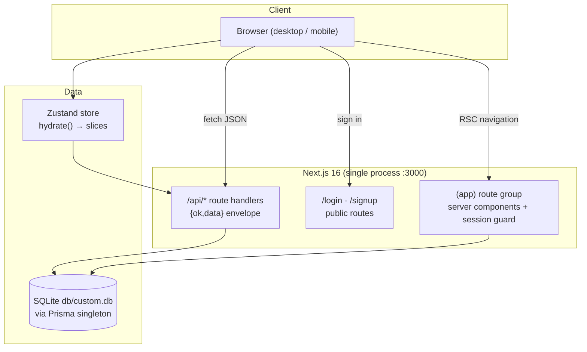

# NEO CRM

[](https://nextjs.org/)
[](https://react.dev/)
[](https://www.typescriptlang.org/)
[](https://tailwindcss.com/)
[](https://www.prisma.io/)
[](#testing)
[](#license)

A complete, self-hostable CRM workspace cloned from the reference app —
accounts, contacts, leads, calendar, activities, analytics and settings in one
clean Next.js application, with the reference app's mobile navigation defect
fixed.

## Overview

The reference CRM lives on a closed platform and ships with a real defect:
below the `lg` breakpoint its sidebar disappears entirely, leaving phone users
unable to reach anything. NEO CRM is a faithful, production-grade clone of
that workspace on an open stack you fully control, and it deliberately fixes
the mobile navigation with a proper focus-trapped drawer. Everything runs from
one process: a Next.js 16 App Router server, a Prisma/SQLite database, and a
seeded demo workspace so the dashboards, charts and reports are alive from the
first boot.

## Key Features

| Feature | Description |
| ------- | ----------- |
| 📊 Dashboard | 6 KPI cards with the reference's HARDCODED static deltas (+5.3%/+15%) and static sparkline arrays, the single-blue #3b82f6 pipeline bars (radius 8, $ axis) with the O-map legend chips (the Won label's gray-400 lookup-miss quirk mirrored), the won/target revenue areas at fillOpacity .6/.3 on stock axes, top reps, the Follow-up checkbox rows, recent deals (table/cards view switcher) — the reference's old-lucide POLYGON filter glyph (hand-rolled SVG: lucide 0.525 re-exports the curved Funnel as Filter) |
| 🏢 Accounts | Tiered company records (A/B/C + key accounts), industry/revenue/owner filters ($0-$1M/$1M-$5M/$5M+), table/cards view switcher, CSV export — the reference's quoted 10-column client-side set incl. the stored Health field; the session-28 row (the building-icon box, the Key-tier yellow tint + filled star, the overdue red border-l-4 + N Overdue badge, the owner initials box, the HEALTH badge under the Status header — the reference's own header/cell mismatch), the row click + View Insights → the Account Insights dialog (max-w-3xl, the Total Revenue/Open Deals/Contacts stat cards, the Recent Activities/Contacts/Open Deals tabs), and the SEPARATE max-w-2xl Edit Account dialog (the full field set incl. Website/Annual Revenue/Employees + the 3-option status) |
| 👥 Contacts | The session-28 contact layer: the Key/Standard/At Risk priority vocabulary, the role/engagement-level/company-size/photo fields, the RAW source values (call/email/website/partner/referral — the emojis are create-dialog labels), the inline role select + the 3-bar engagement cell + the ce last-activity formatter (Never/Today/N days ago/N months ago) in the row, the row click → the Contact Details slide-over (md:w-[500px] right panel, the INITIAL-ONLY hero — the reference renders no photo there, the badges + engagement bars, Call/Email/WhatsApp, the Contact Information card, the Activities/Deals/Notes tabs), the SEPARATE max-w-2xl Edit Contact dialog, the checkbox-card filter panel (Role/Priority/30-day/Company Size/Source), the create dialog's h3 section headers, the rebuilt Scan Card + the s26 Import dialog, and the reference's only full-height layout. Session-30: the create dialog's photo section is the REAL upload round-trip (the img/initials/User-glyph render, the red remove X, the `Please upload an image file (JPG or PNG)` alert, the `John Doe` centered Name field, the max-h-[90vh] scroll-capped shell) backed by the self-hosted `/api/upload` seam |
| 🎯 Leads | The session-29 INTERACTIVE table: the orange Target name box, the INLINE Value number input / Status select (the 5-status set) / Next Follow-up date input with the overdue red border + CircleAlert (immediate mutation, optimistic store), the raw-source outline badge, the STICKY thead, the ⋮ Edit / Convert-to-Opportunity (dead — the reference's own quirk) / Delete menu; the filters popover with the RAW-value selects + the "(Active)" suffix + the NATIVE prompt-based Save View + the loadable Saved Views select; the client-side `leads_` CSV export from the FILTERED rows; 6 KPI cards deriving from the filtered set (Open = new+contacted+qualified, Dropped = lost strictly, the avg cycle = the won leads' average AGE), pipeline/won-lost charts + the recharts FunnelChart conversion funnel, filters popover (status/source/min value/follow-up) with Save View persistence, the SEPARATE max-w-2xl Edit Lead dialog (the 4-option status set + the 4-option source, Estimated Value) |
| 📅 Calendar | Month grid with the reference's tinted clickable event chips (bg-100/text-800 tints + solid dots, click opens the Edit dialog, +N-more overflow lines, plain-text day numbers), the tall-bar upcoming rows with MMM d, h:mm a timestamps, the 40x40 tinted-square agenda rows with the EllipsisVertical Edit/Delete dropdown, type filters — the reference's flat card anatomy (split DOW/month grids, bold responsive title, 8px nav) |
| ⚡ Activities | Call/email/meeting/WhatsApp quick-log (the reference's `calendar`/`message-square` glyphs), priority tabs (overdue / due today / upcoming / completed), activity timeline on the borderless `bg-white rounded-lg shadow p-6` card |
| 📈 Reports | 5 analytics tabs with the reference's bundle-pinned chart internals — the single-line revenue chart, grouped won/lost bars, the row-derived violet pipeline, the cyan horizontal funnel, the two-line forecasting chart, the probability-band PIE, the by-type/by-source label pies, the win-rate/avg-value bars with %/$ tooltips, the Account Health tab (computed Healthy/Needs Attention/At Risk distribution PIE, the horizontal Top-10 by revenue, the red-tinted at-risk rows with Nd-ago/Never, the outline-badge summary), deals-at-risk tables, activity log by owner, source performance summary |
| ⚙️ Settings | Editable picklists (sources, stages, types, tiers, industries) with instant save in a md-breaking 2-col grid, single-column workspace defaults, import templates + data export, and the tinted danger-zone reset (type RESET to confirm — a native confirm() gate + native alert() reporting, the reference's exact dialog strings) |
| 🔍 Global search | Debounced "Search Anything" across accounts, contacts and leads |
| 📄 Document metadata | The reference's full `<head>` surface — its 405-char meta description, the complete OpenGraph + Twitter card family (1200×630 social card), a brand favicon, `/robots.txt` and a nine-route `/sitemap.xml` served in the reference's byte format (all derived from `NEXT_PUBLIC_SITE_URL` via `src/lib/site.ts`) |
| 📲 PWA / installable | The reference's install surface — `/manifest.json` (standalone display, #000000 theme, same-src 192+512 icons) + the `apple-touch-icon` + the `mobile-web-app-capable`/`apple-*` meta family, plus PER-ROUTE canonical + OG/Twitter on every page (og:title "X \| NEO CRM", the "X on NEO CRM." description prefix — all built by the `pageMetadata()` factory in `src/lib/site.ts`) |
| 📱 Mobile navigation | Focus-trapped slide-out drawer with scroll lock, Escape, close-on-navigate, retry-guarded focus entry (transition-visibility race fixed) — the fix the reference app never shipped |
| ☑️ Stock checkboxes | The reference's Radix-style button checkboxes on every filter rail (`role=checkbox` + `data-state` + Check indicator, the dark #171717 checked fill — was a native input) |
| 🔐 Auth | scrypt password hashing + HMAC-signed cookie sessions, rate-limited login, the reference's full in-place login-card funnel: "Forgot password?" reset flow, the in-place signup view (Email/Password/Confirm — no name field, no Google, no divider) and the verify-email view with its 6-digit code ladder (5 attempts → lockout → resend); every auth error renders the reference's Callout banner — zero toasts. The code is logged to the server console (self-hosted delivery; SMTP can be wired in `src/lib/verification-server.ts`) |
| 👤 Profile | Personal Information form (editable Full Name + the session-30 REAL photo upload — `accept="image/*"` with NO type alert on this surface, the toast vocabulary `Photo uploaded successfully`/`Failed to upload photo`, the img render on the form avatar + the Account card, the save → 500ms-reload mechanism, the TOPBAR avatar pickup) + account summary card — mirrors the reference |
| 🧭 Custom 404 | The reference's designed not-found page — slate-50 center card, divider bar, quoted-pathname message, Go Home pill |
| 🛡️ Security headers | The reference's edge-injected response-header set on every route — `Referrer-Policy: strict-origin-when-cross-origin`, `X-Content-Type-Options: nosniff`, `Strict-Transport-Security: max-age=31536000` (bare, like the reference; inert over plain-HTTP localhost per RFC 6797, correct behind HTTPS) — declared once in `next.config.ts` `headers()` |
| 🔤 Typography | The reference's zero-webfont base: NO Inter, NO font preloads — the stock `ui-sans-serif, system-ui` system stack pinned byte-exact in `@theme --font-sans`, default `auto` font smoothing (no `antialiased`, no `text-rendering` override) and the browser-default `::selection` — measured pixel-identical text metrics after the fix |
| ⌨️ Tabs (ARIA + keyboard) | The reference's full Radix tabs contract on every tab strip (activities, reports, settings) — each trigger carries `id` + `aria-controls` wired to its panel's `id`, each panel carries `aria-labelledby` back, all panel shells stay mounted (inactive ones hidden + empty), and the tablist supports the arrow-key model (ArrowLeft/Right with wrap, Home/End, automatic activation — focus follows selection). Our roving tabindex (selected tab reachable) stays the accessible superset over the reference's all-`tabIndex=-1` platform defect |
| 🔗 Route casing | The reference's route-case contract — every app route serves at BOTH casings (`/Reports` and `/reports` alike) with NO URL normalization, each casing a first-class SSR route (og:url + canonical mirror the requested case; `/Dashboard` serves the root head like `/`); the sidebar + drawer + account-menu hrefs are the reference's CAPITALIZED paths (`/Dashboard`, …, `/Profile`) with case-insensitive active-state matching. Capital `/Login` + `/Signup` 404 on both apps (the reference case-folds only its app routes) |
| ⏳ Loading model | The reference's instant-render-with-zeros contract — ZERO skeletons, ZERO spinners, ZERO loading UI anywhere: with a data fetch network-blocked the full page still renders immediately (KPI cards at 0, the empty table row, "Hi, Guest"). Every skeleton family retired (the empty state IS the loading state); the store's `loadingFlags` went with them |
| 🧾 Settings import/export | The reference's Settings Data-tab family — static CSV templates (`contacts_template.csv` with the byte-exact example rows), raw-dump entity exports (`contact_/account_/lead_/activity_` + ISO date — the header is the first row's own keys, every value double-quoted, an EMPTY file at zero data), and the three CardDescriptions (Import Templates / Export Data / the red Danger Zone warning) |
| 📑 PDF + CSV exports | The reference's REAL client-side artifact family — the Reports **PDF** button captures the content area (no sidebar) through `html2canvas-pro` + assembles A4 portrait pages via jsPDF (`crm_reports_YYYY-MM-DD.pdf`); the per-table **Export PDF** buttons generate text PDFs (`open_deals_by_stage_…` — the slug truncates the card title at the parenthetical); CSVs download as `prefix_YYYY-MM-DD.csv` with the reference's exact column sets (leads 8-col, the singular `crm_report` 7-col deal CSV, the per-table 3-col client-side blobs) |
| 💾 Saved reports | The reference's "Saved Reports (N)" button opens the full Save Custom Report View dialog — Report Name input + the 6 column checkboxes (Name/Account/Owner/Value/Stage/Won Date) + the Current Filters summary + the loadable list — persisted to `localStorage.crm_saved_reports` with the reference's byte-exact schema; **Load** re-applies the saved filters |
| 🧪 Tested | 1279 Vitest unit checks + 116 Playwright E2E checks, including a 9-check mobile-nav regression suite (resize lock-release + drawer focus-entry + the closed-state inert/Tab-wrap trap + the ten-route zero-390px-overflow sweep included), the wrong-code verification ladder (5 attempts → lockout → resend), the stat-value typography contract (the bare KPI-value forms on all four stat-card families — leads variant included), the sessioned body pre-gate family pins (12 routes, gate-before-parse AND gate-before-DB ordering, plus the e2e 400 probe), and the reports fixed-scale call-site pins (the reference's literal /1e3 formula) |

## Architecture

| Layer | Technology | Version | Purpose |
| ----- | ---------- | ------- | ------- |
| Framework | Next.js (App Router) | 16.3.6 | Server rendering, routing, API handlers |
| UI runtime | React | 19.3 | Component model (async params/cookies, no forwardRef) |
| Language | TypeScript | 5.9 | Strict types, explicit `typecheck` gate |
| Styling | Tailwind CSS | 4.3 | CSS-first tokens (`@theme`, no JS config) |
| Components | Radix UI + custom kit | — | Dialogs, selects, popovers with native-ARIA tabs/tables |
| Charts | recharts | 2.15 | Pipeline, revenue, funnel, donut visualizations |
| ORM | Prisma | 6.19 | Schema-first models, `db push` workflow |
| Database | SQLite | — | Zero-config local persistence at `db/custom.db` |
| State | Zustand | 5.0 | Single client store for all server state |
| Icons | lucide-react | 0.525 | Nav chrome (1.8 stroke) + content (2.0 stroke) |
| Unit tests | Vitest | 5.0 | Pure domain seams |
| E2E tests | Playwright | 1.63 | Real-browser golden path + mobile regression |
| PDF export | jsPDF 4.2 + html2canvas-pro 2.5 | — | The Reports canvas + text PDF artifact family |



## File Hierarchy

```
📂 neo-crm/
├── 📂 src/
│   ├── 📂 app/
│   │   ├── 📂 (app)/                 # session-guarded route group (layout redirect)
│   │   │   ├── 📄 page.tsx           # Dashboard (/)
│   │   │   ├── 📂 accounts/ contacts/ leads/
│   │   │   ├── 📂 calendar/ activities/
│   │   │   └── 📂 reports/ settings/ profile/
│   │   ├── 📂 api/                   # 27 REST route files, 39 verb handlers (accounts → users)
│   │   ├── 📂 login/ signup/         # public auth pages
│   │   ├── 📄 layout.tsx             # root layout, metadata, Toaster (no webfont — the stock system stack)
│   │   ├── 📄 globals.css            # Tailwind v4 @theme tokens + utilities
│   │   └── 📂 vendor/tw-animate.css  # vendored animation utilities
│   ├── 📂 components/
│   │   ├── 📂 layout/                # sidebar, topbar, mobile-nav (the fix), app-shell
│   │   ├── 📂 ui/                    # button, dialog, select, table, tabs, toast…
│   │   ├── 📂 charts/                # recharts wrappers with empty states
│   │   └── 📂 shared/                # KPI cards, page headers, entity dialogs
│   ├── 📂 lib/                       # auth, api envelope, db(+path), format, csv, constants, reports-data
│   ├── 📂 stores/crm-store.ts        # the single Zustand store
│   └── 📂 types/index.ts             # shared wire types
├── 📂 prisma/
│   ├── 📄 schema.prisma              # 9 models (User…Setting)
│   └── 📄 seed.ts                    # idempotent demo workspace
├── 📂 tests/
│   ├── 📄 *.test.ts                  # 79 Vitest suites (1279 checks)
│   └── 📂 e2e/                       # Playwright (116 checks)
├── 📂 docs/                          # validation report, SSH runbook, screenshots
├── 📄 AGENTS.md · CLAUDE.md · Project_Architecture_Document.md
└── 📄 next.config.ts · postcss.config.mjs · playwright.config.ts
```

Also under `src/app/`: the metadata-asset file conventions — `icon.png`
(512×512 favicon) + `apple-icon.png` (180×180 touch icon) — plus the
`manifest.json/`, `robots.txt/` and `sitemap.xml/` route handlers that
serve the reference's byte formats.

## Quick Start

Requirements: **Node.js ≥ 20** (or Bun ≥ 1.1) and the
[Bun](https://bun.sh) runtime (`curl -fsSL https://bun.sh/install | bash`).

```bash
git clone https://github.com/nordeim/neo-crm.git
cd neo-crm

bun install
cp .env.example .env
# set a session secret:
echo "AUTH_SECRET=\"$(openssl rand -hex 32)\"" >> .env

bun run db:push        # create db/custom.db from the schema
bun run db:seed        # demo accounts/contacts/leads/activities/events
bun run dev            # → http://localhost:3000
```

### Verify Setup

1. `bun run dev` prints `✓ Ready` and serves `http://localhost:3000`.
2. Visiting `/` redirects to `/login` ("Welcome to NEO CRM").
3. Sign in with the demo credentials — **`sepnetflix2023@outlook.com` /
   `$Abcd1234`** — and land on a dashboard with 24 seeded leads, live charts
   and a Recent Deals table.
4. Shrink the window below 768px: the hamburger (top-left) opens the
   navigation drawer with all 8 destinations (the desktop sidebar itself
   appears from 768px, mirroring the reference).

## Environment Variables

| Variable | Required | Purpose | Default |
| -------- | -------- | ------- | ------- |
| `DATABASE_URL` | Yes | SQLite URL, resolved relative to `prisma/schema.prisma` | `file:../db/custom.db` |
| `AUTH_SECRET` | Prod | HMAC secret for session cookies (≥16 chars) | insecure dev constant |
| `NEXT_PUBLIC_SITE_URL` | No | Canonical origin for metadata, `robots.txt`, `sitemap.xml`, `manifest.json` and the per-route OG/Twitter/canonical family (consumed via `src/lib/site.ts`; inlined at build time) | `http://localhost:3000` |

## Testing

```bash
bun run test          # 1279 Vitest unit checks (auth, avatar, constants, db-path, metadata, pwa-metadata, http-headers, login-views, typography, tabs-aria, page-layout, page-titles, profile-route, format, csv, rate-limit, lead-filters, design-tokens, reports-data, login-reset, charts-contracts, route-case, pdf-export, saved-reports, loading-layer, csv-contract, report-periods, settings-data-tab, reset-flow, csv-templates, entity-export, account-health, import-dialog, charts-internals, account-health-tab, dashboard-contracts, leads-charts, calendar-cells, calendar-fetch-bounds, contact-model, entity-edit-dialog, contact-surfaces, account-surfaces, leads-inline, upload-api, contact-photo, profile-photo, opportunity-model, api-robustness, gate-script, coercion-guards, topbar-search, dialog-clear-parity, report-save-guard, report-pdf-guard, storage-read-guards, store-fetch-guards, format-hygiene, mutation-feedback, settings-debounce, settings-rollback, dead-code-hygiene, edit-dialog-remount, dropdown-containment, dashboard-export, insights-vocabulary, leads-inline-feedback, topbar-import-hygiene, csv-formula-guard, source-vocabulary, insights-badge-case, reports-export-feedback, reports-filter-validation, create-dialog-single-mode, db-census, badge-contract, auth-contract, stat-value-contract, body-pregate)
bun run build         # E2E runs against the standalone production build
bun run test:e2e      # 116 Playwright checks on :3100 with its own db/e2e.db
bun run gate          # the full gate in one command: lint → typecheck → test → build → CI=1 e2e (the CI=1 prefix forces a fresh e2e server — a leftover :3100 listener is never reused)
```

E2E coverage: logged-out surface (redirects, bad credentials — the
reference's Callout banner with zero toasts, the login
card's full in-place funnel: the reset-password flow, the signup view
swap with its mismatch guard, the verify-email view with the attempts
ladder + resend, and the /signup superset page), the
authenticated golden path across all 9 pages, lead creation through the real
dialog, global search, the per-page document titles, the reports tab 2-4
structure, the account menu (real role=menu with Profile/Logout), the reports
funnel (horizontal bar chart with the raw stage slugs + dashed grid), the
activities by-type card (chips row + checkbox footer), the settings Defaults/Data tab structures + /Profile casing alias, the entity-dialog
geometry layer (the stock New Lead dialog at phone width — full-bleed,
radius 0, centered title, the 2-col Status/Source pair; the Contact avatar
section with live initials; the wide New Event family with its one-off blue
submit), the session-16 responsive layer (the contacts full-height root at
390 with its 326px card + the 5px mirrored scroll quirk, the settings
picklist grid at md/tablet width, the calendar's split DOW/month grids +
bold title, the borderless accounts table card), the session-17 stock
button/checkbox layer (the account trigger's ghost-Button construction +
two-level avatar, the sidebar `users`/`circle-user`/`calendar` glyphs, the
accounts tier filters' stock button checkboxes with the dark #171717
checked fill, the blue primaries' bare shadow scale), the session-18
document-metadata layer (the reference's meta description, the OG/Twitter
card family, the favicon link, robots.txt's Sitemap line, the nine-route
sitemap.xml), the session-19 PWA + per-route metadata layer (the
installable manifest.json, the #000000 theme-color + the apple/meta
family, the resolving apple-touch-icon, per-route canonical + OG/Twitter
on /accounts, the unprefixed root family, the Contact dialog's type=tel
phone + zero datalists + the exact avatar accept list), the session-20
HTTP response-header layer (the reference's edge security set —
Referrer-Policy/X-Content-Type-Options/HSTS on every response incl.
static assets, plus the sitemap's bare `application/xml` content-type),
the session-21 login-card funnel layer (the reference's in-place signup
view — the s10 "dead button" pin disproven live — plus the verify-email
view with its 6-digit attempts ladder, the Callout error/info banners,
the exact auth error strings, and zero auth toasts), the session-22
typography layer (the reference's zero-webfont base — the Inter webfont
retired for the stock system stack, default `auto` smoothing, the
browser-default `::selection`), the session-23 tabs ARIA + keyboard
layer (the reference's Radix tabs contract — wired trigger/panel ids,
all shells mounted with the inactive ones hidden + empty, the arrow-key
model with wrap + Home/End + automatic activation, and the activities
priority card restructured into the reference's single p-4 border-b
region), the session-24 route-case + URL-state layer (the
reference serves every app route at BOTH casings with no normalization —
its sidebar links point at the capitalized paths, each casing a
first-class SSR head; our capital-route render aliases + the capitalized
nav hrefs + the case-insensitive active state, the dashboard's dead
"More..." affordance restored, and the URL-state census closed at
parity — zero writes, params ignored), the session-25 loading +
export-contract layer (the reference's instant-render model — the
dashboard KPI cards visible immediately post-login with zero skeleton
pass; the Reports header PDF downloading a real client-side
`crm_reports_*.pdf`; the per-table Export PDF/CSV downloading the
reference's `open_deals_by_stage_*.pdf` + `open_deals_*.csv` artifacts;
the Save Custom Report View round-trip — save → count "(1)" → the
list → Load reapplies the filters; the period dropdown's 6-option
vocabulary), the session-26 Settings import/export layer (the three
Data-tab CardDescriptions, the static template artifacts, the raw-dump
singular-prefix exports, the quoted page-level contacts/accounts CSVs
incl. Health, the rebuilt Import Contacts dialog with its result box +
2s auto-close, and the reset flow's native confirm/alert round-trip —
decline holds, accept wipes), the session-27 chart-internals +
Account Health / calendar layer (the Account Health tab's computed health
distribution PIE with its `${name}: ${value}` slice labels, the horizontal
Top-10 chart with the $ axis, the red-tinted at-risk rows with "Nd ago"/
"Never" + the red "At Risk" badges, the outline-badge summary; the
dashboard's "Follow up with {source}" checkbox rows, the static KPI
sparklines + deltas; the calendar chip click opening the Edit Event
dialog; the activities by-type bars all single #3b82f6), the session-28
entity layer (the contacts slide-over + the W7/wce/Mke edit-dialog family,
the inline role select + engagement bars + the Call/Email/WhatsApp actions,
the Account Insights dialog, the checkbox-card contacts filter panel), and
the session-29 leads interactive layer (the inline Value/Status/Date
editing round-trip with the overdue border + CircleAlert, the orange
Target name box + the sticky thead, the "(Active)" filter suffix + the
prompt-based Save View + the loadable Saved Views select, the dead
Convert-to-Opportunity menu item), and the session-30 photo-upload
layer (the contact dialog's REAL upload round-trip — the img/initials/
User-glyph avatar render, the red remove X, the exact alert strings,
the "Uploading photo..." hint, the `John Doe` centered Name field; the
profile-photo flow with the toast vocabulary + the 500ms-reload
mechanism + the topbar avatar pickup; the self-hosted `/api/upload` +
`/api/uploads/[name]` seam mirroring the base44 UploadFile contract;
the reference's dialog scroll-cap layer — `max-h-[90vh] overflow-y-
auto` on the contact create + the Event/Activity family + Save Custom
Report, the bare `max-w-2xl` account create, its own inconsistency
mirrored),
and the session-31 Opportunity-split layer (the reference's SECOND deal
model, bundle-decoded: the Opportunity entity with NO create-edit UI —
its data feeding the dashboard's pipeline chart + Top Reps + Recent
Deals + the won-opp KPIs with the HARDCODED $0 sales target, the FIXED
Nov..May revenue labels, ALL FIVE reports tabs (the 8-slug funnel as the
leads+opps CONCATENATION, the actual/forecasted accuracy formula, the
probability bands, the created-date aging, the last-activity at-risk
join, the opp-based sources + account health), the insights dialogs'
account_name joins, the list-only `/api/opportunities` + the seeded
demo opps),
and the session-32 currency-format + period-wire-id layer (the
reference's LITERAL scale formulas mirrored through the format seam's
fixed `scale` option — the dashboard's currency KPIs always
`$${(v/1e3).toFixed(n)}k` (the "$0k" hardcoded-target quirk included)
and the accounts' revenue family always `$${(v/1e6).toFixed(1)}M`; the
REPORT_PERIODS wire ids corrected to the bundle's
`today/thisWeek/thisMonth/quarter/ytd/all` — the s25 week/month
inferences disproven — with `normalizeSavedPeriod()` migrating stale
localStorage saved views),
and the session-33 dead-control decode closure (the 29th-session
bundle re-read: the reference's dashboard filter-bar "Stage: Source"
search input is DEAD — no value/onChange, the s32 topbar-search family —
and its header "Add" button is dead too; ours stay the documented
functional supersets, with the placeholder + the three-button header
trio now pinned in the `FILTER_BAR`/`DASHBOARD_HEADER` contracts and
their decode notes + render pins in the test layer),
and the session-34 standalone-launch database-path recovery (the
production start `bun run start` from the repo root could NOT open the
database: bun absolutizes the relative `file:` `DATABASE_URL` against the
LAUNCH directory while the standalone `server.js` `process.chdir()`s into
`.next/standalone` before the seam runs, so the bun-absolutization
detection compared against the wrong directory and passed a
parent-of-repo path to the engine — SQLITE_CANTOPEN on every
database-touching route; `runtimeDatabaseUrl()` now also tests the
signature of the .env at the validated standalone repo root — the launch
directory — and re-anchors through `urlForRoot()`, so the documented
production start opens `<repo>/db/custom.db` again; verified live on
the production server: `/api/health` `db:"up"`, login 200, the seeded
dashboard),
and the session-35 uploads-GET-route recovery + the API robustness layer
(the uploads GET route — documented since session-30 and pinned by
tests — was NEVER IN GIT: the unanchored gitignore pattern `uploads/`
also matched `src/app/api/uploads/`, so the file was authored in the
old sandbox but silently never tracked, and every FRESH CLONE shipped
the gate red with every uploaded photo 404ing behind an e2e mask that
only asserted the `src` attribute; the pattern is now anchored
`/uploads/`, the route restored per the session-30 contract — public,
the pinned 32-hex charset, the content-type map, immutable caching —
and the e2e now demands the image bytes back; alongside it: the
launch-dir `isRelativeFileUrl` guard in the db-path seam so an absolute
production `.env` is never re-anchored into a corrupted path, the
mobile-nav close-on-navigation ownership move into AppShell (the
sanctioned own-state adjust-during-render — no more cross-component
render warning on browser back/forward), FK existence guards on every
PUT `[id]` body + the missing POST-side `accountId` checks with
try/catch → `ERR.INTERNAL()` so DB failures stay inside the
`{ ok, error }` envelope, and the store's reset/logout hygiene),
and the session-36 envelope-completion + input-hardening layer (the
re-audit found the session-35 robustness claim broader than its
implementation — the five DELETE handlers, the three POST creates, the
users PATCH update, the settings PUT upsert and the activities `[id]`
update still let Prisma failures escape as raw non-envelope 500s, and
the reset route's seven `deleteMany` calls ran outside a transaction
with a partial-wipe risk on mid-chain failure; now every mutating DB
call in every handler is inside try/catch → `ERR.INTERNAL()`, the
reset wipe is atomic inside `db.$transaction`, the events PUT enforces
the end≥start invariant its own POST carries — checked against the
MERGED record so an endAt-only patch can't slip past an unchanged
startAt, the upload POST pre-gates on the declared Content-Length
before `formData()` buffers the body, `photoUrl` accepts only `null`,
`/api/uploads/…` or `https://…` (no `data:`/`javascript:` payloads),
and `/api/health` returns an honest 503 on db-down while the Playwright
boot probe still passes — fresh-boot e2e verified),
and the session-37 containment + FK-type-hardening layer (the re-audit
found the session-36 "every mutating DB call" claim one family short:
the auth routes' four writes — signup's create, verify's two updates,
resend's update — plus the activities `[id]` existence fetch and the
settings GET's lazy singleton create still escaped the envelope; now
every DB call in every mutating handler is provably INSIDE a try→catch
span — the pins assert containment, not mere presence, so a write that
moves back out fails its pin; a non-string FK payload
(`{"accountId": 123}`) is a 400 "Invalid company/owner/contact
selection" instead of a silent FK clear; and the profile photoUrl cap
normalized to the contacts writers' 500 — a 400-char `https://` URL
stores whole instead of truncating broken),
and the session-38 silent-bug + parser + proof-coverage layer (the
re-audit's headline: the signup `nameFromEmail` fallback was DEAD CODE
for 16 sessions — `asString`'s non-optional `""` defeats the `??`, so
every UI signup stored `name: ""`; now the absent-name path derives
"Probe S38"-class display names again; `photoUrl` gained the same
type-guard the FKs got — a numeric payload is a 400 "Invalid photo URL"
on all three writers instead of a silent clear (contacts) or a silent
ignore (users), with the trim harmonized across both writer families;
the Import dialog now uses the TESTED `parseCsv` seam — RFC-4180 quoted
cells with embedded commas import whole where the naive
`row.split(",")` silently corrupted them — plus the store's
`importContacts` batch with ONE slice refetch after the loop instead of
a full-list refetch per row; the upload POST's mkdir/writeFile joined
the envelope (ENOSPC answers `{ ok, error }`, not a raw 500); all four
rate-limited auth routes run the limiter's opportunistic sweep; and the
`bun run gate` umbrella script encodes the documented gate order in one
command — build chained before the e2e boot, and the e2e step runs
with `CI=1` so `reuseExistingServer` evaluates false and the gate
ALWAYS boots the just-built server — the session-39 correction of the
stale-server claim),
and the session-39 error-semantics + gate-integrity layer (the
dual-audit's findings, all RED-first: the gate's stale-server claim
was FALSE in the reuse scenario — a leftover `:3100` standalone
listener was REUSED regardless of the preceding build, so `bun run
gate` could go green on stale in-memory server code; the e2e step now
runs under `CI=1`, forcing a fresh boot while plain `bun run
test:e2e` keeps the reuse ergonomics; the Import dialog's failure
banner conflated "every POST failed" (expired session, network drop)
with "no valid rows" — both rendered "No valid contacts found…";
`importContacts` now returns `{ created, attempted }` and the banner
is the reference's own "Failed to import contacts. Please try
again." when rows were attempted but none landed; the profile
`save()` gained the try/catch/finally its sibling upload always had —
a network throw no longer strands the Save button busy with no toast;
the signup name family completed — `{"name": 123}` is a 400
"Invalid name" instead of silently deriving, and the DERIVED name is
capped at the explicit-name ceiling of 80; the lint gate enforces
`--max-warnings 0` so the documented 0/0 standard is load-bearing;
and the sweep placement on the three s38 auth routes finally matches
login's (before the denied return — denied requests sweep too)),
and the session-40 non-FK coercion-guard layer (the graduation
audit's headline, all RED-first: three new parse predicates in
`src/lib/api.ts` — `isBadString` / `isBadDate` / `isBadNumber` —
applied at 35 PUT sites + 7 POST-inventing twins across six routes,
killing the silent-mutation family the FK guards of s37-39 closed one
parse-shape over (`{"status": 123}` silently reset an inactive
contact to "active"; `{"endAt": {}}` cleared the end time AND
bypassed the end≥start invariant; `{"value": true}` stored 1 through
`Number()`'s truthy edge; the settings quartet's `?? "default"`
fallbacks were DEAD CODE — `""` is not nullish — so a non-string
silently stored an empty string; all LIVE-proven before the fix); the
contacts PUT `status` gained its missing `CONTACT_STATUSES` enum
check; login's `findUnique` joined the envelope as the last unwrapped
auth read; and the two dead api.ts helpers were deleted),
and the session-41 POST-side lenient-create + export-integrity layer
(the graduation audit's headline: the ledger's "lenient-create, no
data destroyed" rationale was FALSE as stated — `POST {"phone": 123}`
silently stored `phone: null`, the caller's data dropped without
error, and `POST {"stage": 123}` silently invented the "new" default;
all LIVE-proven. 31 `isBadString` guards now close the five POST
routes' silent-drop family — the 19 string fields that silently nulled
plus the 12 enum type-gaps that silently defaulted — each the exact
PUT twin's predicate + message, zero new vocabulary; the three CSV
export builders gained the RFC-4180 `qq()` cell-quoter (a value like
`Acme "Best" Inc` exported as malformed CSV before — the column shift
corrupted our own export→import round-trip; byte-identical for every
quote-free cell, the pinned reference format untouched); the
Deals-at-Risk join went case-insensitive (the Activity/Event dialogs
send lowercase "opportunity" while the seed stores "Opportunity" — a
UI-logged activity NEVER joined the table; the reference's FK join
always matched); `requireSession()`'s shared session read + auth/me
joined the `{ ok, error }` envelope (a DB-down session read answered a
raw non-JSON 500 on every protected route); and the dead `sources` var
+ the stale `DEFAULT_SETTINGS` export deleted),
and the session-42 GET-list envelope + silent-clear completion layer
(the family-symmetry graduation: the ELEVEN GET list routes — the five
entity lists, opportunities, users, dashboard, reports, search, export
— joined the `{ ok, error }` envelope, the last raw reads in the app
(a SQLITE_BUSY-class failure during a list read answered a raw
non-JSON 500 the store degraded to "Request failed (500)"); the
strict-bool silent-clear family closed with `isBadBool` (a present
non-boolean `{"isKey":"yes"}` silently stored FALSE on create and
silently DE-KEYED a key account on PUT — the s41 class one type-shape
over, LIVE-proven); the activities PUT gained its missing
`contactId`/`accountId` branches (a PUT FK was silently IGNORED — an
activity's links could never be re-assigned or cleared; the
contacts/[id] shape + the POST's existence vocabulary); the contacts
PUT `{"status": ""}` silent reset to "active" closed (the only
optional-parse enum whose `??` default passed membership); and the
bare-request period default fixed LIVE (a GET `/api/reports` without
an explicit period returned 400 — the `?? "quarter"` defaults were
dead code, unreachable since `asString(null)` returns `""`)),
and the session-43 Lead.contactId + defaults-quartet + dead-?? layer
(`Lead.contactId` — carried by the schema and wire type but silently
DROPPED by both leads routes — now accepted, validated and stored on
POST + PUT with the FK existence checks; the settings defaults trio
gained membership (`{"defaultLeadStage":"banana"}` used to save
verbatim and poison every subsequent dialog create — LIVE-proven; now
"Default lead stage must be a valid stage") plus the firstDayOfWeek
type guard; the NINE dead `?? "<enum>"` fallbacks on the [id] PUT
routes removed (non-optional `asString` returns `""`, never
undefined — behavior-identical); the events GET `from`/`to` window
params reject garbage instead of silently dropping the filter; and the
topbar global search's debounced fetch — the last unwrapped fetch in
src — joined the try/catch family, resetting results + dropdown on a
network failure),
and the session-44 health/status + clear-parity layer (`Account.health`
— the LAST dead schema field, carried by the schema, wire type, seed
and the badge/CSV readers but silently dropped by both accounts verbs
(LIVE-proven: `{"health":"At Risk"}` → 200 + "Healthy", the stored
badge frozen at its seed value forever) — now accepted + membership-
validated on POST + PUT against `ACCOUNT_HEALTH_STATUSES`; the
contacts POST `status` silent drop closed (the PUT has accepted it
since s42 — every contact was created "active" regardless of payload);
the **UI clear-parity sweep** — 21 payload mappings across all five
dual-verb dialogs (account industry/email/phone/website/revenue/
employees/owner, contact company, lead email/phone/company/source +
both dates, event description/location/Related-To-"None"/end date,
activity notes/related-type/related-name) mapped emptied fields to the
API's explicit-clear convention instead of DROPPING the key —
reference-parity PROVEN live both directions (the reference persists
clears; our `|| undefined` silently kept the old value while the save
toasted success); the reports saveReport localStorage write joined the
leads-page saveView guard convention (a quota/private-mode failure now
toasts instead of throwing uncaught); the topbar search resets on a
non-ok envelope too (a JSON 401/500 no longer strands stale results);
and the reports' dead account include removed (fetched, then discarded
by the serializer — a wasted LEFT JOIN on every reports read)),
and the session-45 unwrapped-surface + stale-response layer (the reports
PDF button's `void exportReportsPdf()` — the last genuinely rejectable
discarded promise in src; html2canvas-pro rejects on huge canvases and
mid-capture DOM mutations — now carries the `.catch` + toast convention;
the localStorage READ guards completing the s44 write-guard family —
`listSavedReports` + the leads saved-views mount timer, a blocked storage
(all-cookies-blocked Chromium) falls back to the empty list instead of
throwing inside an uncaught setTimeout; the topbar search's
AbortController — one per effect run, aborted in cleanup, so a superseded
in-flight response can no longer overwrite the newer query's results; the
calendar `fetchEvents` last-call-wins token — only the newest call's
resolution may write the events slice, rapid month flips can't strand the
stale month; and the format.ts hygiene pair — three dead exports removed
plus `formatMonthYear` gaining the sibling NaN guard),
and the session-46 mutation-feedback + settings-write + dialog-repair
layer (the ten silent mutation-failure sites now toast per the
codebase's own convention — three EntityEditDialog submits that used
to strand open on a failed PUT, five inline deletes (one behind a
literally empty `if (res.ok) {}`), and two fire-and-forget inline
mutations; the settings DefaultsEditor's per-keystroke PUT collision
with the membership guards — a red toast per keystroke while typing a
stage name — replaced by one 500 ms trailing debounced, serialized
flush with an unmount flush so a typed edit is never lost; the failed
picklist add now reverts its phantom chip (guarded so a user who kept
editing is never clobbered) and the settings remount keys moved off
JSON length onto the full serialization; the topbar envelope reset
made abort-aware like its catch; and two LIVE-discovered pre-existing
bugs — the three edit dialogs opened with EMPTY fields (the form
useState captured the empty `initial` at page mount; a per-target
remount key now re-initializes the form on every open) and the ghost
dialog under every row-menu action (Radix portal clicks bubbled
through the React tree to the TableRow's onClick — the dropdown
content now contains its clicks)),
and the session-47 export-rewire + vocabulary + feedback layer (the
dashboard's five export affordances — dead since the s29 route re-scope,
navigating the browser to a raw 400 JSON body — rewired to the
client-side entity-export family with the pages' own builders and
filenames plus a new download e2e closing the coverage gap that hid
the bug for 18 sessions; the account-insights activity icons — dead
Capitalized comparisons against our lowercase vocabulary, every row
fell to the purple fallback — now match the storage so email/call
render their blue Mail / green Phone icons; the three leads inline
edits — fire-and-forget onChange arrows whose failed PUT silently
reverted the user's edit — now toast through one shared 500 ms
debounced failure window so a failing per-keystroke burst collapses
into a single toast; and the topbar's dead Dropdown import block
removed),
and the session-48 security-remainder + decision layer (the operator's
two long-deferred decisions landed: the CSV formula-injection posture
(b) — a shared guardFormulaPrefix seam in BOTH csv.ts and
entity-export.ts that prefixes the Excel text marker on cells starting
with = + @ tab CR, byte-identical for safe cells, `-` deliberately
excluded, the static templates and the import parser untouched; and
the source-vocabulary reconciliation — DOCUMENTED PARITY, not a merge:
the src-dead CONTACT_SOURCES constant and its self-contradicting s5
comment removed, the no-membership/free-form/settings-verbatim posture
recorded in-file with the new bundle evidence that the reference's own
settings list is an entity-backed CRUD surface consumed only by its
settings page). Plus the insights dialog's type badges now render the
ACTIVITY_TYPE_META labels (Call/Meeting — the reference's display from
our lowercase storage), and the reports header Export CSV — the last
window.location.href download seam, which navigated to the raw JSON
envelope on any non-200 — is now the fetch→blob flow with the s46
failure toast, the BOM byte-preserved through an ignoreBOM decode, and
a new download e2e closing its zero-coverage gap),
and the session-49 filter-semantics + feedback layer (the pointer-(a)
filter-membership decision landed: the reports/export routes now
membership-validate the genuinely-closed vocabularies — stage vs
OPPORTUNITY_STAGES, status vs the new shared REPORT_STATUSES, both
through the envelope's 400s, while owner (the data-dependent
name-string join) and source (the s48 free-form parity) stay
deliberately open with the rationale recorded in-file, and the
saved-view Load normalizes stale stage/status entries so a Load never
400s; the stage∧status AND-semantics parity fix — the reference's
filter predicate ANDs every conjunct while our where-builder's
object-spread let a status filter OVERWRITE a concurrent stage filter
(an 18-session-old divergence, now AND-wrapped in both routes with a
new e2e proving the empty intersection); the 12 e2e sleeps retired to
2 annotated no-op-contract keeps (polling assertions, response-waits
with body-level wipe proofs, and one race-free reorder); the leads
inline-edit stale failure toast — a later success within the 500ms
window now cancels the pending error; and the src-dead LEAD_SOURCES
twin removed with the s48 CONTACT_SOURCES precedent),
and the session-50 dead-mode retirement + INFO-triage layer (the
N-47d dead-edit-branch closure: the three create dialogs
— ContactDialog/AccountDialog/LeadDialog — carried full dual-mode
machinery that was UNREACHABLE since the s28 EntityEditDialog family
took over editing, while the reference itself never reuses its create
dialogs for editing; they are now create-only with the create field
sets byte-preserved, the three pages' dead `editing` states removed,
and EventDialog/ActivityDialog keeping their LIVE dual-mode — pinned
RED-first by the create-dialog-single-mode suite with the boundary
guard; the INFO family triaged — F-47c/N-48c/N-48f/N-48j all KEEP
with rationale recorded, N-47d closed; and the four docs-accuracy
carriers fixed — CLAUDE.md's e2e table count, PAD's golden-path row
off-by-one, SKILL's stale constants inventory entry, AGENTS' removed
source-vocabulary constants),
and the session-51 calendar window + KPI-baseline layer (the N-51a
closure: the calendar's month-flip fetch window is now the pure seam
`calendarFetchBounds` in `src/lib/format.ts` — its `to` bound covers
the UNTRIMMED 42-cell grid's final cell, so the trailing next-month
cells [up to 6 days into the next month, e.g. the Nov 2026 view
renders Dec 1-5] keep their events after a month flip, where the old
month-end bound lost them to the s45 last-call-wins windowed fetch;
LIVE-verified end-to-end with a create → flip → persist → delete
round-trip; plus the N-51b KPI-baseline fix — the calendar trend
baselines now read the same filtered population as the currents, so
a filtered view no longer compares a filtered current against an
unfiltered baseline — both pinned RED-first by the
calendar-fetch-bounds suite, proven non-vacuous in a pre-fix
worktree),
and the session-52 saveView purity layer (the N-52c closure: the
leads-page saveView's localStorage write hoisted OUT of the
`setSavedViews` updater into the handler body — updaters stay pure, the
storage side effect runs once per call, behavior-identical through the
blocked-storage + reload paths; the S44-P4 saveReport convention
adopted; pinned RED-first in the storage-read-guards suite, proven
non-vacuous in a pre-fix worktree; plus the four docs-accuracy carriers
— the three sibling "5 checks" mobile-nav rows and README's frozen
Tested-count leading pair),
and the session-53 census-seam + hygiene layer (the N-53b closure:
`bun run db:census` — a census that goes through the app's own db
singleton and PRINTS the resolved path, after the session proved live
that a raw `new PrismaClient()` from the repo root silently opens the
sandbox-root mirror db under both node and bun; plus the N-53c
orphaned-import retirement — eight s27-era dead imports and the
src-dead EVENT_STATUS_META constant — and the N-53d never-caching
wonVsLost useMemo extracted to a plain module-scope call; all pinned
RED-first in the db-census + dead-code-hygiene suites, proven
non-vacuous in a pre-fix worktree),
and the session-54 dead-vocabulary retirement + calendar-memo layer
(the N-54b closure: eleven src-dead vocabulary exports retired from
constants.ts — the fully-dead seven [OPEN_STAGES, isClosedOppStage,
CONTACT_SOURCE_LABEL, LEAD_EDIT_STATUSES, LEAD_EDIT_SOURCES, TIER_META,
PRIORITY_META] + the test-only four [DROPPED_STAGES/isDroppedStage,
REPORTS_PIPELINE_SLUGS, FUNNEL_STAGES, ACCOUNT_EDIT_STATUSES] — the
s48/s49 retirement policy extended, their stale pins removed or
re-anchored to the living surfaces [the Dropped-equals-lost-STRICTLY
filter, the ACCOUNT_STATUSES select wiring]; plus the N-54a calendar
visible/eventsOn never-caching wrappers gone plain [the s53-P4 idiom],
the census banner derived from EXPECTED, and the ghost-action
dead-affordance annotations [bundle-verified]; the month-flip
trailing-cell e2e — the s51 N-51a fetch-window proof end-to-end;
all pinned RED-first, proven non-vacuous in a pre-fix worktree),
and the session-55 orphaned-import + test-only-seam retirement layer
(the N-55a reports-page import narrowing — four lint-invisible orphans
[KpiCard, RevenueLineChart, ConversionFunnel, CHART_COLORS] that
survived the s53 sweep; the N-55b/N-55c test-only seam retirements —
format.ts avgDaysBetween/percentDelta and lead-filters.ts
encodeLeadFilters/decodeLeadFilters — with the encode/decode behavioral
pins RE-ANCHORED to the living saved-views pair, the s54
ACCOUNT_EDIT_STATUSES precedent; the PAD lead-filters row corrected to
the living storage key; all pinned RED-first [4 RED + 1 guard, +5 −3
stale its = 1184], proven non-vacuous in a pre-fix d4b6a61 worktree),
and the session-56 orphaned-import sweep + dead-module retirement layer
(the N-56a TWELVE lint-invisible orphaned imports narrowed across six
files — contacts ×6 [Pencil, Avatar, DropdownSeparator, FILTER_RAIL,
ENGAGEMENT_LEVELS, timeAgo], accounts ×1, activities ×2, the dashboard
×1, the reports route ×1 [addMonths, orphaned since s31], charts ×1
[the dead-since-initial-commit React namespace import] — plus the
N-56b/N-56c dead-module retirements: page-parts' fully-dead CardCaption
and the whole app-authored ui/misc.tsx module (its sole export EmptyState
was s25-stranded), the loading-layer Skeleton pin re-anchored to the
module's absence, and addMonths retired from format.ts as the seam went
test-only when the route import narrowed [the s55 N-55b class]; the
N-56d stale it-title corrected; the source-vocabulary operator boundary
PINNED by a new guard: the vendored ui stock-surface mirror stays whole
— unused stock exports [CardDescription, DialogClose, SelectGroup, …]
stay exported because the mirror's completeness is part of the parity
contract; all pinned RED-first [6 RED + 2 guards + 1 re-anchored it,
+8 −1 stale its = 1191], proven non-vacuous in a pre-fix f7ca140
worktree),
and the session-57 dead-surface narrowing + comment-accuracy layer
(the N-57c dead-prop retirement: the profile page passed
`usersTotal={users.length}` that ProfileForm never read — dead since
s10, and the `users` store destructure existed solely to feed it; the
N-57b export-keyword narrowing: uploads.ts's `UPLOADS_DIR_NAME` export
had zero external consumers while the constant itself stays alive for
its internal repo-root resolution; plus the N-57a stale nav-config
comment corrected to the live `mt-auto` footer truth, the s56 record
comments' Avatar consumer attribution corrected to accounts-page
[profile hand-rolls its avatar spans], the page-parts "seven living
exports" count corrected to ten, and the stale activities-page line
citation refreshed; all pinned RED-first [2 RED + 1 guard, +3 its =
1194], proven non-vacuous in a pre-fix 5b86880 worktree),
and the session-58 dead-surface narrowing + type-contract boundary layer
(the N-58a zero-consumer alias export retired: crm-store's
`export { call as apiCall }` — dead since the initial commit, the aliased
`call` stays the internal engine of every store action; the N-58b
definition-only TYPE retirements: the types barrel's `SearchResult`
interface [zero references repo-wide AND shape-inaccurate vs the topbar's
live inline row shape] plus constants.ts's `LeadStage`/`ActivityType`/
`EventType` derived types [zero non-definition references — the s54
fully-dead class, TYPE variant]; the N-58c module type-contract boundary
PINNED by a new guard: ~20 internally-consumed export keywords
[ApiError/ApiResult, CrmState, DeltaText/DeltaBadgeText,
RateLimitResult, …] stay exported as each module's declared contract
surface — the N-56e KEEP mechanism applied to app-owned modules; plus the
s58 line-citation self-shift refresh; all pinned RED-first [3 RED +
1 guard, +4 its = 1198], proven non-vacuous in a pre-fix d33a90d
worktree),
and the session-59 dead-surface narrowing, missed-sibling layer
(the N-59a types-barrel `SavedReport` interface retired: the
DB-wire-shape type had zero references repo-wide INCLUDING its own
file AND is shape-divergent from the LIVE localStorage `SavedReport`
in saved-reports.ts — the s58 SearchResult class's missed sibling,
the type shadow of the dead Prisma model; the N-59b entity-edit-dialog
`entityId` prop retired with its three call-site bindings —
destructured + typed + passed since s28 but never read in the body,
the lint-invisible dead-prop class's DESTRUCTURED variant; plus the
README badge arithmetic corrected [the s58 badge read 1309 where the
convention demanded 1310]; all pinned RED-first [2 RED + 1 guard,
+3 its = 1201], proven non-vacuous in a pre-fix dca98e9 worktree),
and the session-60 dead-surface narrowing, palette-key + test-local layer
(the N-60a CHART_COLORS key retirement: six of the palette's sixteen keys
— blue/cyan/teal/amber/orange/green — had zero key-reads AND zero computed
access repo-wide, the s54 fully-dead class's KEY variant [the third face
after the TYPE (s58) and INTERFACE (s59) variants]; the live read set
red/gray/violet/emerald + the -400 family verified by exhaustive grep and
LIVE-rendered [the dashboard sparklines + the accounts/activities stat-card
mini bars]; the SKILL §15.4 example + §19 palette-note carriers followed;
the N-60b dead test-local locator retired: crm.spec.ts's formAvatar,
declared since s30 and never used — the lint-invisible class's TEST-LOCAL
variant [its fourth home: IMPORT s56 / PROP-TYPE s57c / DESTRUCTURED s59 /
TEST-LOCAL s60]; plus the session_111.md line-count bracket corrected [the
s59 record's "no trailing newline" claim was false — the SKILL-edit
script's count("\n") + 1 formula over-counts on the newline-terminated
file; the s60 script counts by wc semantics]; all pinned RED-first [2 RED +
1 guard, +3 its = 1204], proven non-vacuous in a pre-fix b077443 worktree),
and the session-61 dead-surface narrowing, manifest + public-asset +
doc-numerics layer (the N-61a public/ duplicate asset retired:
public/neo-crm-dashboard.png was a byte-identical duplicate of the
referenced docs/ original — zero tracked references, yet it shipped in
every standalone build via the `cp -r public` step — the s54 fully-dead
class, PUBLIC-ASSET variant; the N-61b + N-61d dead-dependency
retirement: @radix-ui/react-alert-dialog + @radix-ui/react-radio-group
[zero imports repo-wide AND in all git history — the session-2 R-4
unused-scaffold class, RUNTIME-DEP variant] + bun-types [zero references
— the DEV-DEP variant] dropped, both lockfiles regenerated so
package-lock.json returns to package.json parity for the first time
since session 4; the N-61c doc-numerics refresh: the README/PAD
tree-block counts + the PAD §11 Lines column re-censused by `wc -l`;
the 61-a SKILL §19 chart-row hex sync to globals.css [stale since
session 4]; all pinned RED-first [2 RED + 1 guard, +3 its = 1207],
proven non-vacuous in a pre-fix b01bd01 worktree),
and the session-62 manifest-honesty + dead-arm + profile-save layer
(the N-62a never-imported @radix-ui/react-toast retired —
src/components/ui/toast.tsx is a from-scratch mirror that has never
imported the package [convergent fresh-eyes find; the s61 census had
wrongly counted it live and the s61 guard had pinned it — the guard now
asserts a REAL import site for EVERY surviving radix package, label
included]; the 62-a#3 npm-world closure: @types/node joined as an
EXPLICIT devDep pinning the 26.x the bun tree already resolves, after
the s61 lockfile regen had dropped the resolved entry npm never
auto-installs through the optional-peer chain; the N-62b profile save
gate retired as a reference-divergence fix — bundle evidence: the
reference's Save is disabled only while saving and PATCHes
unconditionally, where our name-only dirty gate silently swallowed
photo-only uploads; the N-62c unreachable `?? a.dueAt` arms retired at
both activities count filters [Activity.createdAt is non-nullable];
the 62-a#2/#5/#6 doc-numerics sweep: the 22→27 route-file counts
[auth(6) + opportunities/upload/uploads named], the SKILL §5/§7
component/model/line-count refresh [9 models with the Opportunity row,
23 activities], the lockfile "session 25"→"session 4" anchor + the
"pure additions"→308/86 framing corrected; all pinned RED-first
[3 RED: the manifest it + the re-anchored s46 it + the profile it],
proven non-vacuous in a pre-fix k6125f6b worktree [3 failed | 52
passed there, 55/55 at the fix]),
and the session-63 server-seam honesty layer
(the two foreign project manuals retired from the repo root —
scandihaven_SKILL.md + project-management_SKILL.md, ~160 KB of OTHER
projects' docs tracked since the initial scaffold with zero functional
references [the operator's prompts cite the GitHub repo, never the
local copies]; the dead-arm SPLIT by risk class — the
construction-dead `?? stage` pair [the PIPELINE_STAGES loops index
PIPELINE_LABELS with every key present] + the `!view` fragment
[asString's non-empty contract] retired, while the defensive DB-read
family [the ACTIVITY_TYPE_META triple + `o.stage || "unknown"` + the
statically-required `: 0` arm] stays ANNOTATED as deliberate; the
page-layout honesty package — CALENDAR_CELL RE-DERIVED from the live
calendar cell [the drifted stale copy made honest, the pins
re-anchored], the allLayoutClasses sweep extended from 41 to 71
groups [the bare-string branch added], the module header's false
"pages consume these records" claim corrected + the 8 zero-consumer
records annotated as test-pinned snapshots; the micro-honesty — the
DEV_SECRET production warn-once, the login email cap joining the 160
family [truncation parity with signup/resend/verify], the rate-limit
comment at the real per-route numbers, the server-TZ annotation; all
pinned RED-first [7 RED: the foreign-docs it + the dead-arms it +
the auth-warn it + the login-cap it + the sweep it + the two
CALENDAR_CELL re-anchors; +6 its = 1216], proven non-vacuous in a
pre-fix d0129de worktree [7 failed | 272 passed there]),
and the session-64 logout-seam + test-suite honesty layer
(the N-64j logout write-guard — the s45 token family's third seam:
a module-level sessionWriteToken every slice fetch captures at entry,
logout bumps it + the events token before the clearing set so a
logout landing mid-hydrate can no longer let stale resolutions
re-populate the cleared slices, and hydrate dies entirely on a
mid-auth logout [the s35 leakage class's last open window]; the
N-64b vacuous-pin re-anchor — the leads status-cumulative funnel pin
matched /cumulative|LEADS_FUNNEL/ over a region that always contains
LEADS_FUNNEL.map, so it could NEVER fail while the exact cumulative
filter forms went unpinned repo-wide; now pinned to the forms and
perturbation-proven; the N-64g dead-cargo retirement — the
stripComments helper's unreachable second replace [the
braced-pattern pass after the plain-pattern sweep] retired from all
54 test-helper copies, absence-pinned with an escaped needle; the
N-64a stale-anchor refresh — 13 line-citation drifts across 10 test
files, token-form citations preferred; the precision carriers — the
dead region local, the E>=4 title, the retired-constant comment, the
tautology/sampling annotations, the vestigial scaffolding; all
pinned RED-first [5 RED: the 4 store its + the stripComments
absence it; +6 its = 1222], proven non-vacuous in a pre-fix f7760f7
worktree [5 failed | 49 passed there; the funnel pin additionally
perturbation-proven]),
and the session-65 e2e-honesty + page-render dead-surface layer
(the N-65b vacuous-search re-anchor — the global-search e2e test
asserted getByText("Accounts").first() [the always-visible SIDEBAR
nav link] + getByText("Northwind Energy").first() [the RECENT DEALS
accountName cell], so a completely broken search stayed green; now
pinned to the dropdown's OWN DOM [the SearchResultRow button + the
section header as its preceding sibling]; the N-65c dead-destructure
retirement — contacts-page's leads/users/settings + settings-page's
updateSettings, the s41-P5 sweep's missed siblings; the N-65d/N-65e
dead-arm retirements — the a.tier === "Key" disjuncts [tier is
membership-validated to A/B/C at both write seams] + the
OPP_STAGE_META ?? s arm, the s63 class's missed siblings; the
N-65g /Profile doc re-derive — AGENTS + PAD re-derived from the
retired s14 redirect to the s24 render alias; the N-65h focus-restore
assertion on the mobile-nav Escape test; the precision carriers —
the anchors drifted at birth, the only e2e line-citation, the
below-lg comments, the no-op conditionals, the defensive DB-read
annotations, the owner-select comment, the re-indent, the import
merge; all pinned RED-first [5 RED: the 4 dead-surface its + the
AGENTS/PAD mechanism it; +5 its = 1227], proven non-vacuous in a
pre-fix 9952a23 worktree [5 failed | 47 passed there]),
and the session-66 badge-primitive honesty + parity-gap wiring layer
(the N-66i Badge primitive RE-DERIVED as the reference's stock badge
mirror — a DIV with rounded-md px-2.5 py-0.5 text-xs font-semibold and
the stock default/secondary/destructive/outline variant set, replacing
the scaffold-era rounded-full SPAN with invented variants; every
call-site className was already byte-identical to the bundle's, so only
the chrome diverged — computed-equal variant expressions where our
tokens are deliberately inverted [default -> neutral-900/50 + shadow,
destructive -> the solid #ef4444, outline -> text-foreground]; the
slide-over priority badge's wrongly-copied row overrides dropped; the
accounts "N Overdue" badge rides the reference's destructive form),
the N-66d OVERDUE COUNT BADGE wired (the reference renders a red count
span on exactly the activities Overdue tab while > 0 — our tabs had the
machinery but never passed a count; the span re-pinned to the literal
classes and the activities page passes the guarded count), the N-66a
search ESCAPE close (the dropdown previously stranded open for keyboard
users — the mobile-nav S12-P1 precedent), the F-66a1 calendar
agenda-row alignment revert (the s65 mid-flight-repair residue that
shipped items-center where the bundle renders items-start), the N-66b/c
dead-surface retirement (GRID_COLS_LG + the page-parts dead props +
the Sparkline guard reorder), and the N-66e/f coverage closures (the
route-case scan now sees the nine .jsx aliases; the new mobile-nav
inert + Tab-wrap e2e) — all pinned RED-first [17 RED across the new
badge-contract suite + the dch session-66 describe + the calendar/tabs
re-anchors; +18 its = 1245], proven non-vacuous in a pre-fix 603184e
worktree [17 failed | 1228 passed there]),
and the session-67 auth-seam honesty + small-hole closures layer
(the N-67c verify attempt counter ATOMIC — the DB-side increment whose
returned record feeds the lockout/remaining ladder, closing the
concurrent-overshoot race; the N-67d auth body pre-gate —
MAX_AUTH_BODY_BYTES 16KB + isBodyTooLarge in api.ts applied before
req.json() in all four public auth routes, the upload precedent extended;
the N-67e upload route rate limit — 20/15min/IP after the session guard,
the disk-writing route joins the family; the N-67f /signup authed-redirect
retirement — the s23-P2 /login pure-render shape, closing the s43
deferred session-read ledger entry; the N-67h Retry-After family —
ERR.RATE_LIMITED gains the optional param, all four routes pass
limit.retryAfterSec, login's hand-built 429 retired; the N-67j
clear-cookie twin symmetry; the N-67k resend in-flight guard; the N-67l
honest body.data.message read; the N-67a DEPLOYMENT.md X-Forwarded-Proto
claim re-derived to the NODE_ENV reality — the header was never read; the
N-67o AUTH_SECRET 16-char minimum documented; the N-67g stale carriers
refreshed; the F-67a1 screenshot re-captured in the Due-Today-active
contrast state) — all pinned RED-first [10 RED in the new
tests/auth-contract.test.ts; +12 its = 1257], proven non-vacuous in a
pre-fix 9628bf4 worktree [10 failed | 1247 passed there], plus the NEW
e2e wrong-code ladder (rungs 2-5 + the lockout repeat + the post-lockout
resend — the 114th check),
and the session-68 stat-value honesty + small-wiring layer (the N-68a
KPI-value typography sweep completed — the s13 decoration trio retired
from BarStatCard/IconStatCard/CircleStatCard, every stat value now the
bundle's bare form; the N-68b reports fixed-scale — scale:"k" at the
Won/Lost call-sites, the reference's literal /1e3 formula, closing a
sub-1000 window that misread amounts 1000x; the N-68d unwired-duplicate
wiring — DIALOG_CONTENT.wide/DIALOG_FOOTER_WIDE/SETTINGS_PICKLIST/
CONTACTS_LAYOUT consumed where byte-copies lived; the F-68a2 sessioned
body pre-gate — isBodyTooLarge in all 12 sessioned routes, the N-67d
family extended; the N-68e format coverage closures; the F-68a1/a3/b1
doc carriers; the N-68i CARD_TITLE_OVERRIDE.filters retirement) — all
pinned RED-first [18 RED across the new stat-value-contract + body-pregate
suites + the format/dch/page-layout/saved-reports/entity-edit-dialog/
contact-photo extensions; +18 its = 1275], proven non-vacuous in a
pre-fix 3d60a20 worktree [18 failed | 1257 passed there],
and the session-69 e2e-honesty + s68-straggler layer (the F-69a1
leads-variant stat value — the IconStatCard leads render arm's
surviving text-foreground retired, the bare family-order form per the
reference's own leads classes; the F-69a3 gate hoist — the leads/[id]
pre-gate moved above the try so an oversized body is rejected before
any DB round-trip, the handler-scoped no-DB-before-the-gate pin added;
the F-69a5 MONTHS_SHORT export — the N-68h dedupe class closed
repo-wide, contact-detail-panel rides the single declaration; the
N-69a local reused-server limiter hazard documented in the playwright
config; the N-69c redundant assertion retired; the N-69g E2E_PORT
single source — tests/e2e/e2e-port.ts owns the default, config + 401
probe import it; the N-69h/i/b comment carriers) — all pinned RED-first
[4 RED: the stat-value-contract leads-variant it + the body-pregate
handler-scoped it + the dch MONTHS_SHORT it + the gate-script E2E_PORT
it; +4 its = 1279], proven non-vacuous in a pre-fix 57e692b worktree
[4 failed | 74 passed there], plus the TWO NEW e2e checks (the sessioned
pre-gate 400 probe + the ten-route zero-390px-overflow sweep — the
LIVE-only surfaces the 69-c rotation catalogued, now pinned; 114 → 116),
and the 9-check
mobile-navigation regression suite (drawer opens with every destination, link
navigation closes it, Escape + focus restore + focus entry into the drawer,
body scroll-lock, the resize-past-md lock release, desktop sidebar swap).

## Deployment

The production build is a standalone server:

```bash
bun run build                        # emits .next/standalone (server.js + traced deps)
bun run start                        # NODE_ENV=production, port 3000
```

`DATABASE_URL` may stay in the mandated relative form (`file:../db/custom.db`)
for `bun run start` from the repo root — `runtimeDatabaseUrl()`
(`src/lib/db-path.ts`) re-anchors it through the schema rule for the
standalone server too (session-34), and an **absolute** path remains the
most conservative choice for exotic deploy trees (see
`docs/DEPLOYMENT.md`). Put the standalone server behind a TLS-terminating
proxy; session cookies are marked `Secure` whenever `NODE_ENV=production`.

## Troubleshooting

| Issue | Cause | Fix |
| ----- | ----- | --- |
| Database created OUTSIDE the repo (e.g. `<parent>/db/custom.db`) | bun absolutizes a relative `file:` `DATABASE_URL` from `.env` against the `.env` location, and the Prisma engine resolves raw relative URLs against the process CWD | Already handled by `runtimeDatabaseUrl()` (`src/lib/db-path.ts`) and the `db:push` wrapper — if you see it, make sure `db.ts`/`seed.ts`/`scripts/prisma-env.ts` derive the URL through that seam |
| Pages render unstyled (raw HTML look) | `postcss.config.mjs` missing or lacking `@tailwindcss/postcss` | Restore the config — Tailwind v4 directives (`@theme`, `@utility`) are only compiled through the plugin |
| `Can't resolve 'tw-animate-css'` | The package only exposes the `style` export condition, unsupported by Turbopack | Keep the vendored copy at `src/app/vendor/tw-animate.css` and import that |
| E2E sees stale data after reseeding | The db file was deleted under a running server (deleted-inode handle) | Never delete `db/e2e.db`; the seed wipes and reseeds **in place** |
| Login rejected despite correct password | `AUTH_SECRET` changed after the cookie was issued (or rate limiter tripped: 10 attempts/15 min/IP) | Re-sign-in; wait out the window if rate-limited |
| `tsc` errors in `tests/e2e/global-setup.ts` after edits | `import.meta` is unavailable (Playwright loads it as CJS) | Use `process.cwd()` there |

## Contributing

- Work on `main` with atomic Conventional Commits (`:tada: feat:`, `:bug: fix:`, `:memo: docs:`).
- Gate before every push: `bun run lint && bun run typecheck && bun run test && bun run build && CI=1 bun run test:e2e` (or just `bun run gate`).
- React 19 rules apply: no `setState` inside effect bodies (use remount-via-key
  or adjust-during-render), no `forwardRef`, no components created during render.
- Tailwind v4: tokens in `@theme` as literal hex — never a JS config, never
  `var()` chains inside `@theme`.
- Push through `docs/ssh_git_wrapper_v3.py` (runbook:
  `docs/how-to-git-push-using-ssh-wrapper_SKILL.md`).

## License

MIT — same as the vendored `tw-animate-css` (Womp LLC). All CRM code in this
repository is provided as-is for educational and self-hosting purposes.

---

**Companion documents:** [`AGENTS.md`](AGENTS.md) (agent contract) ·
[`CLAUDE.md`](CLAUDE.md) (workflow reference) ·
[`Project_Architecture_Document.md`](Project_Architecture_Document.md)
(engineering blueprint)
