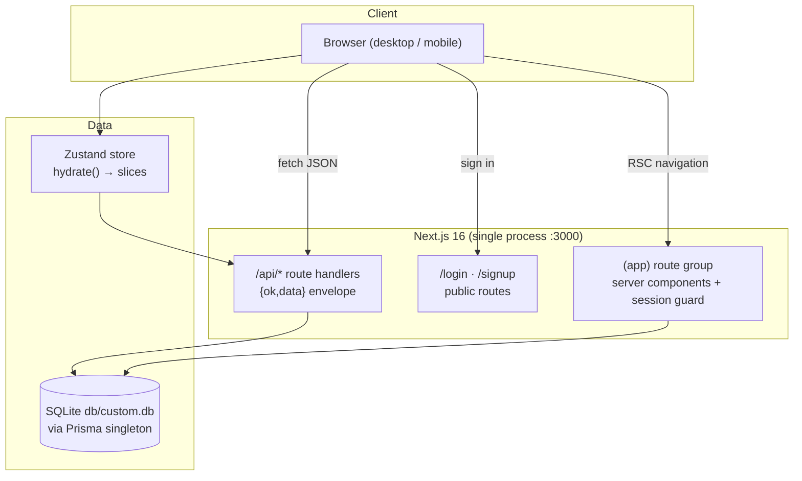

# NEO CRM

[](https://nextjs.org/)
[](https://react.dev/)
[](https://www.typescriptlang.org/)
[](https://tailwindcss.com/)
[](https://www.prisma.io/)
[](#testing)
[](#license)

A complete, self-hostable CRM workspace cloned from the reference app —
accounts, contacts, leads, calendar, activities, analytics and settings in one
clean Next.js application, with the reference app's mobile navigation defect
fixed.

## Overview

The reference CRM lives on a closed platform and ships with a real defect:
below the `lg` breakpoint its sidebar disappears entirely, leaving phone users
unable to reach anything. NEO CRM is a faithful, production-grade clone of
that workspace on an open stack you fully control, and it deliberately fixes
the mobile navigation with a proper focus-trapped drawer. Everything runs from
one process: a Next.js 16 App Router server, a Prisma/SQLite database, and a
seeded demo workspace so the dashboards, charts and reports are alive from the
first boot.

## Key Features

| Feature | Description |
| ------- | ----------- |
| 📊 Dashboard | 6 KPI cards with deltas and sparkline strips, pipeline bar chart, revenue-vs-target line chart, top reps, lead sources, upcoming activities, recent deals |
| 🏢 Accounts | Tiered company records (A/B/C + key accounts), industry/revenue/owner filters, CSV export |
| 👥 Contacts | Hot/warm/cold priorities, sortable columns, CSV import, business-card scan flow (honest degradation on desktop) |
| 🎯 Leads | 7-stage pipeline, deal values, follow-up dates, pipeline/won-lost/funnel charts |
| 📅 Calendar | Month grid with per-type event chips, day agenda, upcoming events, type filters |
| ⚡ Activities | Call/email/meeting/WhatsApp quick-log, priority tabs (overdue / due today / upcoming / completed), activity timeline |
| 📈 Reports | 5 analytics tabs — sales overview, pipeline & weighted forecast, activity & productivity, lead sources, account health |
| ⚙️ Settings | Editable picklists (sources, stages, types, tiers, industries) with instant save, workspace defaults, data export + danger-zone reset |
| 🔍 Global search | Debounced "Search Anything" across accounts, contacts and leads |
| 📱 Mobile navigation | Focus-trapped slide-out drawer with scroll lock, Escape, close-on-navigate — the fix the reference app never shipped |
| 🔐 Auth | scrypt password hashing + HMAC-signed cookie sessions, rate-limited login |
| 👤 Profile | Personal Information form (editable Full Name) + account summary card — mirrors the reference |
| 🧪 Tested | 75 Vitest unit checks + 21 Playwright E2E checks, including a 5-check mobile-nav regression suite |

## Architecture

| Layer | Technology | Version | Purpose |
| ----- | ---------- | ------- | ------- |
| Framework | Next.js (App Router) | 16.3.6 | Server rendering, routing, API handlers |
| UI runtime | React | 19.3 | Component model (async params/cookies, no forwardRef) |
| Language | TypeScript | 5.9 | Strict types, explicit `typecheck` gate |
| Styling | Tailwind CSS | 4.3 | CSS-first tokens (`@theme`, no JS config) |
| Components | Radix UI + custom kit | — | Dialogs, selects, popovers with native-ARIA tabs/tables |
| Charts | recharts | 2.15 | Pipeline, revenue, funnel, donut visualizations |
| ORM | Prisma | 6.19 | Schema-first models, `db push` workflow |
| Database | SQLite | — | Zero-config local persistence at `db/custom.db` |
| State | Zustand | 5.0 | Single client store for all server state |
| Icons | lucide-react | 0.525 | Nav chrome (1.8 stroke) + content (2.0 stroke) |
| Unit tests | Vitest | 5.0 | Pure domain seams |
| E2E tests | Playwright | 1.63 | Real-browser golden path + mobile regression |



## File Hierarchy

```
📂 neo-crm/
├── 📂 src/
│   ├── 📂 app/
│   │   ├── 📂 (app)/                 # session-guarded route group (layout redirect)
│   │   │   ├── 📄 page.tsx           # Dashboard (/)
│   │   │   ├── 📂 accounts/ contacts/ leads/
│   │   │   ├── 📂 calendar/ activities/
│   │   │   └── 📂 reports/ settings/ profile/
│   │   ├── 📂 api/                   # 16 REST route handlers (auth → reset)
│   │   ├── 📂 login/ signup/         # public auth pages
│   │   ├── 📄 layout.tsx             # root layout, Inter font, Toaster
│   │   ├── 📄 globals.css            # Tailwind v4 @theme tokens + utilities
│   │   └── 📂 vendor/tw-animate.css  # vendored animation utilities
│   ├── 📂 components/
│   │   ├── 📂 layout/                # sidebar, topbar, mobile-nav (the fix), app-shell
│   │   ├── 📂 ui/                    # button, dialog, select, table, tabs, toast…
│   │   ├── 📂 charts/                # recharts wrappers with empty states
│   │   └── 📂 shared/                # KPI cards, page headers, entity dialogs
│   ├── 📂 lib/                       # auth, api envelope, db(+path), format, csv, constants
│   ├── 📂 stores/crm-store.ts        # the single Zustand store
│   └── 📂 types/index.ts             # shared wire types
├── 📂 prisma/
│   ├── 📄 schema.prisma              # 8 models (User…Setting)
│   └── 📄 seed.ts                    # idempotent demo workspace
├── 📂 tests/
│   ├── 📄 *.test.ts                  # 7 Vitest suites (75 checks)
│   └── 📂 e2e/                       # Playwright (21 checks)
├── 📂 docs/                          # validation report, SSH runbook, screenshots
├── 📄 AGENTS.md · CLAUDE.md · Project_Architecture_Document.md
└── 📄 next.config.ts · postcss.config.mjs · playwright.config.ts
```

## Quick Start

Requirements: **Node.js ≥ 20** (or Bun ≥ 1.1) and the
[Bun](https://bun.sh) runtime (`curl -fsSL https://bun.sh/install | bash`).

```bash
git clone https://github.com/nordeim/neo-crm.git
cd neo-crm

bun install
cp .env.example .env
# set a session secret:
echo "AUTH_SECRET=\"$(openssl rand -hex 32)\"" >> .env

bun run db:push        # create db/custom.db from the schema
bun run db:seed        # demo accounts/contacts/leads/activities/events
bun run dev            # → http://localhost:3000
```

### Verify Setup

1. `bun run dev` prints `✓ Ready` and serves `http://localhost:3000`.
2. Visiting `/` redirects to `/login` ("Welcome to NEO CRM").
3. Sign in with the demo credentials — **`sepnetflix2023@outlook.com` /
   `$Abcd1234`** — and land on a dashboard with 24 seeded leads, live charts
   and a Recent Deals table.
4. Shrink the window below 1024px: the hamburger (top-left) opens the
   navigation drawer with all 8 destinations.

## Environment Variables

| Variable | Required | Purpose | Default |
| -------- | -------- | ------- | ------- |
| `DATABASE_URL` | Yes | SQLite URL, resolved relative to `prisma/schema.prisma` | `file:../db/custom.db` |
| `AUTH_SECRET` | Prod | HMAC secret for session cookies (≥16 chars) | insecure dev constant |
| `NEXT_PUBLIC_SITE_URL` | No | Canonical origin for metadata | `http://localhost:3000` |

## Testing

```bash
bun run test          # 75 Vitest unit checks (auth, avatar, constants, db-path, format, csv, rate-limit)
bun run build         # E2E runs against the standalone production build
bun run test:e2e      # 21 Playwright checks on :3100 with its own db/e2e.db
```

E2E coverage: logged-out surface (redirects, bad credentials), the
authenticated golden path across all 9 pages, lead creation through the real
dialog, global search, and the 5-check mobile-navigation regression suite
(drawer opens with every destination, link navigation closes it, Escape +
focus restore, body scroll-lock, desktop sidebar swap).

## Deployment

The production build is a standalone server:

```bash
bun run build                        # emits .next/standalone (server.js + traced deps)
bun run start                        # NODE_ENV=production, port 3000
```

`DATABASE_URL` should point at an **absolute** SQLite path in production
(the relative form is dev-friendly but cwd-sensitive — see
`docs/DEPLOYMENT.md`). Put the standalone server behind a TLS-terminating
proxy; session cookies are marked `Secure` whenever `NODE_ENV=production`.

## Troubleshooting

| Issue | Cause | Fix |
| ----- | ----- | --- |
| Database created OUTSIDE the repo (e.g. `<parent>/db/custom.db`) | bun absolutizes a relative `file:` `DATABASE_URL` from `.env` against the `.env` location, and the Prisma engine resolves raw relative URLs against the process CWD | Already handled by `runtimeDatabaseUrl()` (`src/lib/db-path.ts`) and the `db:push` wrapper — if you see it, make sure `db.ts`/`seed.ts`/`scripts/prisma-env.ts` derive the URL through that seam |
| Pages render unstyled (raw HTML look) | `postcss.config.mjs` missing or lacking `@tailwindcss/postcss` | Restore the config — Tailwind v4 directives (`@theme`, `@utility`) are only compiled through the plugin |
| `Can't resolve 'tw-animate-css'` | The package only exposes the `style` export condition, unsupported by Turbopack | Keep the vendored copy at `src/app/vendor/tw-animate.css` and import that |
| E2E sees stale data after reseeding | The db file was deleted under a running server (deleted-inode handle) | Never delete `db/e2e.db`; the seed wipes and reseeds **in place** |
| Login rejected despite correct password | `AUTH_SECRET` changed after the cookie was issued (or rate limiter tripped: 10 attempts/15 min/IP) | Re-sign-in; wait out the window if rate-limited |
| `tsc` errors in `tests/e2e/global-setup.ts` after edits | `import.meta` is unavailable (Playwright loads it as CJS) | Use `process.cwd()` there |

## Contributing

- Work on `main` with atomic Conventional Commits (`:tada: feat:`, `:bug: fix:`, `:memo: docs:`).
- Gate before every push: `bun run lint && bun run typecheck && bun run test && bun run build && bun run test:e2e`.
- React 19 rules apply: no `setState` inside effect bodies (use remount-via-key
  or adjust-during-render), no `forwardRef`, no components created during render.
- Tailwind v4: tokens in `@theme` as literal hex — never a JS config, never
  `var()` chains inside `@theme`.
- Push through `docs/ssh_git_wrapper_v3.py` (runbook:
  `docs/how-to-git-push-using-ssh-wrapper_SKILL.md`).

## License

MIT — same as the vendored `tw-animate-css` (Womp LLC). All CRM code in this
repository is provided as-is for educational and self-hosting purposes.

---

**Companion documents:** [`AGENTS.md`](AGENTS.md) (agent contract) ·
[`CLAUDE.md`](CLAUDE.md) (workflow reference) ·
[`Project_Architecture_Document.md`](Project_Architecture_Document.md)
(engineering blueprint)
