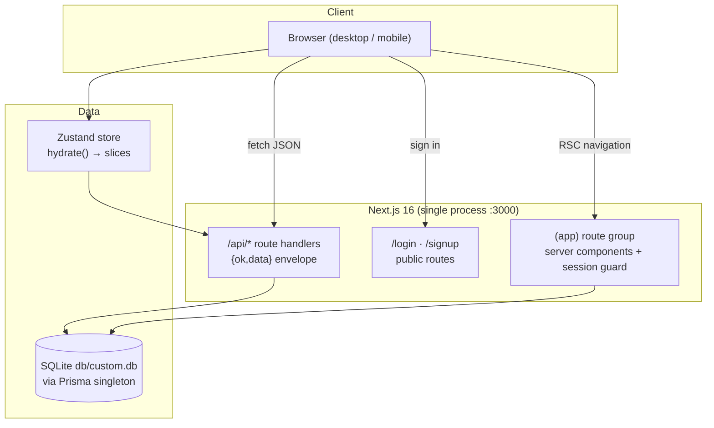

# NEO CRM

[](https://nextjs.org/)
[](https://react.dev/)
[](https://www.typescriptlang.org/)
[](https://tailwindcss.com/)
[](https://www.prisma.io/)
[](#testing)
[](#license)

A complete, self-hostable CRM workspace cloned from the reference app —
accounts, contacts, leads, calendar, activities, analytics and settings in one
clean Next.js application, with the reference app's mobile navigation defect
fixed.

## Overview

The reference CRM lives on a closed platform and ships with a real defect:
below the `lg` breakpoint its sidebar disappears entirely, leaving phone users
unable to reach anything. NEO CRM is a faithful, production-grade clone of
that workspace on an open stack you fully control, and it deliberately fixes
the mobile navigation with a proper focus-trapped drawer. Everything runs from
one process: a Next.js 16 App Router server, a Prisma/SQLite database, and a
seeded demo workspace so the dashboards, charts and reports are alive from the
first boot.

## Key Features

| Feature | Description |
| ------- | ----------- |
| 📊 Dashboard | 6 KPI cards with the reference's HARDCODED static deltas (+5.3%/+15%) and static sparkline arrays, the single-blue #3b82f6 pipeline bars (radius 8, $ axis) with the O-map legend chips (the Won label's gray-400 lookup-miss quirk mirrored), the won/target revenue areas at fillOpacity .6/.3 on stock axes, top reps, the Follow-up checkbox rows, recent deals (table/cards view switcher) — the reference's old-lucide POLYGON filter glyph (hand-rolled SVG: lucide 0.525 re-exports the curved Funnel as Filter) |
| 🏢 Accounts | Tiered company records (A/B/C + key accounts), industry/revenue/owner filters ($0-$1M/$1M-$5M/$5M+), table/cards view switcher, CSV export — the reference's quoted 10-column client-side set incl. the stored Health field; the session-28 row (the building-icon box, the Key-tier yellow tint + filled star, the overdue red border-l-4 + N Overdue badge, the owner initials box, the HEALTH badge under the Status header — the reference's own header/cell mismatch), the row click + View Insights → the Account Insights dialog (max-w-3xl, the Total Revenue/Open Deals/Contacts stat cards, the Recent Activities/Contacts/Open Deals tabs), and the SEPARATE max-w-2xl Edit Account dialog (the full field set incl. Website/Annual Revenue/Employees + the 3-option status) |
| 👥 Contacts | The session-28 contact layer: the Key/Standard/At Risk priority vocabulary, the role/engagement-level/company-size/photo fields, the RAW source values (call/email/website/partner/referral — the emojis are create-dialog labels), the inline role select + the 3-bar engagement cell + the ce last-activity formatter (Never/Today/N days ago/N months ago) in the row, the row click → the Contact Details slide-over (md:w-[500px] right panel, the INITIAL-ONLY hero — the reference renders no photo there, the badges + engagement bars, Call/Email/WhatsApp, the Contact Information card, the Activities/Deals/Notes tabs), the SEPARATE max-w-2xl Edit Contact dialog, the checkbox-card filter panel (Role/Priority/30-day/Company Size/Source), the create dialog's h3 section headers, the rebuilt Scan Card + the s26 Import dialog, and the reference's only full-height layout. Session-30: the create dialog's photo section is the REAL upload round-trip (the img/initials/User-glyph render, the red remove X, the `Please upload an image file (JPG or PNG)` alert, the `John Doe` centered Name field, the max-h-[90vh] scroll-capped shell) backed by the self-hosted `/api/upload` seam |
| 🎯 Leads | The session-29 INTERACTIVE table: the orange Target name box, the INLINE Value number input / Status select (the 5-status set) / Next Follow-up date input with the overdue red border + CircleAlert (immediate mutation, optimistic store), the raw-source outline badge, the STICKY thead, the ⋮ Edit / Convert-to-Opportunity (dead — the reference's own quirk) / Delete menu; the filters popover with the RAW-value selects + the "(Active)" suffix + the NATIVE prompt-based Save View + the loadable Saved Views select; the client-side `leads_` CSV export from the FILTERED rows; 6 KPI cards deriving from the filtered set (Open = new+contacted+qualified, Dropped = lost strictly, the avg cycle = the won leads' average AGE), pipeline/won-lost charts + the recharts FunnelChart conversion funnel, filters popover (status/source/min value/follow-up) with Save View persistence, the SEPARATE max-w-2xl Edit Lead dialog (the 4-option status set + the 4-option source, Estimated Value) |
| 📅 Calendar | Month grid with the reference's tinted clickable event chips (bg-100/text-800 tints + solid dots, click opens the Edit dialog, +N-more overflow lines, plain-text day numbers), the tall-bar upcoming rows with MMM d, h:mm a timestamps, the 40x40 tinted-square agenda rows with the EllipsisVertical Edit/Delete dropdown, type filters — the reference's flat card anatomy (split DOW/month grids, bold responsive title, 8px nav) |
| ⚡ Activities | Call/email/meeting/WhatsApp quick-log (the reference's `calendar`/`message-square` glyphs), priority tabs (overdue / due today / upcoming / completed), activity timeline on the borderless `bg-white rounded-lg shadow p-6` card |
| 📈 Reports | 5 analytics tabs with the reference's bundle-pinned chart internals — the single-line revenue chart, grouped won/lost bars, the row-derived violet pipeline, the cyan horizontal funnel, the two-line forecasting chart, the probability-band PIE, the by-type/by-source label pies, the win-rate/avg-value bars with %/$ tooltips, the Account Health tab (computed Healthy/Needs Attention/At Risk distribution PIE, the horizontal Top-10 by revenue, the red-tinted at-risk rows with Nd-ago/Never, the outline-badge summary), deals-at-risk tables, activity log by owner, source performance summary |
| ⚙️ Settings | Editable picklists (sources, stages, types, tiers, industries) with instant save in a md-breaking 2-col grid, single-column workspace defaults, import templates + data export, and the tinted danger-zone reset (type RESET to confirm — a native confirm() gate + native alert() reporting, the reference's exact dialog strings) |
| 🔍 Global search | Debounced "Search Anything" across accounts, contacts and leads |
| 📄 Document metadata | The reference's full `<head>` surface — its 405-char meta description, the complete OpenGraph + Twitter card family (1200×630 social card), a brand favicon, `/robots.txt` and a nine-route `/sitemap.xml` served in the reference's byte format (all derived from `NEXT_PUBLIC_SITE_URL` via `src/lib/site.ts`) |
| 📲 PWA / installable | The reference's install surface — `/manifest.json` (standalone display, #000000 theme, same-src 192+512 icons) + the `apple-touch-icon` + the `mobile-web-app-capable`/`apple-*` meta family, plus PER-ROUTE canonical + OG/Twitter on every page (og:title "X \| NEO CRM", the "X on NEO CRM." description prefix — all built by the `pageMetadata()` factory in `src/lib/site.ts`) |
| 📱 Mobile navigation | Focus-trapped slide-out drawer with scroll lock, Escape, close-on-navigate, retry-guarded focus entry (transition-visibility race fixed) — the fix the reference app never shipped |
| ☑️ Stock checkboxes | The reference's Radix-style button checkboxes on every filter rail (`role=checkbox` + `data-state` + Check indicator, the dark #171717 checked fill — was a native input) |
| 🔐 Auth | scrypt password hashing + HMAC-signed cookie sessions, rate-limited login, the reference's full in-place login-card funnel: "Forgot password?" reset flow, the in-place signup view (Email/Password/Confirm — no name field, no Google, no divider) and the verify-email view with its 6-digit code ladder (5 attempts → lockout → resend); every auth error renders the reference's Callout banner — zero toasts. The code is logged to the server console (self-hosted delivery; SMTP can be wired in `src/lib/verification-server.ts`) |
| 👤 Profile | Personal Information form (editable Full Name + the session-30 REAL photo upload — `accept="image/*"` with NO type alert on this surface, the toast vocabulary `Photo uploaded successfully`/`Failed to upload photo`, the img render on the form avatar + the Account card, the save → 500ms-reload mechanism, the TOPBAR avatar pickup) + account summary card — mirrors the reference |
| 🧭 Custom 404 | The reference's designed not-found page — slate-50 center card, divider bar, quoted-pathname message, Go Home pill |
| 🛡️ Security headers | The reference's edge-injected response-header set on every route — `Referrer-Policy: strict-origin-when-cross-origin`, `X-Content-Type-Options: nosniff`, `Strict-Transport-Security: max-age=31536000` (bare, like the reference; inert over plain-HTTP localhost per RFC 6797, correct behind HTTPS) — declared once in `next.config.ts` `headers()` |
| 🔤 Typography | The reference's zero-webfont base: NO Inter, NO font preloads — the stock `ui-sans-serif, system-ui` system stack pinned byte-exact in `@theme --font-sans`, default `auto` font smoothing (no `antialiased`, no `text-rendering` override) and the browser-default `::selection` — measured pixel-identical text metrics after the fix |
| ⌨️ Tabs (ARIA + keyboard) | The reference's full Radix tabs contract on every tab strip (activities, reports, settings) — each trigger carries `id` + `aria-controls` wired to its panel's `id`, each panel carries `aria-labelledby` back, all panel shells stay mounted (inactive ones hidden + empty), and the tablist supports the arrow-key model (ArrowLeft/Right with wrap, Home/End, automatic activation — focus follows selection). Our roving tabindex (selected tab reachable) stays the accessible superset over the reference's all-`tabIndex=-1` platform defect |
| 🔗 Route casing | The reference's route-case contract — every app route serves at BOTH casings (`/Reports` and `/reports` alike) with NO URL normalization, each casing a first-class SSR route (og:url + canonical mirror the requested case; `/Dashboard` serves the root head like `/`); the sidebar + drawer + account-menu hrefs are the reference's CAPITALIZED paths (`/Dashboard`, …, `/Profile`) with case-insensitive active-state matching. Capital `/Login` + `/Signup` 404 on both apps (the reference case-folds only its app routes) |
| ⏳ Loading model | The reference's instant-render-with-zeros contract — ZERO skeletons, ZERO spinners, ZERO loading UI anywhere: with a data fetch network-blocked the full page still renders immediately (KPI cards at 0, the empty table row, "Hi, Guest"). Every skeleton family retired (the empty state IS the loading state); the store's `loadingFlags` went with them |
| 🧾 Settings import/export | The reference's Settings Data-tab family — static CSV templates (`contacts_template.csv` with the byte-exact example rows), raw-dump entity exports (`contact_/account_/lead_/activity_` + ISO date — the header is the first row's own keys, every value double-quoted, an EMPTY file at zero data), and the three CardDescriptions (Import Templates / Export Data / the red Danger Zone warning) |
| 📑 PDF + CSV exports | The reference's REAL client-side artifact family — the Reports **PDF** button captures the content area (no sidebar) through `html2canvas-pro` + assembles A4 portrait pages via jsPDF (`crm_reports_YYYY-MM-DD.pdf`); the per-table **Export PDF** buttons generate text PDFs (`open_deals_by_stage_…` — the slug truncates the card title at the parenthetical); CSVs download as `prefix_YYYY-MM-DD.csv` with the reference's exact column sets (leads 8-col, the singular `crm_report` 7-col deal CSV, the per-table 3-col client-side blobs) |
| 💾 Saved reports | The reference's "Saved Reports (N)" button opens the full Save Custom Report View dialog — Report Name input + the 6 column checkboxes (Name/Account/Owner/Value/Stage/Won Date) + the Current Filters summary + the loadable list — persisted to `localStorage.crm_saved_reports` with the reference's byte-exact schema; **Load** re-applies the saved filters |
| 🧪 Tested | 873 Vitest unit checks + 106 Playwright E2E checks, including a 7-check mobile-nav regression suite (resize lock-release + drawer focus-entry included) |

## Architecture

| Layer | Technology | Version | Purpose |
| ----- | ---------- | ------- | ------- |
| Framework | Next.js (App Router) | 16.3.6 | Server rendering, routing, API handlers |
| UI runtime | React | 19.3 | Component model (async params/cookies, no forwardRef) |
| Language | TypeScript | 5.9 | Strict types, explicit `typecheck` gate |
| Styling | Tailwind CSS | 4.3 | CSS-first tokens (`@theme`, no JS config) |
| Components | Radix UI + custom kit | — | Dialogs, selects, popovers with native-ARIA tabs/tables |
| Charts | recharts | 2.15 | Pipeline, revenue, funnel, donut visualizations |
| ORM | Prisma | 6.19 | Schema-first models, `db push` workflow |
| Database | SQLite | — | Zero-config local persistence at `db/custom.db` |
| State | Zustand | 5.0 | Single client store for all server state |
| Icons | lucide-react | 0.525 | Nav chrome (1.8 stroke) + content (2.0 stroke) |
| Unit tests | Vitest | 5.0 | Pure domain seams |
| E2E tests | Playwright | 1.63 | Real-browser golden path + mobile regression |
| PDF export | jsPDF 4.2 + html2canvas-pro 2.5 | — | The Reports canvas + text PDF artifact family |



## File Hierarchy

```
📂 neo-crm/
├── 📂 src/
│   ├── 📂 app/
│   │   ├── 📂 (app)/                 # session-guarded route group (layout redirect)
│   │   │   ├── 📄 page.tsx           # Dashboard (/)
│   │   │   ├── 📂 accounts/ contacts/ leads/
│   │   │   ├── 📂 calendar/ activities/
│   │   │   └── 📂 reports/ settings/ profile/
│   │   ├── 📂 api/                   # 16 REST route handlers (auth → reset)
│   │   ├── 📂 login/ signup/         # public auth pages
│   │   ├── 📄 layout.tsx             # root layout, metadata, Toaster (no webfont — the stock system stack)
│   │   ├── 📄 globals.css            # Tailwind v4 @theme tokens + utilities
│   │   └── 📂 vendor/tw-animate.css  # vendored animation utilities
│   ├── 📂 components/
│   │   ├── 📂 layout/                # sidebar, topbar, mobile-nav (the fix), app-shell
│   │   ├── 📂 ui/                    # button, dialog, select, table, tabs, toast…
│   │   ├── 📂 charts/                # recharts wrappers with empty states
│   │   └── 📂 shared/                # KPI cards, page headers, entity dialogs
│   ├── 📂 lib/                       # auth, api envelope, db(+path), format, csv, constants, reports-data
│   ├── 📂 stores/crm-store.ts        # the single Zustand store
│   └── 📂 types/index.ts             # shared wire types
├── 📂 prisma/
│   ├── 📄 schema.prisma              # 8 models (User…Setting)
│   └── 📄 seed.ts                    # idempotent demo workspace
├── 📂 tests/
│   ├── 📄 *.test.ts                  # 38 Vitest suites (600 checks)
│   └── 📂 e2e/                       # Playwright (92 checks)
├── 📂 docs/                          # validation report, SSH runbook, screenshots
├── 📄 AGENTS.md · CLAUDE.md · Project_Architecture_Document.md
└── 📄 next.config.ts · postcss.config.mjs · playwright.config.ts
```

Also under `src/app/`: the metadata-asset file conventions — `icon.png`
(512×512 favicon) + `apple-icon.png` (180×180 touch icon) — plus the
`manifest.json/`, `robots.txt/` and `sitemap.xml/` route handlers that
serve the reference's byte formats.

## Quick Start

Requirements: **Node.js ≥ 20** (or Bun ≥ 1.1) and the
[Bun](https://bun.sh) runtime (`curl -fsSL https://bun.sh/install | bash`).

```bash
git clone https://github.com/nordeim/neo-crm.git
cd neo-crm

bun install
cp .env.example .env
# set a session secret:
echo "AUTH_SECRET=\"$(openssl rand -hex 32)\"" >> .env

bun run db:push        # create db/custom.db from the schema
bun run db:seed        # demo accounts/contacts/leads/activities/events
bun run dev            # → http://localhost:3000
```

### Verify Setup

1. `bun run dev` prints `✓ Ready` and serves `http://localhost:3000`.
2. Visiting `/` redirects to `/login` ("Welcome to NEO CRM").
3. Sign in with the demo credentials — **`sepnetflix2023@outlook.com` /
   `$Abcd1234`** — and land on a dashboard with 24 seeded leads, live charts
   and a Recent Deals table.
4. Shrink the window below 768px: the hamburger (top-left) opens the
   navigation drawer with all 8 destinations (the desktop sidebar itself
   appears from 768px, mirroring the reference).

## Environment Variables

| Variable | Required | Purpose | Default |
| -------- | -------- | ------- | ------- |
| `DATABASE_URL` | Yes | SQLite URL, resolved relative to `prisma/schema.prisma` | `file:../db/custom.db` |
| `AUTH_SECRET` | Prod | HMAC secret for session cookies (≥16 chars) | insecure dev constant |
| `NEXT_PUBLIC_SITE_URL` | No | Canonical origin for metadata, `robots.txt`, `sitemap.xml`, `manifest.json` and the per-route OG/Twitter/canonical family (consumed via `src/lib/site.ts`; inlined at build time) | `http://localhost:3000` |

## Testing

```bash
bun run test          # 873 Vitest unit checks (auth, avatar, constants, db-path, metadata, pwa-metadata, http-headers, login-views, typography, tabs-aria, page-layout, page-titles, profile-route, format, csv, rate-limit, lead-filters, design-tokens, reports-data, login-reset, charts-contracts, route-case, pdf-export, saved-reports, loading-layer, csv-contract, report-periods, settings-data-tab, reset-flow, csv-templates, entity-export, account-health, import-dialog, charts-internals, account-health-tab, dashboard-contracts, leads-charts, calendar-cells, contact-model, entity-edit-dialog, contact-surfaces, account-surfaces, leads-inline, upload-api, contact-photo, profile-photo, opportunity-model, api-robustness)
bun run build         # E2E runs against the standalone production build
bun run test:e2e      # 106 Playwright checks on :3100 with its own db/e2e.db
```

E2E coverage: logged-out surface (redirects, bad credentials — the
reference's Callout banner with zero toasts, the login
card's full in-place funnel: the reset-password flow, the signup view
swap with its mismatch guard, the verify-email view with the attempts
ladder + resend, and the /signup superset page), the
authenticated golden path across all 9 pages, lead creation through the real
dialog, global search, the per-page document titles, the reports tab 2-4
structure, the account menu (real role=menu with Profile/Logout), the reports
funnel (horizontal bar chart with the raw stage slugs + dashed grid), the
activities by-type card (chips row + checkbox footer), the settings Defaults/Data tab structures + /Profile casing alias, the entity-dialog
geometry layer (the stock New Lead dialog at phone width — full-bleed,
radius 0, centered title, the 2-col Status/Source pair; the Contact avatar
section with live initials; the wide New Event family with its one-off blue
submit), the session-16 responsive layer (the contacts full-height root at
390 with its 326px card + the 5px mirrored scroll quirk, the settings
picklist grid at md/tablet width, the calendar's split DOW/month grids +
bold title, the borderless accounts table card), the session-17 stock
button/checkbox layer (the account trigger's ghost-Button construction +
two-level avatar, the sidebar `users`/`circle-user`/`calendar` glyphs, the
accounts tier filters' stock button checkboxes with the dark #171717
checked fill, the blue primaries' bare shadow scale), the session-18
document-metadata layer (the reference's meta description, the OG/Twitter
card family, the favicon link, robots.txt's Sitemap line, the nine-route
sitemap.xml), the session-19 PWA + per-route metadata layer (the
installable manifest.json, the #000000 theme-color + the apple/meta
family, the resolving apple-touch-icon, per-route canonical + OG/Twitter
on /accounts, the unprefixed root family, the Contact dialog's type=tel
phone + zero datalists + the exact avatar accept list), the session-20
HTTP response-header layer (the reference's edge security set —
Referrer-Policy/X-Content-Type-Options/HSTS on every response incl.
static assets, plus the sitemap's bare `application/xml` content-type),
the session-21 login-card funnel layer (the reference's in-place signup
view — the s10 "dead button" pin disproven live — plus the verify-email
view with its 6-digit attempts ladder, the Callout error/info banners,
the exact auth error strings, and zero auth toasts), the session-22
typography layer (the reference's zero-webfont base — the Inter webfont
retired for the stock system stack, default `auto` smoothing, the
browser-default `::selection`), the session-23 tabs ARIA + keyboard
layer (the reference's Radix tabs contract — wired trigger/panel ids,
all shells mounted with the inactive ones hidden + empty, the arrow-key
model with wrap + Home/End + automatic activation, and the activities
priority card restructured into the reference's single p-4 border-b
region), the session-24 route-case + URL-state layer (the
reference serves every app route at BOTH casings with no normalization —
its sidebar links point at the capitalized paths, each casing a
first-class SSR head; our capital-route render aliases + the capitalized
nav hrefs + the case-insensitive active state, the dashboard's dead
"More..." affordance restored, and the URL-state census closed at
parity — zero writes, params ignored), the session-25 loading +
export-contract layer (the reference's instant-render model — the
dashboard KPI cards visible immediately post-login with zero skeleton
pass; the Reports header PDF downloading a real client-side
`crm_reports_*.pdf`; the per-table Export PDF/CSV downloading the
reference's `open_deals_by_stage_*.pdf` + `open_deals_*.csv` artifacts;
the Save Custom Report View round-trip — save → count "(1)" → the
list → Load reapplies the filters; the period dropdown's 6-option
vocabulary), the session-26 Settings import/export layer (the three
Data-tab CardDescriptions, the static template artifacts, the raw-dump
singular-prefix exports, the quoted page-level contacts/accounts CSVs
incl. Health, the rebuilt Import Contacts dialog with its result box +
2s auto-close, and the reset flow's native confirm/alert round-trip —
decline holds, accept wipes), the session-27 chart-internals +
Account Health / calendar layer (the Account Health tab's computed health
distribution PIE with its `${name}: ${value}` slice labels, the horizontal
Top-10 chart with the $ axis, the red-tinted at-risk rows with "Nd ago"/
"Never" + the red "At Risk" badges, the outline-badge summary; the
dashboard's "Follow up with {source}" checkbox rows, the static KPI
sparklines + deltas; the calendar chip click opening the Edit Event
dialog; the activities by-type bars all single #3b82f6), the session-28
entity layer (the contacts slide-over + the W7/wce/Mke edit-dialog family,
the inline role select + engagement bars + the Call/Email/WhatsApp actions,
the Account Insights dialog, the checkbox-card contacts filter panel), and
the session-29 leads interactive layer (the inline Value/Status/Date
editing round-trip with the overdue border + CircleAlert, the orange
Target name box + the sticky thead, the "(Active)" filter suffix + the
prompt-based Save View + the loadable Saved Views select, the dead
Convert-to-Opportunity menu item), and the session-30 photo-upload
layer (the contact dialog's REAL upload round-trip — the img/initials/
User-glyph avatar render, the red remove X, the exact alert strings,
the "Uploading photo..." hint, the `John Doe` centered Name field; the
profile-photo flow with the toast vocabulary + the 500ms-reload
mechanism + the topbar avatar pickup; the self-hosted `/api/upload` +
`/api/uploads/[name]` seam mirroring the base44 UploadFile contract;
the reference's dialog scroll-cap layer — `max-h-[90vh] overflow-y-
auto` on the contact create + the Event/Activity family + Save Custom
Report, the bare `max-w-2xl` account create, its own inconsistency
mirrored),
and the session-31 Opportunity-split layer (the reference's SECOND deal
model, bundle-decoded: the Opportunity entity with NO create-edit UI —
its data feeding the dashboard's pipeline chart + Top Reps + Recent
Deals + the won-opp KPIs with the HARDCODED $0 sales target, the FIXED
Nov..May revenue labels, ALL FIVE reports tabs (the 8-slug funnel as the
leads+opps CONCATENATION, the actual/forecasted accuracy formula, the
probability bands, the created-date aging, the last-activity at-risk
join, the opp-based sources + account health), the insights dialogs'
account_name joins, the list-only `/api/opportunities` + the seeded
demo opps),
and the session-32 currency-format + period-wire-id layer (the
reference's LITERAL scale formulas mirrored through the format seam's
fixed `scale` option — the dashboard's currency KPIs always
`$${(v/1e3).toFixed(n)}k` (the "$0k" hardcoded-target quirk included)
and the accounts' revenue family always `$${(v/1e6).toFixed(1)}M`; the
REPORT_PERIODS wire ids corrected to the bundle's
`today/thisWeek/thisMonth/quarter/ytd/all` — the s25 week/month
inferences disproven — with `normalizeSavedPeriod()` migrating stale
localStorage saved views),
and the session-33 dead-control decode closure (the 29th-session
bundle re-read: the reference's dashboard filter-bar "Stage: Source"
search input is DEAD — no value/onChange, the s32 topbar-search family —
and its header "Add" button is dead too; ours stay the documented
functional supersets, with the placeholder + the three-button header
trio now pinned in the `FILTER_BAR`/`DASHBOARD_HEADER` contracts and
their decode notes + render pins in the test layer),
and the session-34 standalone-launch database-path recovery (the
production start `bun run start` from the repo root could NOT open the
database: bun absolutizes the relative `file:` `DATABASE_URL` against the
LAUNCH directory while the standalone `server.js` `process.chdir()`s into
`.next/standalone` before the seam runs, so the bun-absolutization
detection compared against the wrong directory and passed a
parent-of-repo path to the engine — SQLITE_CANTOPEN on every
database-touching route; `runtimeDatabaseUrl()` now also tests the
signature of the .env at the validated standalone repo root — the launch
directory — and re-anchors through `urlForRoot()`, so the documented
production start opens `<repo>/db/custom.db` again; verified live on
the production server: `/api/health` `db:"up"`, login 200, the seeded
dashboard),
and the session-35 uploads-GET-route recovery + the API robustness layer
(the uploads GET route — documented since session-30 and pinned by
tests — was NEVER IN GIT: the unanchored gitignore pattern `uploads/`
also matched `src/app/api/uploads/`, so the file was authored in the
old sandbox but silently never tracked, and every FRESH CLONE shipped
the gate red with every uploaded photo 404ing behind an e2e mask that
only asserted the `src` attribute; the pattern is now anchored
`/uploads/`, the route restored per the session-30 contract — public,
the pinned 32-hex charset, the content-type map, immutable caching —
and the e2e now demands the image bytes back; alongside it: the
launch-dir `isRelativeFileUrl` guard in the db-path seam so an absolute
production `.env` is never re-anchored into a corrupted path, the
mobile-nav close-on-navigation ownership move into AppShell (the
sanctioned own-state adjust-during-render — no more cross-component
render warning on browser back/forward), FK existence guards on every
PUT `[id]` body + the missing POST-side `accountId` checks with
try/catch → `ERR.INTERNAL()` so DB failures stay inside the
`{ ok, error }` envelope, and the store's reset/logout hygiene),
and the session-36 envelope-completion + input-hardening layer (the
re-audit found the session-35 robustness claim broader than its
implementation — the five DELETE handlers, the three POST creates, the
users PATCH update, the settings PUT upsert and the activities `[id]`
update still let Prisma failures escape as raw non-envelope 500s, and
the reset route's seven `deleteMany` calls ran outside a transaction
with a partial-wipe risk on mid-chain failure; now every mutating DB
call in every handler is inside try/catch → `ERR.INTERNAL()`, the
reset wipe is atomic inside `db.$transaction`, the events PUT enforces
the end≥start invariant its own POST carries — checked against the
MERGED record so an endAt-only patch can't slip past an unchanged
startAt, the upload POST pre-gates on the declared Content-Length
before `formData()` buffers the body, `photoUrl` accepts only `null`,
`/api/uploads/…` or `https://…` (no `data:`/`javascript:` payloads),
and `/api/health` returns an honest 503 on db-down while the Playwright
boot probe still passes — fresh-boot e2e verified),
and the session-37 containment + FK-type-hardening layer (the re-audit
found the session-36 "every mutating DB call" claim one family short:
the auth routes' four writes — signup's create, verify's two updates,
resend's update — plus the activities `[id]` existence fetch and the
settings GET's lazy singleton create still escaped the envelope; now
every DB call in every mutating handler is provably INSIDE a try→catch
span — the pins assert containment, not mere presence, so a write that
moves back out fails its pin; a non-string FK payload
(`{"accountId": 123}`) is a 400 "Invalid company/owner/contact
selection" instead of a silent FK clear; and the profile photoUrl cap
normalized to the contacts writers' 500 — a 400-char `https://` URL
stores whole instead of truncating broken),
and the 7-check
mobile-navigation regression suite (drawer opens with every destination, link
navigation closes it, Escape + focus restore + focus entry into the drawer,
body scroll-lock, the resize-past-md lock release, desktop sidebar swap).

## Deployment

The production build is a standalone server:

```bash
bun run build                        # emits .next/standalone (server.js + traced deps)
bun run start                        # NODE_ENV=production, port 3000
```

`DATABASE_URL` may stay in the mandated relative form (`file:../db/custom.db`)
for `bun run start` from the repo root — `runtimeDatabaseUrl()`
(`src/lib/db-path.ts`) re-anchors it through the schema rule for the
standalone server too (session-34), and an **absolute** path remains the
most conservative choice for exotic deploy trees (see
`docs/DEPLOYMENT.md`). Put the standalone server behind a TLS-terminating
proxy; session cookies are marked `Secure` whenever `NODE_ENV=production`.

## Troubleshooting

| Issue | Cause | Fix |
| ----- | ----- | --- |
| Database created OUTSIDE the repo (e.g. `<parent>/db/custom.db`) | bun absolutizes a relative `file:` `DATABASE_URL` from `.env` against the `.env` location, and the Prisma engine resolves raw relative URLs against the process CWD | Already handled by `runtimeDatabaseUrl()` (`src/lib/db-path.ts`) and the `db:push` wrapper — if you see it, make sure `db.ts`/`seed.ts`/`scripts/prisma-env.ts` derive the URL through that seam |
| Pages render unstyled (raw HTML look) | `postcss.config.mjs` missing or lacking `@tailwindcss/postcss` | Restore the config — Tailwind v4 directives (`@theme`, `@utility`) are only compiled through the plugin |
| `Can't resolve 'tw-animate-css'` | The package only exposes the `style` export condition, unsupported by Turbopack | Keep the vendored copy at `src/app/vendor/tw-animate.css` and import that |
| E2E sees stale data after reseeding | The db file was deleted under a running server (deleted-inode handle) | Never delete `db/e2e.db`; the seed wipes and reseeds **in place** |
| Login rejected despite correct password | `AUTH_SECRET` changed after the cookie was issued (or rate limiter tripped: 10 attempts/15 min/IP) | Re-sign-in; wait out the window if rate-limited |
| `tsc` errors in `tests/e2e/global-setup.ts` after edits | `import.meta` is unavailable (Playwright loads it as CJS) | Use `process.cwd()` there |

## Contributing

- Work on `main` with atomic Conventional Commits (`:tada: feat:`, `:bug: fix:`, `:memo: docs:`).
- Gate before every push: `bun run lint && bun run typecheck && bun run test && bun run build && bun run test:e2e`.
- React 19 rules apply: no `setState` inside effect bodies (use remount-via-key
  or adjust-during-render), no `forwardRef`, no components created during render.
- Tailwind v4: tokens in `@theme` as literal hex — never a JS config, never
  `var()` chains inside `@theme`.
- Push through `docs/ssh_git_wrapper_v3.py` (runbook:
  `docs/how-to-git-push-using-ssh-wrapper_SKILL.md`).

## License

MIT — same as the vendored `tw-animate-css` (Womp LLC). All CRM code in this
repository is provided as-is for educational and self-hosting purposes.

---

**Companion documents:** [`AGENTS.md`](AGENTS.md) (agent contract) ·
[`CLAUDE.md`](CLAUDE.md) (workflow reference) ·
[`Project_Architecture_Document.md`](Project_Architecture_Document.md)
(engineering blueprint)
